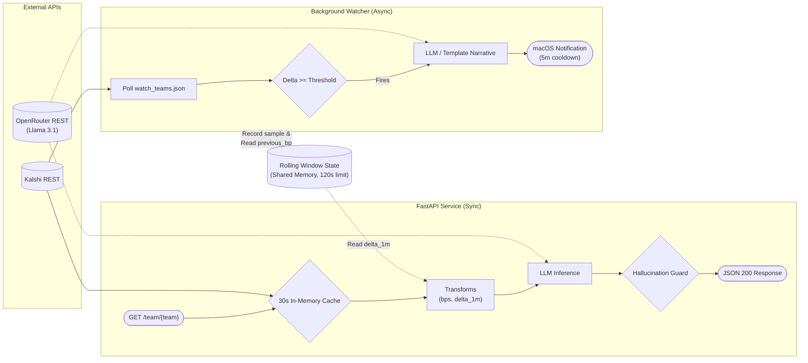

# Kalshi at the World Cup

# Intro

I have been watching the World Cup fervently in the last couple weeks and try to stay informed with match fixtures and results. However, I don't have the time to watch every match, though I'd like to stay updated on which way the game is leaning during its duration. Incidentally, I've also been following the emerging trend of prediction markets and how they capture and measure the sentiment around certain events. I combined these two concepts into this project -- an API that turns Kalshi World Cup prediction-market odds into developer-consumable JSON with a human-readable narrative field that summarizes the current sentiment. For my own use, I've attached a background watcher that polls this API and fires a MacOS notification on meaningful moves. 

## System Diagram 



### Key Features
- Kalshi public REST API call needs no auth 
- Watcher shares rolling 2m window with API endpoint 
- LLM is a final transform, never a decision-maker 

## Tradeoffs
- Deterministic gate vs LLM-judge: Notifications trigger via strict math (relative delta threshold). The LLM only writes the prose. Ensures testability and prevents hallucinated spam or silent failures.
- Graceful degradation (Always `200 OK`): Kalshi or LLM outages return null data fields with a fallback template narrative. Clients don't crash; developers/fans always get a readable status.
- REST polling vs WebSockets: Used Kalshi's public `REST API` instead of WebSockets. Public `REST` requires zero auth. At our scale (watching 3-5 teams), polling is highly viable and debuggable.
- Integer basis points: All internal probability math uses integers (`5% = 500bp`). Floats only appear at the final `JSON` boundary. Prevents floating-point precision drift. 
- Configured watch list: The background loop tracks a configured subset (`watch_teams.json`), not all 48 teams. Avoids an `O(N)` cycle-time scaling cliff and wasted `API` calls.

## To Improve
- Server-Sent Events (`SSE`): Upgrade the polling endpoint to stream real-time JSON updates to clients.
- Match event enrichment: Wire a secondary sports `API` (like API-Football) to feed live goals and cards into the LLM prompt for richer narratives.


## AI Tools
AI tools featured heavily in the creation of this project. I used my assistant for several purposes: 
- Teach me the components it was making and why it was making it; required it to force me to write key parts of the code for maximum understanding
- Research spikes on specific APIs and practices; Kalshi, OpenRouter, api-football, etc. 
- Generate tests for me in English in Given-When-Then format, then implement TDD (failing tests first, then iterative code until all tests pass)
For more information, please refer to my `AGENTS.md`. 

## Running It
The API is hosted at `https://speakeasy-wc-production.up.railway.app/`. 

To see available teams, hit the root or teams endpoint:
`curl https://speakeasy-wc-production.up.railway.app/teams`

Then query a specific team (best results with an ongoing/upcoming match):
`curl https://speakeasy-wc-production.up.railway.app/team/brazil`

### Local Setup
Ensure you have [uv](https://github.com/astral-sh/uv) installed, then:
```bash
uv sync
# Requires OPENROUTER_API_KEY in .env for full LLM functionality
uv run uvicorn main:app --reload
```