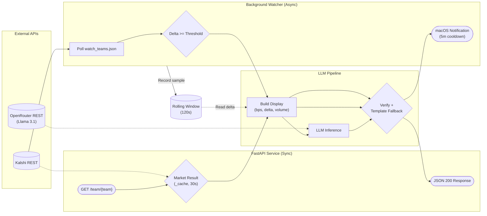
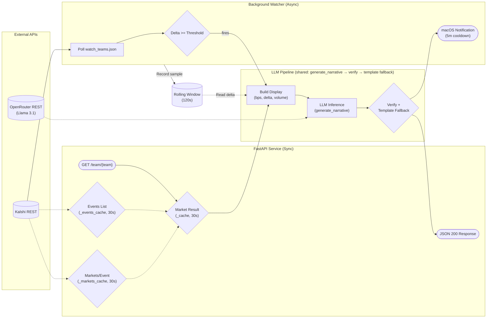

# Speakeasy FDE Take-Home — Complete Project Handoff

> **Purpose:** This document consolidates the entire Kalshi World Cup prediction-market project, all architectural decisions, interview prep materials, coaching feedback, and full source code. Feed this to another agent to continue interview prep, code review, or extension work.

> **Extracted from:** `U10 - speakeasy-takehome-main.zip` (commit `dca661c`)
> **Production URL:** https://speakeasy-wc-production.up.railway.app/
> **Test count:** 96 unit tests across 7 test files

---

## Table of Contents

1. [Executive Summary](#1-executive-summary)
2. [What Was Built](#2-what-was-built)
3. [System Architecture](#3-system-architecture)
4. [Build Timeline & Components](#4-build-timeline--components)
5. [Key Architectural Decisions (D1–D38)](#5-key-architectural-decisions-d1d38)
6. [Tradeoffs to Defend in Interview](#6-tradeoffs-to-defend-in-interview)
7. [Interview Coaching (Score 90/100)](#7-interview-coaching-score-90100)
8. [Speakeasy FDE Prep Plan](#8-speakeasy-fde-prep-plan)
9. [Mock Interview Materials](#9-mock-interview-materials)
10. [Running & Deployment](#10-running--deployment)
11. [Full Source Code](#11-full-source-code)
12. [Prep Documents Archive](#12-prep-documents-archive)

---

## 1. Executive Summary

**Project:** A FastAPI backend that turns **Kalshi World Cup prediction-market odds** into **developer-consumable JSON** with a human-readable `narrative` field. An optional background watcher polls markets and fires **macOS notifications** on meaningful probability moves.

**Role context:** Take-home for a **Forward Deployed Engineer (FDE)** role at **Speakeasy** (AI-native API platform — SDKs, Terraform providers, API docs from OpenAPI specs).

**Core thesis:** An FDE bridges raw API complexity to human outcomes. The **interface** is developer-facing (typed FastAPI JSON); the **content** is fan-facing (LLM narrative). The LLM is a **transform layer**, never a **decision layer**.

**Tech stack:** Python 3.13+, uv, FastAPI, httpx async, OpenRouter (Llama 3.1 8B), pytest, ruff. Deployed on Railway via Docker.

**Scope staging:**
- **Must-have (shipped):** `GET /team/{team}` → JSON with narrative
- **Nice-to-have (shipped):** Background watcher + macOS notifications + demo CLI

---

## 2. What Was Built

### 2.1 Deliverables

| Deliverable | Status | Location |
|-------------|--------|----------|
| FastAPI service | ✅ | `main.py` |
| Kalshi REST client (no auth) | ✅ | `main.py` |
| OpenRouter LLM integration | ✅ | `main.py` |
| Hallucination guard + template fallback | ✅ | `main.py` |
| Pydantic response schema | ✅ | `models.py` |
| Team config (48 teams) | ✅ | `config.py` |
| Background watcher | ✅ | `watcher/core.py` |
| Deterministic notification gate | ✅ | `watcher/core.py` |
| macOS notifications (osascript) | ✅ | `watcher/core.py` |
| Demo CLI with synthetic data | ✅ | `watcher/demo.py`, `watcher/__main__.py` |
| Unit tests (96 tests) | ✅ | `tests/` |
| Decision log (38 decisions) | ✅ | `docs/DECISIONS.md` |
| Build spec | ✅ | `docs/SPEC.md` |
| Teaching contract | ✅ | `AGENTS.md` |
| Railway deployment | ✅ | `Dockerfile`, `railway.toml` |
| README with Mermaid diagram | ✅ | `README.md` |

### 2.2 API Endpoints

- `GET /` — Health check + list of supported teams
- `GET /team/{team_name}` — Full sentiment JSON for a team
  - Unknown team → **404** with list of supported teams
  - Known team + any failure → **200** with null fields + explanatory narrative (D17)

### 2.3 Response Schema (`TeamSentiment`)

```json
{
  "team": "brazil",
  "opponent": "argentina",
  "match_status": "ongoing",
  "market": "KXWCADVANCE-26JUN29NEDMAR-BRA",
  "current_prob": 0.34,
  "delta_1m": 0.06,
  "volume": 125000,
  "liquidity": 5000,
  "last_updated": "2026-06-23T21:00:00Z",
  "narrative": "Brazil's odds surged after a strong first half..."
}
```

---

## 3. System Architecture

### 3.1 Mermaid Diagram (from README)



### 3.2 Data Flow (On-Demand Path)

```
curl /team/brazil
  → Config lookup (TEAMS dict) → 404 if unknown
  → Cache check (30s TTL) → return cached if fresh
  → Kalshi fetch:
       1. GET /markets?series_ticker={series}&status=open for KXWCADVANCE first
          (advance probability including ET/penalties — knockout rounds)
       2. Fall back to KXWCGAME (regulation time — group stage)
       3. Within each series, nearest occurrence_datetime, ticker ends with "-{pm}"
       4. Fall back to KXMENWORLDCUP-26-{tw} (tournament winner)
  → Data transforms (integer basis points internally)
  → Record sample in rolling window → compute delta_1m
  → LLM narrative via OpenRouter (bounded backoff on 429/5xx)
  → Hallucination guard (regex number verification)
  → Template fallback if LLM fails or numbers mismatch
  → Assemble TeamSentiment JSON → HTTP 200
```

### 3.3 Data Flow (Watcher Path)

```
Every poll cycle (WATCH_TEAMS from watch_teams.json):
  For each team (0.3s inter-team delay):
    → Fetch market (cached 30s in live mode)
    → Extract fields, record sample in shared rolling window
    → Compare current vs LAST sample (not 60s-smoothed delta)
    → should_notify(current_bp, previous_bp, threshold=0.20)?
    → If yes + cooldown expired (5 min):
        → LLM narrative (only on gate fire, not every poll)
        → Verify → template fallback if needed
        → osascript macOS notification
```

### 3.4 Shared State

| State | Type | Purpose | Scope |
|-------|------|---------|-------|
| `_cache` | dict | 30s market fetch cache | Per team_key |
| `_open_markets_cache` | dict | 30s open-markets-per-series cache | Per series_ticker |
| `_rolling` | dict | Rolling window (timestamp, prob_bp) | Per team_key, 120s max age |
| `_last_notified` | dict | Notification cooldown tracker | Per team_key, 300s |

**Critical limitation:** All state is **in-memory, single-process**. Multiple Railway replicas would have inconsistent deltas and duplicate notifications.

---

## 4. Build Timeline & Components

Built following the AGENTS.md teaching contract — 10 components in dependency order:

### Must-Have (Components 1–7)

| # | Component | Key Files | Engineer-Typed Parts |
|---|-----------|-----------|---------------------|
| 1 | Config | `config.py` | TEAMS dict (48 entries verified against Kalshi) |
| 2 | Kalshi client | `main.py` | Per-match search logic, orchestrator fallback chain |
| 3 | Data transforms | `main.py` | `price_to_prob`, `compute_delta` (TDD) |
| 4 | LLM client | `main.py` | `generate_narrative`, system prompt, labeled user prompt |
| 5 | Hallucination guard | `main.py` | `verify_narrative`, `template_narrative` (TDD) |
| 6 | FastAPI endpoint | `main.py` | Error handling flow (200-degraded pattern) |
| 7 | Tests | `tests/` | Given-When-Then statements, edge case tests |

### Nice-to-Have (Components 8–10)

| # | Component | Key Files | Notes |
|---|-----------|-----------|-------|
| 8 | Background watcher | `watcher/core.py` | DI pattern, poll loop, shared state |
| 9 | Notification gate | `watcher/core.py` | `should_notify` pure function (TDD, 16 tests) |
| 10 | macOS notifications | `watcher/core.py` | osascript subprocess, try/except |

### Post-Submission Bug Fixes & Enhancements

| Date | Fix | Decision |
|------|-----|----------|
| Jun 25 | match_status from date not Kalshi status | D26 |
| Jun 25 | Labeled LLM prompt (volume ≠ viewers) | D29 |
| Jun 25 | Game timing wording in prompt | D29 |
| Jun 25 | Explicit fallback chain (tuple broke `or`) | D15 |
| Jun 29 | KXWCADVANCE knockout markets | D32 |
| Jun 29 | Opponent from ticker not yes_sub_title | D31 |
| Jun 29 | WATCH_TEAMS config (not all 48) | D34 |
| Jun 30 | occurrence_datetime for match_status | D38 |
| Jun 30 | Watcher extraction + demo CLI | D37 |
| Jun 30 | Per-series open-markets fetch (dropped events list, match_date) | D39 |

---

## 5. Key Architectural Decisions (D1–D39)

> Full detail in `docs/DECISIONS.md` (included in source section below).

| ID | Decision | Review Answer (one-liner) |
|----|----------|---------------------------|
| D1 | Kalshi + World Cup | Unique data source; integration problem not plumbing |
| D2 | JSON with narrative field | Typed, demoable, synchronous v1 |
| D3 | Two-layer design (dev interface + fan content) | FDE job IS bridging API to human outcome |
| D4 | LLM editorializes, doesn't decide | Data deterministic; LLM is transform |
| D5 | Deterministic gate + LLM content | Gate testable; LLM-as-gatekeeper floods/goes silent |
| D6 | Config file for teams/thresholds | Product thinking, ~5 extra lines |
| D7 | Must-have endpoint + nice-to-have watcher | Scope staging protects submission |
| D8 | Kalshi public data needs NO auth | Major de-risk; zero credentials for must-have |
| D9 | Integer cents/basis points, no float arithmetic | Kalshi warns against floats |
| D10 | WS preferred, REST polling fallback | 100 req/sec generous at 3-5 teams |
| D11 | Python 3.13+, uv, FastAPI, ruff, pytest | Modern, typed, fast tooling |
| D12 | In-memory rolling window for delta | Candlesticks 404; 60s window not 1h |
| D13 | Flat JSON with volume/liquidity | Complete picture in one call |
| D14 | OpenRouter (swappable LLM) | One env var changes model |
| D15 | In-play first, tournament-winner fallback | One response, one narrative |
| D16 | WS requires auth even for public channels | Start with REST polling |
| D17 | Always 200 with degraded narrative | Client never crashes; narrative always present |
| D18 | Constrained prompt + output verification | Hallucination guard catches wrong numbers |
| D19 | In-memory 30s TTL cache | ~15 lines, explainable |
| D20 | Single-file main.py + separate config/models | Understanding weighted highest |
| D21 | Unit tests only, mock externals | Deterministic logic is where bugs hide |
| D22 | Hardcoded team mapping verified against Kalshi | Zero failure modes vs startup fetch |
| D23 | httpx async, pinned Python 3.13 | Sync requests blocks event loop |
| D24 | Pydantic TeamSentiment response model | Swagger docs, validates output |
| D25 | Raw dict from Kalshi client (no boundary model) | Degrade gracefully on schema drift |
| D26 | Nearest match to today; date-derived status | All markets 'active' until settled |
| D27 | Integer basis points internally | Drift-free arithmetic |
| D28 | Opponent from market title (now ticker) | Human-readable, degrades to None |
| D29 | OpenRouter + Llama 3.1 8B + bounded backoff | Free, swappable, 3s max added latency |
| D30 | Global-set number comparison in guard | ~15 lines, explainable in one breath |
| D31 | 404 unknown team, 200 degraded for failures | Client error vs infrastructure failure |
| D32 | KXWCADVANCE for knockout rounds | Regulation markets show ~1-2% in knockouts |
| D33 | Match events APIs spiked, not integrated | football-data.org score-only; API-Football gated |
| D34 | WATCH_TEAMS config subset | Spec deviation corrected; cuts wasted API calls |
| D35 | No new tests for WATCH_TEAMS change | Loop driver change, poll logic unchanged |
| D36 | Gate + macOS notifications | Gate first, LLM only on fire; 5min cooldown |
| D37 | Watcher extraction + demo CLI | DI seam; synthetic fetcher for live demo |
| D38 | occurrence_datetime for match_status | Ticker date is local; kickoff is UTC |
| D39 | Per-series open-markets fetch (no events list, no match_date) | GET /markets?series_ticker={s}&status=open is 1 call vs events→markets→filter; dropped match_date threading |

---

## 6. Tradeoffs to Defend in Interview

Use the pattern: **goal → constraint → choice → what you sacrificed**

### 6.1 In-Memory Rolling Window vs Redis

> "For the PoC I chose an in-memory rolling window instead of Redis. The goal was fast iteration with zero operational overhead; with a single process, sub-millisecond reads and simple code win. The cost is explicit: no horizontal scale, and crash-recovery wipes a couple minutes of history, which can re-fire stale alerts. I accepted that because the blast radius is small — duplicate notifications in a PoC are acceptable. When we need multi-pod resilience, the window moves to Redis; it's a flip of the storage layer, not a data-model rewrite."

### 6.2 REST Polling vs WebSocket

> "I chose REST polling over WebSocket. At 3–5 teams, polling at ~1 req/sec total is debuggable and easy to run; it avoids auth and connection-management complexity. The cost is lower freshness and less efficient push. That's fine for a PoC whose SLA is 'tens of seconds.' When we grow past that envelope, we have a clean upgrade path to WS."

### 6.3 Deterministic Gate vs LLM-as-Judge

> "LLMs are great for prose; they're terrible as gates. The moment we let a model decide when to fire notifications, we lose a trustable SLA and a unit-testable gate — `assert should_notify(0.34, 0.40) is True` never flakes. I keep the gate on math and the LLM on narrative."

### 6.4 Graceful Degradation (Always 200)

> "Speakeasy is infra; it's judged on uptime curves. A degraded-but-readable 200 is still a response the client can ship to production. A 500 forces every downstream team to build a fallback layer anyway."

---

## 7. Interview Coaching (Score 90/100)

### 7.1 Gaps to Fix

| Question | Score | Gap | Fix |
|----------|-------|-----|-----|
| Q2 (ticker) | 1/2 | Wrote KXWCGADVANCE (extra G) | Correct: **KXWCADVANCE** |
| Q14 (sync latency) | 2.5/5 | Deflected instead of engaging threat | Name **thread-pool starvation** first |
| Q19 (100+ teams) | 3/5 | Bare bullets, "scaling workers" weak | Order: **Redis → WS → rate limiter + cache** |
| Q20 (LLM judge pushback) | 3.5/5 | Missed silent failures + testability | Emphasize **unit-testable gate** |
| Q21 (missing fields) | 4/5 | UX focus, not uptime/infra | Tie to **degraded 200 = uptime strategy** |
| Q22 (tradeoffs) | 3.5/5 | "Good choices" not owned shortcuts | Name what you **gave up** explicitly |

### 7.2 Rehearsed Scripts

**Q14 — Sync Latency Threat:**
> "The core threat isn't a crash, it's thread-pool starvation: if any synchronous upstream call hangs for 45s on FastAPI's default pool, one stuck request can freeze every other in-flight request. I address that today by keeping Kalshi and OpenRouter calls on an async client with a 5s timeout and a templated narrative fallback. If we needed to harden further, I'd push the LLM work off the request path entirely — onto a queue or worker."

**Q19 — 100+ Teams:**
> "Three moves, in order: (1) Redis for the rolling window so state survives horizontal scale. (2) Swap REST polling for WebSocket subscription on Kalshi's ticker channel. (3) A client-side rate limiter + shared events cache so fan-out coalesces into one upstream call per cycle. Scaling workers is downstream of all three."

**Q20 — LLM Judge Pushback:**
> "The day an LLM decides to fire notifications, we lose the ability to tell a customer 'we will notify you within 6 basis points of movement' — because the threshold is now a model's mood. We also lose the test suite that proves it. I keep the LLM on prose and the gate on math."

### 7.3 Strengths to Lead With

1. **LLM pipeline** (transform → narrative → verification → fallback)
2. **Exponential-backoff client** (429/5xx handling)
3. **Never-error-out stack** (200 degraded responses)
4. **Deterministic gate** with 16 unit tests

---

## 8. Speakeasy FDE Prep Plan

### 8.1 Speakeasy Core Values

1. **Autonomy over Consensus** — Make decisions, own outcomes
2. **Execution over Perfection** — Working MVP > perfect unfinished
3. **Transparency over Illusion** — Honest about progress, push back on bad designs
4. **Through Customer Value Our Ego is Lost** — Customer success = team success

### 8.2 Interview Loop

| Round | Duration | Focus |
|-------|----------|-------|
| Technical Project Defense | 45–60 min | Architecture, tradeoffs, failure modes, live extensions |
| Behavioral & Customer Scenarios | 45–60 min | Customer empathy, ambiguity, pushback, ownership |

### 8.3 Widow Trunk Phases (Compressed)

1. **Baseline Shock** — Hostile project defense
2. **Pattern Bootcamps** — Caching, rolling window, LLM gating, graceful degradation
3. **Hostile Integration** — Mock interviews as Speakeasy engineers
4. **Adversarial Tool Discipline** — Defend AI usage choices
5. **Communication & Narrative** — STAR stories tied to values
6. **Pre-Flight Cheat Sheet** — One page for interview day

---

## 9. Mock Interview Materials

### 9.1 Architecture Defense Questions

- What happens to rolling window state with multiple Railway replicas?
- What if OpenRouter latency spikes — how do you avoid blocking FastAPI?
- Why deterministic gate instead of LLM-as-judge?
- What does the client see when Kalshi or LLM is down?
- Walk through data flow from API call to user-visible output.

### 9.2 Extension Scenarios

**Scenario 1 — Scaling to 100+ teams:**
- Decompose system without overloading Kalshi
- Changes to polling, caching, rolling window
- Rate limit monitoring and enforcement

**Scenario 2 — SSE/WebSockets:**
- Add streaming for live dashboard
- New failure modes (backpressure, reconnects)
- Keep debuggable and testable

**Scenario 3 — Speakeasy Demo:**
- Make reusable for API customer demo
- Separate customer logic from core infrastructure
- Feed field learnings to product roadmap

**Scenario 4 — Dependency Outage:**
- Walk through current graceful degradation
- Improve fallback narratives and status reporting
- Observability (logs, metrics, alerts)

### 9.3 Behavioral Scenarios

- "Our World Cup odds dashboard flickers and shows blank narratives"
- "We want 100Hz polling for high-frequency trading on Kalshi crypto"
- "Two customers want different notification behaviors"

---

## 10. Running & Deployment

### 10.1 Local Setup

```bash
cd speakeasy-takehome-main
uv sync
# Requires OPENROUTER_API_KEY in .env
uv run uvicorn main:app --reload
```

### 10.2 Test Commands

```bash
uv run pytest          # 96 tests, no network
uv run ruff check .
uv run ruff format .
```

### 10.3 Demo Watcher

```bash
# Simulates odds jump after 2 polling cycles
uv run python -m watcher --demo --jump-after 2
```

### 10.4 Production

- **URL:** https://speakeasy-wc-production.up.railway.app/
- **Docker:** Python 3.13-slim, uv sync, uvicorn on $PORT
- **Env vars:** OPENROUTER_API_KEY (required), LLM_MODEL, CACHE_TTL_SECONDS, KALSHI_BASE_URL

### 10.5 File Structure

```
speakeasy-takehome-main/
├── main.py              # Kalshi client, transforms, LLM, guard, FastAPI endpoint
├── config.py            # 48-team mapping, env vars, WATCH_TEAMS loader
├── models.py            # TeamSentiment Pydantic schema
├── watcher/
│   ├── core.py          # Poll loop, gate, notifications, shared state
│   ├── demo.py          # SyntheticFetcher for demo mode
│   └── __main__.py      # CLI entry point
├── tests/               # 96 unit tests
├── docs/
│   ├── SPEC.md          # Build plan (10 components)
│   └── DECISIONS.md     # 38 architectural decisions
├── AGENTS.md            # Teaching contract for AI-assisted build
├── README.md            # Project overview + Mermaid diagram
├── watch_teams.json     # Watcher team list (7 teams)
├── Dockerfile
├── railway.toml
└── pyproject.toml
```

---

## 11. Full Source Code

### `main.py`

```python
"""Kalshi client + FastAPI service — World Cup prediction-market sentiment.

No authentication needed for public market data (D8). REST polling, not
WebSocket — WS requires RSA auth even for public channels (D16), and the
100 req/sec REST limit is generous for our scale.

The background watcher polls a configured subset of teams (WATCH_TEAMS,
loaded from watch_teams.json), not all 48 in TEAMS — matches docs/SPEC.md's
Watcher(teams) design. A team not in WATCH_TEAMS still works on-demand,
but its delta_1m is always null (no watcher warming its window).
"""

from __future__ import annotations

import asyncio
import math
import re
import time
from contextlib import asynccontextmanager
from datetime import datetime, timedelta, timezone
from decimal import Decimal, InvalidOperation

import httpx
from fastapi import FastAPI, HTTPException

from config import (
    CODE_TO_NAME,
    KALSHI_BASE_URL,
    LLM_MODEL,
    OPENROUTER_API_KEY,
    TEAMS,
    get_team,
)
from models import TeamSentiment
from watcher.core import (
    _get_cached_or_fetch,
    _record_sample,
    _rolling,
    _watcher_loop,
)

# --- HTTP plumbing ----------------------------------------------------------


_client: httpx.AsyncClient | None = None


def _get_client() -> httpx.AsyncClient:
    """Lazy singleton — one client reused for connection pooling."""
    global _client
    if _client is None:
        _client = httpx.AsyncClient(timeout=10.0, follow_redirects=True)
    return _client


async def _fetch_json(path: str, params: dict[str, str] | None = None) -> dict:
    """GET {KALSHI_BASE_URL}/{path}?{params}. Raise httpx.HTTPError on failure."""
    r = await _get_client().get(f"{KALSHI_BASE_URL}/{path}", params=params)
    r.raise_for_status()
    return r.json()


# --- Constants for per-match search -----------------------------------------

KXWCGAME_SERIES = "KXWCGAME"

# Pre-kickoff grace for the scheduled->ongoing transition. World Cup kickoffs
# are reliable within ~30m, so we flip to "ongoing" 30m before occurrence_datetime
# to absorb minor delays. Wider would guess; narrower misses imminent kickoffs.
KICKOFF_GRACE = timedelta(minutes=30)

# Knockout-phase priority: ADVANCE first ("to advance" — including ET/penalties,
# the fan-meaningful probability), KXWCGAME fallback (regulation-time only).
KXWCADVANCE_SERIES = "KXWCADVANCE"
_MATCH_SERIES_PRIORITY = (KXWCADVANCE_SERIES, KXWCGAME_SERIES)

# Cache open markets per series. Shared across all watcher teams per cycle
# so the 48-teams fan-out collapses to 1 fetch per 30s per series.
_open_markets_cache: dict[str, tuple[float, list]] = {}
_OPEN_MARKETS_CACHE_TTL = 30.0


async def _get_open_markets(series: str) -> list:
    """Return /markets?series_ticker={series}&status=open, cached 30s.

    Kalshi filters past settled fixtures server-side via status=open, so the
    bidirectional-abs() past-matches bug is structurally impossible here.
    """
    now = time.monotonic()
    entry = _open_markets_cache.get(series)
    if entry is not None and (now - entry[0]) < _OPEN_MARKETS_CACHE_TTL:
        return entry[1]
    resp = await _fetch_json("markets", {"series_ticker": series, "status": "open"})
    markets = resp.get("markets", [])
    _open_markets_cache[series] = (now, markets)
    return markets


async def fetch_tournament_winner_market(tw: str) -> dict | None:
    """Fetch KXMENWORLDCUP-26-{tw}. Return the market object, or None if 404.

    Re-raise on other HTTP errors (timeout, 500) — caller handles.
    This is the fallback when no in-play match exists (D15).
    """
    try:
        body = await _fetch_json(f"markets/KXMENWORLDCUP-26-{tw}")
        return body.get("market")
    except httpx.HTTPStatusError as e:
        if e.response.status_code == 404:
            return None
        raise


# --- Per-match market (rewritten Jun 30) ------------------------------------

# Uses /markets?series_ticker={series}&status=open directly — Kalshi filters
# past settled fixtures server-side, so the bidirectional-abs() past-matches
# bug is structurally impossible. Minute-precision occurrence_datetime from
# the market object replaces ticker-string date parsing. ADVANCE series first
# (knockout-phase fans care about progression), KXWCGAME fallback (group stage).


async def fetch_per_match_market(pm: str) -> dict | None:
    """Find the team's current or next-match open market. Return the market dict.

    Tries KXWCADVANCE first (knockout — advance probability including ET/penalties,
    what fans actually mean), then KXWCGAME (regulation-time only, covers group
    stage). The preference order is product-aware: in knockout rounds the
    KXWCGAME market shows ~96% tie / 1–2% per side, while KXWCADVANCE shows
    the real ~50% advance probability.

    Within each series, picks the market with the nearest occurrence_datetime
    and whose ticker ends with "-{pm}" (team's 3-letter per-match code).
    Returns None if no open market found; caller (fetch_market_for_team) falls
    back to tournament-winner per D15.
    """
    suffix = f"-{pm}"
    now_utc = datetime.now(timezone.utc)
    for series in _MATCH_SERIES_PRIORITY:
        markets = await _get_open_markets(series)
        candidates = []
        for m in markets:
            ticker = m.get("ticker", "")
            if not ticker.endswith(suffix):
                continue
            k = _parse_utc_dt(m.get("occurrence_datetime"))
            if k is None:
                continue  # garbage kickoff — can't rank, skip
            candidates.append((abs((k - now_utc).total_seconds()), m))
        if candidates:
            return min(candidates, key=lambda t: t[0])[1]
    return None


# --- Orchestrator (ENGINEER TYPES THIS) -------------------------------------


async def fetch_market_for_team(team: str) -> dict | None:
    """Given a team name (e.g. "brazil"), return the market dict or None.

    Per-match first (most relevant); tournament-winner fallback (D15).
    """
    codes = get_team(team)
    if codes is None:
        return None
    pm_market = await fetch_per_match_market(codes["pm"])
    if pm_market is not None:
        return pm_market
    return await fetch_tournament_winner_market(codes["tw"])


# --- Data transforms (Component 3) ------------------------------------------
# Pure functions: raw Kalshi dict -> structured fields. No I/O, no side effects.
# Internal numeric type: integer basis points (D9) — no float arithmetic.
# 5% = 500 bp. The endpoint converts bp -> float at the JSON output boundary.


def compute_delta(
    rolling_window: list[tuple[float, int]] | None, current_prob: int | None
) -> int | None:
    if rolling_window is None or current_prob is None or len(rolling_window) == 0:
        return None

    span = rolling_window[-1][0] - rolling_window[0][0]
    if span >= 60:
        return current_prob - rolling_window[0][1]


def price_to_prob(price_dollars: str | None) -> int | None:
    if price_dollars is None:
        return None
    else:
        try:
            decimal: Decimal = Decimal(price_dollars)
            if not (0 <= decimal <= 1):
                return None
            return int(decimal * 10000)
        except (ValueError, InvalidOperation):
            return None


def _parse_int_amount(s: str | None) -> int | None:
    """Parse a Kalshi fixed-point/decimal string to int. None on garbage."""
    if s is None or s == "":
        return None
    try:
        return int(Decimal(s))
    except (ValueError, InvalidOperation):
        return None


def _parse_utc_dt(s: str | None) -> datetime | None:
    """Parse a Kalshi ISO-8601 timestamp (trailing-Z UTC) to an aware UTC datetime.

    None on missing/garbage input so callers can fall back to the ticker-date
    path rather than crash. Kalshi always returns `...Z` (UTC) for time fields.
    """
    if not s:
        return None
    try:
        dt = datetime.fromisoformat(s.replace("Z", "+00:00"))
    except ValueError:
        return None
    if dt.tzinfo is None:
        dt = dt.replace(tzinfo=timezone.utc)
    return dt


def _extract_opponent(
    title: str | None,
    yes_sub_title: str | None,
    team_name: str | None = None,
    *,
    ticker: str | None = None,
) -> str | None:
    """Parse opponent from a per-match market ticker or title.

    Primary: extract both 3-letter team codes from the ticker suffix and
    middle (e.g. KXWCADVANCE-26JUN29NEDMAR-NED -> opponent code MAR).
    Look up display name via CODE_TO_NAME.

    Fallback: parse from title string (fragile, kept for unknown ticker
    formats). 'Scotland vs Brazil Winner?' + team_name='Brazil' -> 'Scotland'.
    Tournament-winner titles have no ' vs ' -> None.
    """
    if ticker:
        parts = ticker.split("-")
        if len(parts) == 3 and len(parts[1]) >= 13:
            our_code = parts[2]
            team_codes = parts[1][7:13]
            code1 = team_codes[:3]
            code2 = team_codes[3:6]
            opp_code = code2 if code1 == our_code else (code1 if code2 == our_code else None)
            if opp_code and opp_code in CODE_TO_NAME:
                return CODE_TO_NAME[opp_code]

    if not title or " vs " not in title:
        return None
    title_parts = title.split(" vs ")
    if len(title_parts) != 2:
        return None
    identifier = team_name if team_name is not None else yes_sub_title
    if not identifier:
        return None
    if identifier in title_parts[1]:
        opponent_side = title_parts[0]
    elif identifier in title_parts[0]:
        opponent_side = title_parts[1]
    else:
        return None
    words = opponent_side.split()
    return words[0].rstrip(":") if words else None


def extract_market_fields(
    market: dict | None,
    team_name: str | None = None,
) -> dict:
    """Pull structured fields from a raw Kalshi market object.

    Returns a dict with: opponent, match_status, market, current_prob,
    volume, liquidity, last_updated. All values are None if the market
    is None or fields are missing (D17 graceful degradation).

    current_prob is in basis points (int 0-10000); the endpoint converts
    to float at the JSON output boundary (D9).

    match_status (D26): Kalshi's `status` is 'active' for every per-match market
    until settled, so it can't distinguish scheduled from ongoing from past. The
    market's `occurrence_datetime` (exact UTC kickoff, on every KXWCADVANCE and
    KXWCGAME market) disambiguates: >30m before kickoff -> 'scheduled', within
    30m of/after kickoff -> 'ongoing', until status flips to a settled state. A
    settled status ('finalized'/'closed'/'settled') overrides time. When
    `occurrence_datetime` is missing/garbage and no settled status, falls back
    to 'active' -> 'scheduled'. match_status is only set for per-match markets
    (opponent set).
    """
    if market is None:
        return {
            "opponent": None,
            "match_status": None,
            "market": None,
            "current_prob": None,
            "volume": None,
            "liquidity": None,
            "last_updated": None,
        }

    ticker = market.get("ticker")
    title = market.get("title")
    yes_sub = market.get("yes_sub_title")
    status = market.get("status", "")

    opponent = _extract_opponent(title, yes_sub, team_name, ticker=ticker)

    # Match status: only meaningful for per-match markets (opponent is not None).
    if opponent is not None:
        if status in ("finalized", "closed", "settled"):
            match_status = "closed"
        else:
            # Primary: the market's own `occurrence_datetime` — the exact UTC
            # kickoff Kalshi sets on every per-match market (KXWCADVANCE and
            # KXWCGAME). Supersedes the ticker-string date (D26 fix): the ticker
            # embeds the LOCAL matchday, so a late-ET kickoff (23:00 ET = 04:00Z
            # next day) crossed the UTC date boundary and the day-granular calc
            # mislabeled it (e.g. MEX/ECU ticker "JUN30", kickoff "2026-07-01T04:00Z"
            # -> code said "closed" on Jul 1 while the match was in play).
            # occurrence_datetime is UTC and minute-precise.
            kickoff = _parse_utc_dt(market.get("occurrence_datetime"))
            if kickoff is not None:
                # 30m pre-kickoff grace: WC kickoffs are reliable within ~30m, so
                # flip scheduled->ongoing 30m before kickoff to absorb minor
                # delays. Runs "ongoing" until Kalshi finalizes (status flip) —
                # the market is live until settled, so "ongoing" is correct.
                now = datetime.now(timezone.utc)
                match_status = "scheduled" if now < kickoff - KICKOFF_GRACE else "ongoing"
            elif status == "active":
                match_status = "scheduled"
            else:
                match_status = status or None
    else:
        match_status = None

    return {
        "opponent": opponent,
        "match_status": match_status,
        "market": ticker,
        "current_prob": price_to_prob(market.get("last_price_dollars")),
        "volume": _parse_int_amount(market.get("volume_fp")),
        "liquidity": _parse_int_amount(market.get("liquidity_dollars")),
        "last_updated": market.get("updated_time"),
    }


# --- LLM client (Component 4) -----------------------------------------------
# OpenRouter makes the LLM swappable via one env var (D14). Isolated behind
# one function so swapping providers is a one-line change.
#
# API shape (verified via Context7, June 2026):
#   POST https://openrouter.ai/api/v1/chat/completions
#   Headers: Authorization: Bearer {key}, Content-Type: application/json
#   Body: {"model": ..., "messages": [{role, content}, ...], "max_tokens": ..., "temperature": ...}
#   Response: choices[0].message.content (standard OpenAI shape)

OPENROUTER_URL = "https://openrouter.ai/api/v1/chat/completions"

# ENGINEER TYPES THIS — the hallucination constraint in code (D18).
# One sentence: who the LLM is, what it must use, what it must NOT do.
SYSTEM_PROMPT = "You are a sports commentator writing for a casual fan. Use ONLY the facts provided. Do not invent events, scores, or statistics. If the facts are thin, keep it short."


def _build_user_prompt(data: dict) -> str:
    """Build a LABELED user prompt from display-format data (D18/D29).

    Why labeled: the old `json.dumps(data)` sent bare numbers under ambiguous
    keys, and the 8B model misread `volume` (betting dollars) as 'viewers'
    (DECISIONS known limitation). Labeling each field attacks the cause — the
    LLM sees 'dollars wagered (betting activity)', not a bare int to guess at.
    None fields are OMITTED (not 'None'): no surface, no hallucination. Volume
    is omitted entirely when None so there's nothing to misread. The prompt
    positively labels volume rather than saying 'not viewers' — naming a
    forbidden concept can prime an 8B model toward it.
    """
    team = data.get("team", "the team")
    opponent = data.get("opponent")
    match_status = data.get("match_status")
    prob = data.get("current_prob")
    delta = data.get("delta_1m")
    volume = data.get("volume")

    lines = [
        f"Write one or two sentences for a casual fan about {team}'s World Cup "
        f"prediction market. Use ONLY the facts below. Do not invent scores, "
        f"events, or statistics. Keep it short if the facts are thin."
    ]
    lines.append(f"- Team: {team}")
    lines.append(
        f"- Opponent: {opponent if opponent is not None else 'no specific opponent (tournament-winner market)'}"
    )
    if match_status is not None:
        # Plain English, not the enum. The raw "ongoing" under "Match status"
        # let the LLM write "the prediction market is ongoing" — conflating the
        # MARKET (tradeable for days) with the MATCH. Describing the GAME's
        # timing removes that conflation. "today" (not "in play") is also honest:
        # we have the match DATE, not kickoff TIME, so we can't claim it's live.
        timing = {
            "scheduled": "the match is in the future",
            "ongoing": "the match is today",
            "closed": "the match has been played",
        }.get(match_status, match_status)
        lines.append(f"- Game timing: {timing}")

    if prob is not None:
        lines.append(f"- Current probability of winning: {prob * 100:.1f}%")
    else:
        lines.append("- Current probability of winning: unavailable")

    if delta is not None and delta != 0:
        prev = prob - delta if prob is not None else None
        direction = "up" if delta > 0 else "down"
        if prev is not None and prob is not None:
            lines.append(
                f"- Over the last minute, probability moved {direction} "
                f"from {prev * 100:.1f}% to {prob * 100:.1f}%"
            )
        else:
            lines.append(f"- Over the last minute, probability moved {direction}")
    elif delta == 0:
        lines.append("- Over the last minute, probability is unchanged")
    else:
        lines.append("- No 1-minute history yet (just started watching this market)")

    if volume is not None:
        lines.append(
            f"- Volume: {volume / 1e6:.1f}M dollars traded on the market. "
            f"This is the total dollars wagered (betting activity)."
        )

    return "\n".join(lines)


# ENGINEER TYPES THE BODY — prompt construction + API call + bounded backoff.
async def generate_narrative(data: dict) -> str:
    """Send structured data to OpenRouter, return narrative prose.

    `data` contains display-format values (floats, not internal bp) — the
    endpoint (Component 6) converts bp -> float before calling this.

    On 429/5xx: retry with bounded backoff (2 retries, 1s then 2s).
    On persistent failure or 4xx (auth/request errors): raise.
    The caller (Component 6 endpoint) catches and falls back to template_narrative (D17).
    """
    body = _build_user_prompt(data)
    request_body = {
        "model": LLM_MODEL,
        "messages": [
            {"role": "system", "content": SYSTEM_PROMPT},
            {"role": "user", "content": body},
        ],
        "max_tokens": 150,
        "temperature": 0.7,
    }
    headers = {"Authorization": f"Bearer {OPENROUTER_API_KEY}", "Content-Type": "application/json"}
    # Bounded backoff: 2 retries on 429/5xx, sleep 1s then 2s.
    # 4xx (except 429) = bad auth/request, retrying won't help -> raise immediately.
    client = _get_client()
    for attempt in range(3):
        try:
            response = await client.post(OPENROUTER_URL, headers=headers, json=request_body)
            if response.status_code == 429 or response.status_code >= 500:
                if attempt < 2:
                    await asyncio.sleep(2**attempt)
                    continue
                response.raise_for_status()
            response.raise_for_status()
            return response.json()["choices"][0]["message"]["content"]
        except httpx.TransportError:
            if attempt < 2:
                await asyncio.sleep(2**attempt)
                continue
            raise
    raise RuntimeError("OpenRouter retries exhausted")


# --- Hallucination guard (Component 5) --------------------------------------
# After the LLM returns prose, verify it against the source data. If the LLM
# invented or altered a number, throw its prose away and substitute a
# deterministic template. The user NEVER sees a hallucinated statistic.
#
# source_data is DISPLAY-FORMAT (floats) -- the same dict handed to
# generate_narrative. The endpoint (Component 6) converts internal basis
# points -> float before calling either function below (D9, D27).
#
# Two known limitations (review gold -- name them before the reviewer does):
#   1. Catches invented STATISTICS, not invented PROSE events. "Brazil won
#      3-0" -> caught (3, 0 not in source). "Brazil looked dominant" -> NOT
#      caught. Mitigated by the constrained system prompt (D18).
#   2. Global-set comparison can't catch field-conflation (volume 12.5M
#      misread as 12.5% prob). Logged as a v1 gap / "another week" fix.


def verify_narrative(narrative: str, source_data: dict) -> bool:
    r"""True if every number in the narrative is consistent with source_data
    (or the narrative has no numbers). False -> fall back to template.

    Global-set comparison: each prose number must be isclose to SOME allowed
    number built from source_data in any plausible form (0.05 or 5.0,
    12.5M or 12500000). Empty narrative -> False (checked BEFORE the
    no-numbers rule, or "" passes vacuously). Allowed set includes
    previous = p - d, since the LLM expresses delta indirectly as "from X%
    to Y%". Known gaps: prose-only inventions, field-conflation -- both
    logged in docs/DECISIONS.md, mitigated by the constrained prompt (D18).
    """
    if not narrative:
        return False

    prose_nums = [float(m) for m in re.findall(r"-?\d+\.?\d*", narrative)]
    if not prose_nums:
        return True  # thin narrative is allowed by the system prompt

    allowed: list[float] = []
    p = source_data.get("current_prob")
    d = source_data.get("delta_1m")
    v = source_data.get("volume")

    if p is not None:
        allowed += [p, p * 100]
    if d is not None:
        allowed += [d, d * 100]
    if p is not None and d is not None:
        prev = p - d
        allowed += [prev, prev * 100]
    if v is not None:
        allowed += [v, v / 1e6, v / 1e9]

    for n in prose_nums:
        if not any(math.isclose(n, a, rel_tol=0.02, abs_tol=0.05) for a in allowed):
            return False
    return True


def template_narrative(data: dict) -> str:
    """Deterministic fallback narrative. Same input -> same string, always.

    None fields are omitted, never shown as "None" (D17: narrative is always
    present and human-readable). Uses `is None` checks -- 0.0 is a real
    probability, not "unavailable". Omits the up/down clause when delta is
    None or 0; omits Volume when volume is None.
    """
    p = data.get("current_prob")
    d = data.get("delta_1m")
    v = data.get("volume")
    team = data.get("team", "The team")

    if p is None:
        return f"{team}'s market data is currently unavailable."

    base = f"{team}'s current probability is {p * 100:.1f}%"

    if d is not None and d != 0:
        prev = p - d
        direction = "down from" if d < 0 else "up from"
        base += f", {direction} {prev * 100:.1f}% previously"

    if v is not None:
        base += f". Volume: {v / 1e6:.1f}M."
    else:
        base += "."

    return base


# --- FastAPI endpoint (Component 6) ------------------------------------------
# Wires Components 1-5 into GET /team/{team_name} -> TeamSentiment JSON.
#
# The orchestrator's real job is ERROR HANDLING (D17): every external call can
# fail, and a known team always gets HTTP 200 with a present `narrative` field.
# Three degraded modes (D17):
#   - Kalshi down/timeout  -> null fields + "temporarily unavailable"
#   - No market on Kalshi  -> null fields + "no active market found for X"
#   - LLM fails/hallucinates -> structured data intact + template_narrative
#
# Unknown team -> HTTP 404 (the resource doesn't exist; distinct from a known
# team whose data we couldn't fetch). See D31.
#
# Internal numeric type is basis points (D27); bp -> float happens at the ONE
# line where the Pydantic model needs a float. The rolling window feeds
# compute_delta (D12) -- cold-start None until the process has >=1m of samples
# for that team. The on-demand endpoint populates the window as a side effect,
# so repeated calls for the same team eventually yield a non-None delta_1m.
# The watcher (Component 8, in watcher/core.py) is the PRIMARY window-filler;
# without it, sporadic curls can't accumulate 1m of span (any gap >60s resets
# to span=0).

_watcher_task: asyncio.Task | None = None


@asynccontextmanager
async def lifespan(_app: FastAPI):
    global _watcher_task
    _watcher_task = asyncio.create_task(
        _watcher_loop(
            fetcher=fetch_market_for_team,
            extract_fields=extract_market_fields,
            generate_narrative=generate_narrative,
            verify_narrative=verify_narrative,
            template_narrative=template_narrative,
        )
    )
    yield
    if _watcher_task:
        _watcher_task.cancel()
        try:
            await _watcher_task
        except asyncio.CancelledError:
            pass


app = FastAPI(
    title="Speakeasy",
    description="Kalshi World Cup prediction-market sentiment as developer-consumable JSON.",
    lifespan=lifespan,
)


@app.get("/team/{team_name}", response_model=TeamSentiment)
async def get_team_sentiment(team_name: str) -> TeamSentiment:
    """Return World Cup market sentiment for a team as developer-consumable JSON.

    Flow: config lookup -> Kalshi fetch (30s cache) -> transforms -> LLM
    narrative -> hallucination guard -> assembled TeamSentiment.

    Known team + any failure -> HTTP 200 with null fields + explanatory
    narrative (D17). Unknown team -> HTTP 404 (nonexistent resource, not an
    infrastructure failure -- D31).
    """
    # 1. Config lookup. Unknown team -> 404 (D31: client error, not D17).
    codes = get_team(team_name)
    if codes is None:
        raise HTTPException(
            status_code=404,
            detail=f"Unknown team '{team_name}'. Supported: {', '.join(sorted(TEAMS))}",
        )

    # Canonical key (shared cache + rolling window regardless of input casing).
    team_key = team_name.strip().lower().replace(" ", "_").replace("-", "_")
    display_name = team_key.replace("_", " ").title()

    # 2. Fetch market (30s cache). ANY error -> degrade to None (D17).
    fetch_failed = False
    try:
        market = await _get_cached_or_fetch(team_key, fetch_market_for_team)
    except Exception:
        fetch_failed = True
        market = None

    # 3. Extract structured fields (pure, never raises). current_prob is in bp.
    fields = extract_market_fields(market, display_name)

    # 4. Update rolling window + compute delta (bp internally, D27).
    now = time.monotonic()
    _record_sample(team_key, fields["current_prob"], now)
    delta_bp = compute_delta(_rolling.get(team_key), fields["current_prob"])

    # 5. bp -> float at the output boundary (D27: the ONE line floats appear).
    current_prob = fields["current_prob"] / 10000.0 if fields["current_prob"] is not None else None
    delta_1m = delta_bp / 10000.0 if delta_bp is not None else None

    # 6. Display-format dict for the LLM, guard, and template (floats, D27).
    display = {
        "team": display_name,
        "opponent": fields["opponent"],
        "match_status": fields["match_status"],
        "current_prob": current_prob,
        "delta_1m": delta_1m,
        "volume": fields["volume"],
    }

    # 7. Narrative (D17). Three degraded modes + the LLM-verified happy path.
    if fetch_failed:
        narrative = f"Market data for {display_name} is temporarily unavailable."
    elif market is None:
        narrative = f"No active market found for {display_name}."
    elif current_prob is None:
        # Market exists but price is missing/garbage -> template handles None.
        narrative = template_narrative(display)
    else:
        # We have a probability -> try the LLM, verify, fall back to template.
        try:
            raw = await generate_narrative(display)
            narrative = raw if verify_narrative(raw, display) else template_narrative(display)
        except Exception:
            narrative = template_narrative(display)

    # 8. Assemble the response (structured fields are the source of truth).
    return TeamSentiment(
        team=team_key,
        opponent=fields["opponent"],
        match_status=fields["match_status"],
        market=fields["market"],
        current_prob=current_prob,
        delta_1m=delta_1m,
        volume=fields["volume"],
        liquidity=fields["liquidity"],
        last_updated=fields["last_updated"],
        narrative=narrative,
    )


@app.get("/")
async def root() -> dict:
    """Health check + supported teams (developer discovery)."""
    return {"status": "ok", "teams": sorted(TEAMS)}


# --- Smoke test -------------------------------------------------------------


async def smoke():
    """Kalshi connectivity smoke test.

    Run via: uv run python -c "import asyncio, main; asyncio.run(main.smoke())"
    Hits the live API (no auth) — verifies TW, per-match, and orchestrator paths.
    """
    m = await fetch_tournament_winner_market("BR")
    if m:
        print(f"TW:  {m['ticker']} last={m['last_price_dollars']}")
    else:
        print("TW:  None")

    pm = await fetch_per_match_market("BRA")
    if pm:
        m2, _ = pm
        print(f"PM:  {m2['ticker']} last={m2['last_price_dollars']}")
    else:
        print("PM:  None")

    orch = await fetch_market_for_team("brazil")
    if orch:
        m3, _ = orch
        print(f"ORCH: {m3['ticker']} last={m3['last_price_dollars']}")
    else:
        print("ORCH: None")


if __name__ == "__main__":
    import uvicorn

    uvicorn.run(app)
```

### `config.py`

```python
"""Single source of truth for team mappings, thresholds, and env vars."""

from __future__ import annotations

import json
import os
import sys
from dotenv import load_dotenv

load_dotenv()

# --- Team mappings ----------------------------------------------------------
# Each entry verified against Kalshi's live API (June 2026).
# Key: lowercase team name with underscores (user input is normalized to this).
# tw: tournament-winner suffix  -> KXMENWORLDCUP-26-{tw}
# pm: per-match suffix          -> searched in KXWCGAME event tickers
#
# Naming note: the spec originally called these code2/code3, assuming
# tournament-winner always uses 2-letter codes. It doesn't — 16 teams use
# 3-letter codes there (DZA, BIH, CPV, etc.). Renamed to tw/pm for accuracy.

TEAMS: dict[str, dict[str, str]] = {
    "algeria": {"tw": "DZA", "pm": "DZA"},
    "argentina": {"tw": "AR", "pm": "ARG"},
    "australia": {"tw": "AU", "pm": "AUS"},
    "austria": {"tw": "AT", "pm": "AUT"},
    "belgium": {"tw": "BE", "pm": "BEL"},
    "bosnia": {"tw": "BIH", "pm": "BIH"},
    "brazil": {"tw": "BR", "pm": "BRA"},
    "canada": {"tw": "CA", "pm": "CAN"},
    "cape_verde": {"tw": "CPV", "pm": "CPV"},
    "colombia": {"tw": "CO", "pm": "COL"},
    "congo_dr": {"tw": "COD", "pm": "COD"},
    "croatia": {"tw": "HR", "pm": "CRO"},
    "curacao": {"tw": "CUW", "pm": "CUW"},
    "czechia": {"tw": "CZE", "pm": "CZE"},
    "ecuador": {"tw": "EC", "pm": "ECU"},
    "egypt": {"tw": "EGY", "pm": "EGY"},
    "england": {"tw": "GB", "pm": "ENG"},
    "france": {"tw": "FR", "pm": "FRA"},
    "germany": {"tw": "DE", "pm": "GER"},
    "ghana": {"tw": "GH", "pm": "GHA"},
    "haiti": {"tw": "HTI", "pm": "HTI"},
    "iran": {"tw": "IR", "pm": "IRI"},
    "iraq": {"tw": "IRQ", "pm": "IRQ"},
    "ivory_coast": {"tw": "CIV", "pm": "CIV"},
    "japan": {"tw": "JP", "pm": "JPN"},
    "jordan": {"tw": "JOR", "pm": "JOR"},
    "mexico": {"tw": "MX", "pm": "MEX"},
    "morocco": {"tw": "MA", "pm": "MAR"},
    "netherlands": {"tw": "NL", "pm": "NED"},
    "new_zealand": {"tw": "NZL", "pm": "NZL"},
    "norway": {"tw": "NO", "pm": "NOR"},
    "panama": {"tw": "PAN", "pm": "PAN"},
    "paraguay": {"tw": "PY", "pm": "PAR"},
    "portugal": {"tw": "PT", "pm": "POR"},
    "qatar": {"tw": "QAT", "pm": "QAT"},
    "saudi_arabia": {"tw": "SA", "pm": "KSA"},
    "scotland": {"tw": "SC", "pm": "SCO"},
    "senegal": {"tw": "SN", "pm": "SEN"},
    "south_africa": {"tw": "RSA", "pm": "RSA"},
    "south_korea": {"tw": "KR", "pm": "KOR"},
    "spain": {"tw": "ES", "pm": "ESP"},
    "sweden": {"tw": "SE", "pm": "SWE"},
    "switzerland": {"tw": "CH", "pm": "SUI"},
    "tunisia": {"tw": "TN", "pm": "TUN"},
    "turkey": {"tw": "TR", "pm": "TUR"},
    "usa": {"tw": "US", "pm": "USA"},
    "uruguay": {"tw": "UY", "pm": "URU"},
    "uzbekistan": {"tw": "UZB", "pm": "UZB"},
}

# Reverse mapping: pm (per-match) 3-letter code -> display name.
# Used by _extract_opponent to parse opponent from the ticker instead of the
# fragile title string. Built from TEAMS (single source of truth).
CODE_TO_NAME: dict[str, str] = {v["pm"]: k.replace("_", " ").lower() for k, v in TEAMS.items()}

# --- Thresholds -------------------------------------------------------------
DEFAULT_THRESHOLD: float = 0.20  # 20% relative delta -> notify (D5)
INTER_TEAM_DELAY_SECONDS: float = 0.30

# Per-team notification cooldown. Prevents oscillation spam: a market bouncing
# 500<->650 bp every poll would fire the gate every 30s without this. 5 min
# balances responsiveness (a real event in the 6th minute still fires) against
# noise. Configurable via env so an operator can tune without a code change.
COOLDOWN_SECONDS: int = int(os.environ.get("COOLDOWN_SECONDS", "300"))

# --- Env vars (with defaults) ----------------------------------------------
KALSHI_BASE_URL: str = os.environ.get(
    "KALSHI_BASE_URL", "https://api.elections.kalshi.com/trade-api/v2"
)
CACHE_TTL_SECONDS: int = int(os.environ.get("CACHE_TTL_SECONDS", "30"))
OPENROUTER_API_KEY: str = os.environ.get("OPENROUTER_API_KEY", "")
LLM_MODEL: str = os.environ.get("LLM_MODEL", "meta-llama/llama-3.1-8b-instruct")


# --- Watch list (config file) ----------------------------------------------
# The watcher polls only these teams (docs/SPEC.md: Watcher(teams)), not all 48.
# Loaded from a JSON file so per-team thresholds can be added later without
# a format change (AGENTS.md: 'threshold overridable per team'). Falls back
# to a default list if the file is missing or unreadable. Invalid entries
# (not in TEAMS) are warned on stderr and filtered out.
_WATCH_TEAMS_FILE = os.environ.get(
    "WATCH_TEAMS_FILE",
    os.path.join(os.path.dirname(__file__), "watch_teams.json"),
)


def _load_watch_teams(path: str) -> list[str]:
    """Load the watch list from a JSON file (flat list of team names).

    Missing file -> silent default (harmless first run). Malformed file or
    read error -> warn on stderr, use default. Invalid team names (not in
    TEAMS) -> warn on stderr, filter out.
    """
    default = ["brazil", "argentina", "usa", "germany", "france"]
    try:
        with open(path, encoding="utf-8") as f:
            raw = json.load(f)
        if not isinstance(raw, list):
            print(f"WATCH_TEAMS: {path} is not a JSON list, using default", file=sys.stderr)
            raw = default
    except FileNotFoundError:
        raw = default
    except (json.JSONDecodeError, OSError) as e:
        print(f"WATCH_TEAMS: error reading {path}: {e}, using default", file=sys.stderr)
        raw = default
    teams = [str(t).strip().lower() for t in raw if str(t).strip()]
    valid: list[str] = []
    for t in teams:
        if t in TEAMS:
            valid.append(t)
        else:
            print(f"WATCH_TEAMS: '{t}' is not a known team, skipping", file=sys.stderr)
    return valid


WATCH_TEAMS: list[str] = _load_watch_teams(_WATCH_TEAMS_FILE)


def get_team(name: str) -> dict[str, str] | None:
    """Case-insensitive, whitespace-tolerant team lookup.
    'Brazil' -> TEAMS['brazil'], 'south korea' -> TEAMS['south_korea'].
    Returns None if not found."""
    normalized = name.strip().lower().replace(" ", "_").replace("-", "_")
    return TEAMS.get(normalized)


if __name__ == "__main__":
    # Quick smoke test: verify every TW ticker resolves on the live API.
    import httpx

    client = httpx.Client(timeout=10)
    ok, bad = 0, 0
    for team, codes in TEAMS.items():
        ticker = f"KXMENWORLDCUP-26-{codes['tw']}"
        r = client.get(f"{KALSHI_BASE_URL}/markets/{ticker}")
        if r.status_code == 200 and r.json().get("market", {}).get("ticker"):
            ok += 1
        else:
            bad += 1
            print(f"FAIL {team}: {ticker} -> {r.status_code}")
    client.close()
    print(f"\n{ok} OK, {bad} FAIL out of {len(TEAMS)} teams")

```

### `models.py`

```python
"""Response schema — the developer-facing interface contract (D3).

This is what `GET /team/{team_name}` returns. Every component produces toward
this shape: transforms fill the structured fields, the LLM fills `narrative`,
the endpoint assembles them into this model.

Optional fields with None defaults encode D17 (degraded narrative): when Kalshi
is down or no market is found, the structured fields are null but `narrative`
is always present and explains what happened.
"""

from __future__ import annotations

from pydantic import BaseModel, Field


class TeamSentiment(BaseModel):
    team: str = Field(..., description="The team requested, e.g. 'brazil'")
    opponent: str | None = Field(
        None, description="Opponent if a per-match market, null for tournament-winner fallback"
    )
    match_status: str | None = Field(
        None, description="'ongoing', 'scheduled', 'closed', or null for tournament-winner"
    )
    market: str | None = Field(None, description="Kalshi market ticker, null if no market found")
    current_prob: float | None = Field(
        None, description="Win probability 0-1, null if market data unavailable"
    )
    delta_1m: float | None = Field(
        None, description="Probability change over 1m, null during cold start (<1m of tracking)"
    )
    volume: int | None = Field(None, description="Total market volume, null if no market")
    liquidity: int | None = Field(
        None, description="Available liquidity in dollars, null if no market"
    )
    last_updated: str | None = Field(
        None, description="ISO timestamp of last market update, null if no market"
    )
    narrative: str = Field(
        ..., description="Human-readable sentiment. ALWAYS present, even in failure (D17)."
    )

```

### `watcher/__init__.py`

```python
# Empty init; exports will be defined in core.py and optionally re-exported later.

```

### `watcher/core.py`

```python
"""Background watcher: polls Kalshi markets for configured teams and fires
macOS notifications when a team's probability moves meaningfully.

Dependency-injected so the data source and narrative functions can be swapped
(main.py wires the real Kalshi fetcher + LLM; the demo CLI wires a synthetic
fetcher). Shared state (_rolling, _cache, _last_notified) lives here because
the watcher is the primary window-filler; main.py's endpoint imports _rolling
and _record_sample to warm the same window for on-demand curls.

Design: a deterministic gate (should_notify) decides WHEN to notify; the LLM
(only when the gate fires) decides WHAT to say. The watcher never raises
(D17): a notify/poll failure must not take down the window-filler.
"""

from __future__ import annotations

import asyncio
import subprocess
import time
from typing import Awaitable, Callable, Optional

from config import (
    CACHE_TTL_SECONDS,
    COOLDOWN_SECONDS,
    DEFAULT_THRESHOLD,
    INTER_TEAM_DELAY_SECONDS,
    WATCH_TEAMS,
)

# Shared state (imported by main.py for endpoint delta computation)
_WINDOW_MAX_AGE: float = 120.0
_rolling: dict[str, list[tuple[float, int]]] = {}
_cache: dict[str, tuple[float, dict | None]] = {}
_last_notified: dict[str, float] = {}


# --- Notification gate (pure) ---
def should_notify(
    current_bp: int | None,
    previous_bp: int | None,
    threshold: float = DEFAULT_THRESHOLD,
) -> bool:
    if current_bp is None or previous_bp is None:
        return False
    if previous_bp == 0:
        return current_bp > 0
    return abs(current_bp - previous_bp) >= threshold * previous_bp


# --- macOS notifications (best-effort) ---
_NOTIF_TITLE_PREFIX = "Kalshi"


def send_notification(title: str, message: str) -> None:
    safe_title = title.replace('"', '\\"')
    safe_message = message.replace('"', '\\"')
    script = f'display notification "{safe_message}" with title "{safe_title}"'
    try:
        subprocess.run(["osascript", "-e", script], check=False, capture_output=True, timeout=5)
    except Exception:
        pass


# --- Internals shared with endpoint ---
def _record_sample(team_key: str, prob_bp: int | None, now: float) -> None:
    if prob_bp is None:
        return
    window = _rolling.setdefault(team_key, [])
    window.append((now, prob_bp))
    _rolling[team_key] = [s for s in window if now - s[0] <= _WINDOW_MAX_AGE]


async def _get_cached_or_fetch(
    team_key: str,
    fetcher: Callable[[str], Awaitable[dict | None]],
) -> dict | None:
    now = time.monotonic()
    entry = _cache.get(team_key)
    if entry is not None and (now - entry[0]) < CACHE_TTL_SECONDS:
        return entry[1]
    result = await fetcher(team_key)
    _cache[team_key] = (now, result)
    return result


TraceFn = Callable[[str], None]


async def _poll_team(
    team_key: str,
    *,
    fetcher: Callable[[str], Awaitable[dict | None]],
    extract_fields: Callable[[dict | None, Optional[str]], dict],
    generate_narrative: Callable[[dict], Awaitable[str]],
    verify_narrative: Callable[[str, dict], bool],
    template_narrative: Callable[[dict], str],
    trace: TraceFn | None = None,
    use_cache: bool = True,
) -> None:
    """Fetch one team's market, record a sample, maybe notify. Never raises.

    Gate compares current vs last sample (~previous poll). On fire: LLM narrative
    with template fallback, then send_notification. Cooldown prevents spam.
    """
    try:
        window = _rolling.get(team_key)
        previous_bp = window[-1][1] if window else None

        if use_cache:
            market = await _get_cached_or_fetch(team_key, fetcher)
        else:
            market = await fetcher(team_key)
        if market is None:
            if trace:
                trace(f"{team_key}: no market -> skip")
            return
        display_name = team_key.replace("_", " ").title()
        fields = extract_fields(market, display_name)
        current_bp = fields["current_prob"]
        now = time.monotonic()
        _record_sample(team_key, current_bp, now)

        if trace and previous_bp is not None and current_bp is not None:
            # Log decision context pre-gate
            prev = previous_bp / 100.0
            curr = current_bp / 100.0
            trace(f"{team_key}: prev={prev:.2f}bp curr={curr:.2f}bp")

        if not should_notify(current_bp, previous_bp):
            if trace:
                trace(f"{team_key}: gate=no")
            return

        now_m = time.monotonic()
        last = _last_notified.get(team_key, 0.0)
        if now_m - last < COOLDOWN_SECONDS:
            if trace:
                trace(f"{team_key}: cooldown -> suppress")
            return
        _last_notified[team_key] = now_m
        current_prob_f = current_bp / 10000.0 if current_bp is not None else None
        previous_prob_f = previous_bp / 10000.0 if previous_bp is not None else None
        delta_bp = (
            (current_bp - previous_bp)
            if current_bp is not None and previous_bp is not None
            else None
        )
        delta_f = delta_bp / 10000.0 if delta_bp is not None else None
        display = {
            "team": display_name,
            "opponent": fields["opponent"],
            "match_status": fields["match_status"],
            "current_prob": current_prob_f,
            "previous_prob": previous_prob_f,
            "delta_1m": delta_f,
            "volume": fields["volume"],
        }

        try:
            narrative = await generate_narrative(display)
            if not verify_narrative(narrative, display):
                if trace:
                    trace("guard: LLM invalid -> template")
                narrative = template_narrative(display)
        except Exception:
            if trace:
                trace("guard: LLM error -> template")
            narrative = template_narrative(display)

        if trace:
            trace("notifying…")
        send_notification(f"{_NOTIF_TITLE_PREFIX}: {display_name}", narrative)
    except Exception:
        # Never crash the loop
        if trace:
            trace("error: swallowed per D17")
        pass


async def _watcher_loop(
    *,
    fetcher: Callable[[str], Awaitable[dict | None]],
    extract_fields: Callable[[dict | None, Optional[str]], dict],
    generate_narrative: Callable[[dict], Awaitable[str]],
    verify_narrative: Callable[[str, dict], bool],
    template_narrative: Callable[[dict], str],
    trace: TraceFn | None = None,
    use_cache: bool = True,
) -> None:
    while True:
        for team_key in WATCH_TEAMS:
            await _poll_team(
                team_key,
                fetcher=fetcher,
                extract_fields=extract_fields,
                generate_narrative=generate_narrative,
                verify_narrative=verify_narrative,
                template_narrative=template_narrative,
                trace=trace,
                use_cache=use_cache,
            )
            await asyncio.sleep(INTER_TEAM_DELAY_SECONDS)


def reset_demo_state() -> None:
    """Reset rolling + cache + cooldown state for clean demo runs."""
    _rolling.clear()
    _last_notified.clear()
    _cache.clear()


# Public API
__all__ = [
    "_rolling",
    "_cache",
    "_WINDOW_MAX_AGE",
    "_get_cached_or_fetch",
    "_record_sample",
    "_watcher_loop",
    "_poll_team",
    "should_notify",
    "send_notification",
    "reset_demo_state",
]
```

### `watcher/demo.py`

```python
from __future__ import annotations


class SyntheticFetcher:
    """Synthetic market source for demo: flat at 5000bp, then jump to 6500bp on cue."""

    def __init__(self, jump_after_polls: int = 3):
        self._count = 0
        self._jump_after = jump_after_polls

    async def __call__(self, team_key: str) -> dict | None:
        self._count += 1
        jump = self._count >= self._jump_after
        prob_bp = 6500 if jump else 5000
        market = {
            "ticker": "KXWCGAME-26JUN25DEMO-DEM",
            "title": "Demo vs Opponent Winner?",
            "yes_sub_title": "Demo",
            "status": "active",
            "last_price_dollars": f"{prob_bp / 10000:.4f}",
            "volume_fp": "1000000",
        }
        return market
```

### `watcher/__main__.py`

```python
from __future__ import annotations

import argparse
import asyncio

import main  # imports narrative + transforms
from watcher.core import _watcher_loop, reset_demo_state
from watcher.demo import SyntheticFetcher


def _trace(msg: str) -> None:
    print(f"[watcher] {msg}")


def main_cli() -> None:
    parser = argparse.ArgumentParser(description="Watcher CLI")
    parser.add_argument("--demo", action="store_true", help="Run with synthetic data source")
    parser.add_argument("--jump-after", type=int, default=3, help="Demo: polls before jump")
    args = parser.parse_args()

    if args.demo:
        reset_demo_state()
        fetcher = SyntheticFetcher(jump_after_polls=args.jump_after)
        asyncio.run(
            _watcher_loop(
                fetcher=fetcher,
                extract_fields=main.extract_market_fields,
                generate_narrative=main.generate_narrative,
                verify_narrative=main.verify_narrative,
                template_narrative=main.template_narrative,
                trace=_trace,
                use_cache=False,
            )
        )
    else:
        asyncio.run(
            _watcher_loop(
                fetcher=main.fetch_market_for_team,
                extract_fields=main.extract_market_fields,
                generate_narrative=main.generate_narrative,
                verify_narrative=main.verify_narrative,
                template_narrative=main.template_narrative,
                trace=None,
            )
        )


if __name__ == "__main__":
    main_cli()

```

### `tests/test_gate.py`

```python
"""Unit tests for the notification gate (Component 9).

should_notify(current_bp, previous_bp, threshold) -> bool is THE deterministic
gate (D5): a relative-probability-delta threshold decides WHEN to notify. Pure
function, no I/O, unit-testable without an LLM. Chosen over LLM-as-gatekeeper
(untestable, can flood or go silent) and absolute-delta (dumb across the
range -- 5%->10% is huge, 80%->85% is noise; relative fixes that).

Inputs are INTEGER BASIS POINTS (D27: no float arithmetic in the pipeline).
5% = 500 bp. current/previous are int 0..10000 or None (cold start / data
blip). The threshold stays a float (0.20) -- the comparison is
`abs(cur - prev) >= thr * prev`, a single float multiply on the RHS with an
int on the LHS. Not drift-prone like money subtraction (D27 rationale).

prev=0 handling (the div-by-zero case): prev=0, cur>0 -> True (any nonzero
move from 0% is a qualitative shift in a prediction market -- "they're on the
board"); prev=0, cur=0 -> False. Rejected absolute-delta-fallback (magic
number to defend) and treat-as-cold-start (0%->50% would never notify).

Negative bp is NOT tested: price_to_prob (D27) rejects out-of-range -> None,
so the gate sees None, never negative bp. The gate trusts its caller.
"""

from watcher.core import should_notify


# --- Happy path --------------------------------------------------------------


def test_delta_exceeds_threshold():
    # prev=500bp (5%), cur=650bp (6.5%), thr=0.20 -> rel delta 0.30 >= 0.20.
    assert should_notify(650, 500, 0.20) is True


# --- Below / zero / duplicate -----------------------------------------------


def test_delta_below_threshold():
    # prev=500bp, cur=550bp, thr=0.20 -> rel delta 0.10 < 0.20.
    assert should_notify(550, 500, 0.20) is False


def test_zero_delta():
    # prev=cur -> 0 movement. Duplicate reading, no news.
    assert should_notify(500, 500, 0.20) is False


# --- Boundary (SPEC-named: exactly at threshold) ----------------------------


def test_exactly_at_threshold_inclusive():
    # prev=500bp, cur=600bp, thr=0.20 -> rel delta exactly 0.20. `>=` inclusive.
    # A `>` implementation would fail here and silently miss the exact case.
    assert should_notify(600, 500, 0.20) is True


# --- Negative delta (a drop is also news) -----------------------------------


def test_negative_delta_exceeds_threshold():
    # prev=5000bp (50%), cur=3500bp (35%), thr=0.20 -> rel delta 0.30. A fall
    # is as newsworthy as a rise.
    assert should_notify(3500, 5000, 0.20) is True


# --- None inputs (cold start / data blip) -----------------------------------


def test_both_none_cold_start():
    # No data at all -> no baseline -> no notify.
    assert should_notify(None, None, 0.20) is False


def test_previous_none_first_reading():
    # First reading: current exists but no previous to compare -> no notify.
    assert should_notify(500, None, 0.20) is False


def test_current_none_data_blip():
    # Previous exists but current missing -> can't notify on no current data.
    assert should_notify(None, 500, 0.20) is False


# --- Division by zero (prev=0) ----------------------------------------------


def test_prev_zero_current_nonzero():
    # prev=0%, cur=1% -> any nonzero move from zero is a qualitative shift.
    assert should_notify(100, 0, 0.20) is True


def test_prev_zero_current_zero():
    # prev=0%, cur=0% -> no movement.
    assert should_notify(0, 0, 0.20) is False


# --- Per-team override threshold (D6) ---------------------------------------


def test_lower_threshold_fires_where_default_wouldnt():
    # prev=500bp, cur=550bp, thr=0.05 -> 0.10 >= 0.05 -> True (False at 0.20).
    assert should_notify(550, 500, 0.05) is True


def test_higher_threshold_suppresses_where_default_would_fire():
    # prev=500bp, cur=600bp, thr=0.30 -> 0.20 < 0.30 -> False (True at 0.20).
    assert should_notify(600, 500, 0.30) is False


# --- The D5 rationale (relative > absolute -- the reviewer probe) -----------


def test_high_prob_small_absolute_move_is_noise():
    # prev=8000bp (80%), cur=8400bp (84%), thr=0.20 -> rel delta 0.05 < 0.20.
    # +4pp absolute is noise at the top of the range. THIS is why relative.
    assert should_notify(8400, 8000, 0.20) is False


def test_high_prob_large_relative_move_fires():
    # prev=8000bp (80%), cur=9600bp (96%), thr=0.20 -> rel delta 0.20 >= 0.20.
    # Same neighborhood as #13 but a real swing crosses the gate.
    assert should_notify(9600, 8000, 0.20) is True


# --- Scale / extreme bp -----------------------------------------------------


def test_collapse_to_zero_fires():
    # prev=9999bp (99.99%), cur=0bp -> rel delta 1.0. A collapse is news.
    assert should_notify(0, 9999, 0.20) is True


def test_top_of_range_no_movement():
    # prev=9999bp, cur=9999bp -> no movement at the ceiling.
    assert should_notify(9999, 9999, 0.20) is False

```

### `tests/test_guard.py`

```python
"""Unit tests for the hallucination guard (Component 5).

verify_narrative: extract numbers from LLM prose, compare to source_data.
  - Global-set comparison: each prose number must be close to SOME source
    number, in any plausible form (prob as 0.05 or 5.0, volume as 12500000
    or 12.5). Tolerance via math.isclose(rel_tol=0.02, abs_tol=0.05).
  - Known limitation #1: catches invented STATISTICS, not invented PROSE
    events that carry no numbers. Mitigated by the constrained system
    prompt (D18); logged in docs/DECISIONS.md.
  - Known limitation #2: global-set can't catch field-conflation (volume
    12.5M misread as 12.5% prob). Logged as a v1 gap.

template_narrative: deterministic fallback. Same input -> same string.
  Handles every None field by omitting that clause (D17: narrative is
  always present and human-readable, even in failure).

source_data here is DISPLAY-FORMAT (floats) -- the same dict given to
generate_narrative. The endpoint (Component 6) converts internal basis
points -> float before calling either function (D9, D27).
"""

from main import _build_user_prompt, template_narrative, verify_narrative


# --- verify_narrative: pass cases ------------------------------------------


def test_verify_correct_numbers_pass():
    # LLM echoes 5.0% (prob), 5.2% (previous = prob - delta), 12.5M (volume).
    # All derivable from source within tolerance.
    data = {"current_prob": 0.05, "delta_1m": -0.002, "volume": 12500000}
    narrative = "Brazil's probability is 5.0%, down from 5.2%. Volume: 12.5M."
    assert verify_narrative(narrative, data) is True


def test_verify_no_numbers_pass():
    # Thin narrative with no numbers is allowed (system prompt: "if the facts
    # are thin, keep it short"). No numbers -> nothing to contradict.
    data = {"current_prob": 0.05, "delta_1m": None, "volume": None}
    narrative = "Brazil look steady heading into the match."
    assert verify_narrative(narrative, data) is True


def test_verify_rounding_tolerance_passes():
    # LLM rounds 0.0502 -> "5%". 5.0 vs 5.02 must be within tolerance.
    data = {"current_prob": 0.0502, "delta_1m": None, "volume": None}
    narrative = "Probability is 5%."
    assert verify_narrative(narrative, data) is True


def test_verify_all_none_source_numberless_prose_passes():
    # Kalshi returned garbage -> all fields None. LLM kept it prose-only.
    data = {"current_prob": None, "delta_1m": None, "volume": None}
    narrative = "Market data is thin right now."
    assert verify_narrative(narrative, data) is True


# --- verify_narrative: fail cases ------------------------------------------


def test_verify_wrong_number_fails():
    # The canonical hallucination: data says 5%, LLM says 34%.
    data = {"current_prob": 0.05, "delta_1m": None, "volume": None}
    narrative = "Brazil's probability is 34%."
    assert verify_narrative(narrative, data) is False


def test_verify_empty_narrative_fails():
    # Empty prose is a failure -> triggers template fallback (D17: narrative
    # is always present and human-readable). Must be special-cased BEFORE the
    # no-numbers rule, otherwise "" would vacuously pass.
    data = {"current_prob": 0.05, "delta_1m": None, "volume": None}
    assert verify_narrative("", data) is False


def test_verify_invented_statistic_fails():
    # LLM invents a score "3-0". 3 is not derivable from {0.05} -> fail.
    # (Known gap: a prose-only invention like "Brazil looked dominant" with
    # no numbers would NOT be caught -- see limitation #1 in the docstring.)
    data = {"current_prob": 0.05, "delta_1m": None, "volume": None}
    narrative = "Brazil won 3-0 against Argentina."
    assert verify_narrative(narrative, data) is False


def test_verify_all_none_source_numbered_prose_fails():
    # All source fields None -> allowed-number set is empty. Any number the
    # LLM emits has nothing to match against -> fail.
    data = {"current_prob": None, "delta_1m": None, "volume": None}
    narrative = "Probability is 5%."
    assert verify_narrative(narrative, data) is False


# --- template_narrative: deterministic fallback ----------------------------


def test_template_happy_path_exact():
    # Exact-match pins the format. previous = current - delta = 0.052.
    data = {"team": "Brazil", "current_prob": 0.05, "delta_1m": -0.002, "volume": 12500000}
    assert template_narrative(data) == (
        "Brazil's current probability is 5.0%, down from 5.2% previously. Volume: 12.5M."
    )


def test_template_none_prob_is_unavailable():
    # No probability -> "unavailable". Must never emit the literal "None".
    data = {"team": "Brazil", "current_prob": None, "delta_1m": None, "volume": None}
    result = template_narrative(data)
    assert "unavailable" in result
    assert "None" not in result


def test_template_none_delta_omits_up_down_clause():
    # Prob present, no delta -> show prob + volume, but NO "previously" clause.
    data = {"team": "Brazil", "current_prob": 0.05, "delta_1m": None, "volume": 12500000}
    result = template_narrative(data)
    assert "5.0%" in result
    assert "Volume:" in result
    assert "previously" not in result


def test_template_none_volume_omits_volume_clause():
    data = {"team": "Brazil", "current_prob": 0.05, "delta_1m": None, "volume": None}
    result = template_narrative(data)
    assert "Volume:" not in result


def test_template_positive_delta_says_up_from():
    # delta > 0 -> prob rose. previous = current - delta = 0.06 - 0.01 = 0.05 -> "5.0%".
    data = {"team": "Brazil", "current_prob": 0.06, "delta_1m": 0.01, "volume": None}
    result = template_narrative(data)
    assert "up from 5.0% previously" in result


def test_template_zero_prob_shows_zero_not_unavailable():
    # 0 is a real probability, not "unavailable".
    data = {"team": "Brazil", "current_prob": 0.0, "delta_1m": None, "volume": None}
    result = template_narrative(data)
    assert "0.0%" in result
    assert "unavailable" not in result


def test_template_is_deterministic():
    data = {"team": "Brazil", "current_prob": 0.05, "delta_1m": -0.002, "volume": 12500000}
    assert template_narrative(data) == template_narrative(data)


# --- _build_user_prompt: labeled prompt (D18/D29 fix) -----------------------
# Bug: the old `json.dumps(data)` sent a bare {"volume": 18147393} and the 8B
# model called it "18 million viewers" — confusing betting volume with audience.
# Fix: label each field, especially volume = dollars wagered (betting activity).
# None fields are OMITTED so there's no surface to hallucinate against.


def test_prompt_labels_volume_as_betting_activity():
    # The bug: bare int under "volume" -> LLM said "viewers". Fix: explicit label.
    data = {
        "team": "Japan",
        "opponent": "Sweden",
        "match_status": "ongoing",
        "current_prob": 0.38,
        "delta_1m": None,
        "volume": 18147393,
    }
    prompt = _build_user_prompt(data)
    assert "betting" in prompt.lower() or "wagered" in prompt.lower()
    assert "dollars" in prompt.lower()


def test_prompt_omits_volume_when_none():
    # No volume -> no volume line at all (remove the surface for hallucination).
    data = {
        "team": "Brazil",
        "opponent": "Scotland",
        "match_status": "scheduled",
        "current_prob": 0.05,
        "delta_1m": None,
        "volume": None,
    }
    prompt = _build_user_prompt(data)
    assert "volume" not in prompt.lower()


def test_prompt_handles_none_opponent():
    # Tournament-winner (no opponent) -> graceful label, never the literal "None".
    data = {
        "team": "Brazil",
        "opponent": None,
        "match_status": None,
        "current_prob": 0.05,
        "delta_1m": None,
        "volume": None,
    }
    prompt = _build_user_prompt(data)
    assert "None" not in prompt
    assert "tournament" in prompt.lower() or "no specific opponent" in prompt.lower()


def test_prompt_handles_none_delta_cold_start():
    # delta None (cold start) -> cold-start wording, never literal "None".
    data = {
        "team": "Brazil",
        "opponent": "Scotland",
        "match_status": "scheduled",
        "current_prob": 0.05,
        "delta_1m": None,
        "volume": None,
    }
    prompt = _build_user_prompt(data)
    assert "None" not in prompt
    assert "1 minute" in prompt or "history" in prompt


def test_prompt_handles_none_prob_defensive():
    # The endpoint won't call generate_narrative with None prob (uses template),
    # but _build_user_prompt must not crash if it does (defensive coding).
    data = {
        "team": "Brazil",
        "opponent": "Scotland",
        "match_status": "scheduled",
        "current_prob": None,
        "delta_1m": None,
        "volume": None,
    }
    prompt = _build_user_prompt(data)
    assert "unavailable" in prompt
    assert "None" not in prompt


def test_prompt_delta_up_shows_direction_and_previous():
    data = {
        "team": "Brazil",
        "opponent": "Scotland",
        "match_status": "scheduled",
        "current_prob": 0.06,
        "delta_1m": 0.01,
        "volume": None,
    }
    prompt = _build_user_prompt(data)
    assert "up" in prompt
    assert "5.0%" in prompt  # prev = 0.06 - 0.01 = 0.05


def test_prompt_delta_down_shows_direction_and_previous():
    data = {
        "team": "Brazil",
        "opponent": "Scotland",
        "match_status": "scheduled",
        "current_prob": 0.05,
        "delta_1m": -0.002,
        "volume": None,
    }
    prompt = _build_user_prompt(data)
    assert "down" in prompt
    assert "5.2%" in prompt  # prev = 0.05 - (-0.002) = 0.052


def test_prompt_delta_zero_says_unchanged():
    data = {
        "team": "Brazil",
        "opponent": "Scotland",
        "match_status": "scheduled",
        "current_prob": 0.05,
        "delta_1m": 0.0,
        "volume": None,
    }
    prompt = _build_user_prompt(data)
    assert "unchanged" in prompt


def test_prompt_match_status_translated_to_game_timing():
    # Bug: "Match status: ongoing" -> LLM said "the prediction market is ongoing"
    # (conflating the market, tradeable for days, with the match). Fix: describe
    # the GAME's timing in plain English, labeled "Game timing" not "Match status".
    data = {
        "team": "Japan",
        "opponent": "Sweden",
        "match_status": "ongoing",
        "current_prob": 0.39,
        "delta_1m": None,
        "volume": None,
    }
    prompt = _build_user_prompt(data)
    assert "Game timing" in prompt
    assert "the match is today" in prompt
    # The ambiguous raw enum must not appear as a labeled status.
    assert "Match status: ongoing" not in prompt


def test_prompt_match_status_scheduled_is_future():
    data = {
        "team": "Brazil",
        "opponent": "Scotland",
        "match_status": "scheduled",
        "current_prob": 0.05,
        "delta_1m": None,
        "volume": None,
    }
    prompt = _build_user_prompt(data)
    assert "the match is in the future" in prompt


def test_prompt_match_status_closed_is_played():
    data = {
        "team": "Brazil",
        "opponent": "Scotland",
        "match_status": "closed",
        "current_prob": 0.05,
        "delta_1m": None,
        "volume": None,
    }
    prompt = _build_user_prompt(data)
    assert "the match has been played" in prompt

```

### `tests/test_transforms.py`

```python
"""Unit tests for data transforms (Component 3).

price_to_prob and compute_delta are the deterministic, load-bearing logic
most worth defending in review (D21). extract_market_fields has
characterization tests (implementation existed first; tests lock down the
D28 opponent-extraction logic and graceful-degradation contract).

Internal numeric type: integer basis points (0-10000), per D9 — no float
arithmetic anywhere. 5% = 500 bp. The endpoint converts bp -> float at the
JSON output boundary only.
"""

from datetime import date, datetime, timedelta, timezone

from main import compute_delta, extract_market_fields, price_to_prob


def test_price_to_prob_happy_path():
    assert price_to_prob("0.0500") == 500


def test_price_to_prob_none_input():
    assert price_to_prob(None) is None


def test_price_to_prob_empty_string():
    assert price_to_prob("") is None


def test_price_to_prob_zero():
    assert price_to_prob("0.0000") == 0


def test_price_to_prob_one_hundred_percent():
    assert price_to_prob("1.0000") == 10000


def test_price_to_prob_negative():
    assert price_to_prob("-0.05") is None


def test_price_to_prob_over_one():
    assert price_to_prob("1.5000") is None


def test_price_to_prob_garbage():
    assert price_to_prob("abc") is None


def test_price_to_prob_non_round_value():
    # The float-drift trap: int(float("0.0537") * 10000) can yield 536 or
    # 537.0000001 -> 537 depending on drift. Decimal-based parse is exact.
    assert price_to_prob("0.0537") == 537


# --- compute_delta ----------------------------------------------------------
# Window: list[(unix_seconds_float, prob_bp_int)], oldest->newest.
# Current sample is NOT in the window (caller appends it after).
# span = window[-1].ts - window[0].ts; if span >= 60s, return current - oldest.
# Returns int bp delta (sign preserved), or None if window < 1m / empty / invalid.


def test_compute_delta_happy_path():
    # Window spans 80s; oldest prob 3000 bp, current 3600 bp.
    window = [(1000.0, 3000), (1080.0, 3100)]
    assert compute_delta(window, 3600) == 600


def test_compute_delta_exactly_one_minute():
    # Boundary: span is exactly 60s. >= 60 must qualify (not return None).
    # A common bug: using > 60 instead of >= 60. This test catches it.
    window = [(1000.0, 3000), (1060.0, 3100)]
    assert compute_delta(window, 3600) == 600


def test_compute_delta_cold_start():
    # Window spans only 40s -> not enough history, return None.
    window = [(1000.0, 3000), (1040.0, 3100)]
    assert compute_delta(window, 3600) is None


def test_compute_delta_empty_window():
    assert compute_delta([], 3600) is None


def test_compute_delta_single_sample():
    # One sample can't span 1m (span = 0). Return None.
    window = [(1000.0, 3000)]
    assert compute_delta(window, 3600) is None


def test_compute_delta_zero_delta():
    # Prob unchanged over 1m. 0 is a valid delta, NOT None.
    window = [(1000.0, 3000), (1060.0, 3000)]
    assert compute_delta(window, 3000) == 0


def test_compute_delta_negative_delta():
    # Prob dropped over 1m. Sign must be preserved (negative delta).
    window = [(1000.0, 3600), (1060.0, 3500)]
    assert compute_delta(window, 3000) == -600


def test_compute_delta_none_current():
    # No current reading -> can't compute delta. Defensive None.
    window = [(1000.0, 3000), (1060.0, 3100)]
    assert compute_delta(window, None) is None


def test_compute_delta_none_window():
    # No window at all (e.g. endpoint hit before watcher ever ran). Defensive None.
    assert compute_delta(None, 3600) is None


# --- extract_market_fields --------------------------------------------------
# Characterization tests (D28): the implementation existed first; these lock
# down opponent extraction from the market title, status mapping, and the
# graceful-degradation contract (missing/garbage fields -> None, never crash).


def _per_match_market(**overrides) -> dict:
    """Build a sample KXWCGAME per-match market dict. Override fields via kwargs."""
    base = {
        "ticker": "KXWCGAME-26JUN24SCOBRA-BRA",
        "title": "Scotland vs Brazil Winner?",
        "yes_sub_title": "Brazil",
        "status": "active",
        "last_price_dollars": "0.5300",
        "volume_fp": "7000000",
        "liquidity_dollars": "5000",
        "updated_time": "2026-06-24T21:00:00Z",
    }
    base.update(overrides)
    return base


def test_extract_market_fields_none_market():
    # None market -> all-None dict (D17: degrade gracefully, never crash).
    result = extract_market_fields(None)
    assert result == {
        "opponent": None,
        "match_status": None,
        "market": None,
        "current_prob": None,
        "volume": None,
        "liquidity": None,
        "last_updated": None,
    }


def test_extract_market_fields_per_match_happy_path():
    # Per-match: opponent from title, status active -> scheduled, all fields populated.
    result = extract_market_fields(_per_match_market())
    assert result["opponent"] == "scotland"
    assert result["match_status"] == "scheduled"
    assert result["market"] == "KXWCGAME-26JUN24SCOBRA-BRA"
    assert result["current_prob"] == 5300
    assert result["volume"] == 7000000
    assert result["liquidity"] == 5000
    assert result["last_updated"] == "2026-06-24T21:00:00Z"


def test_extract_market_fields_tournament_winner():
    # Tournament-winner: no " vs " in title -> opponent None, match_status None.
    market = {
        "ticker": "KXMENWORLDCUP-26-BR",
        "title": "Will the Brazil win the 2026 Men's World Cup?",
        "yes_sub_title": "Brazil",
        "status": "active",
        "last_price_dollars": "0.0500",
    }
    result = extract_market_fields(market)
    assert result["opponent"] is None
    assert result["match_status"] is None
    assert result["current_prob"] == 500


def test_extract_market_fields_missing_fields_no_crash():
    # Only a ticker present -> .get() returns None for the rest, no KeyError.
    result = extract_market_fields({"ticker": "SOME-TICKER"})
    assert result["opponent"] is None
    assert result["match_status"] is None
    assert result["market"] == "SOME-TICKER"
    assert result["current_prob"] is None
    assert result["volume"] is None
    assert result["liquidity"] is None
    assert result["last_updated"] is None


def test_extract_market_fields_status_finalized_is_closed():
    # Per-match with status "finalized" -> match_status "closed".
    result = extract_market_fields(_per_match_market(status="finalized"))
    assert result["match_status"] == "closed"


def test_extract_market_fields_opponent_team_first_in_title():
    # Our team is on the LEFT of " vs " -> opponent is on the right.
    result = extract_market_fields(
        _per_match_market(title="Brazil vs Scotland Winner?", yes_sub_title="Brazil")
    )
    assert result["opponent"] == "scotland"


def test_extract_market_fields_opponent_ticker_based():
    # Opponent extracted from ticker, not title (structured 3-letter codes).
    # Ticker suffix=MAR (our team=Morocco), middle 6 chars contain both codes.
    result = extract_market_fields(
        _per_match_market(
            ticker="KXWCGAME-26JUN29NEDMAR-MAR",
            title="Netherlands vs Morocco Winner?",
            yes_sub_title="Reg Time: Morocco",
        ),
        team_name="Morocco",
    )
    assert result["opponent"] == "netherlands"
    assert result["match_status"] == "scheduled"


def test_extract_market_fields_empty_dict_no_crash():
    # Empty dict (e.g. Kalshi returned 200 with empty body) -> all None, no crash.
    result = extract_market_fields({})
    assert result["opponent"] is None
    assert result["match_status"] is None
    assert result["market"] is None
    assert result["current_prob"] is None
    assert result["volume"] is None
    assert result["liquidity"] is None
    assert result["last_updated"] is None


def test_extract_market_fields_garbage_price_is_none():
    # Garbage in last_price_dollars -> price_to_prob returns None, propagates (D27).
    result = extract_market_fields(_per_match_market(last_price_dollars="abc"))
    assert result["current_prob"] is None


# --- match_status: date-based (D26) -----------------------------------------
# Kalshi's 'active' status is set for EVERY KXWCGAME market until settled, so
# it can't tell scheduled from ongoing from past. The parsed match_date
# (threaded from fetch_per_match_market) disambiguates. Tests build match_date
# relative to date.today() so they're correct any day they run.


def test_match_status_future_is_scheduled():
    # match_date tomorrow, status active -> scheduled (not yet played).
    tomorrow = date.today() + timedelta(days=1)
    result = extract_market_fields(_per_match_market(), match_date=tomorrow)
    assert result["match_status"] == "scheduled"


def test_match_status_today_is_ongoing():
    # match_date today, status active -> ongoing (D26: 'active' can't tell, date can).
    # Known imprecision: we have the match DATE, not kickoff TIME, so "ongoing"
    # for today is a best-guess (could be an 8pm kickoff not yet started). Logged
    # in DECISIONS; the real fix needs a kickoff timestamp Kalshi doesn't expose.
    today = date.today()
    result = extract_market_fields(_per_match_market(), match_date=today)
    assert result["match_status"] == "ongoing"


def test_match_status_past_is_closed():
    # match_date yesterday, status still active (Kalshi keeps active until settled)
    # -> closed (the match has been played). Conflation: "closed" here means
    # "sporting result known", not "market settled" — same conflation D26 flagged.
    yesterday = date.today() - timedelta(days=1)
    result = extract_market_fields(_per_match_market(), match_date=yesterday)
    assert result["match_status"] == "closed"


def test_match_status_settled_overrides_date():
    # status finalized beats date: a finalized market is closed even on match day.
    today = date.today()
    result = extract_market_fields(_per_match_market(status="finalized"), match_date=today)
    assert result["match_status"] == "closed"


def test_match_status_no_date_falls_back_to_active_scheduled():
    # No match_date threaded (direct caller, or tournament-winner path) -> old
    # 'active' -> 'scheduled' behavior. Backward-compat: callers that don't pass
    # match_date still get the pre-D26-fix behavior rather than a crash.
    result = extract_market_fields(_per_match_market())
    assert result["match_status"] == "scheduled"


def test_match_status_tournament_winner_ignores_date():
    # Tournament-winner has no opponent -> match_status None even if a date is
    # passed. match_status is only meaningful for per-match markets.
    market = {
        "ticker": "KXMENWORLDCUP-26-BR",
        "title": "Will the Brazil win the 2026 Men's World Cup?",
        "yes_sub_title": "Brazil",
        "status": "active",
        "last_price_dollars": "0.0500",
    }
    result = extract_market_fields(market, match_date=date.today())
    assert result["match_status"] is None


# --- match_status: occurrence_datetime (D26 fix, primary path) --------------
# Kalshi sets `occurrence_datetime` (exact UTC kickoff) on every per-match
# market. It supersedes the ticker-string date: the ticker embeds the LOCAL
# matchday, so a late-ET kickoff crosses the UTC date boundary and the day-
# grained calc mislabels it. occurrence_datetime is UTC + minute-precise.
# 30m pre-kickoff grace: flip scheduled->ongoing 30m before kickoff.


def _now_utc():
    return datetime.now(timezone.utc)


def test_match_status_occurrence_far_future_is_scheduled():
    # Kickoff 5h out -> well past the 30m grace -> scheduled.
    occ = _now_utc() + timedelta(hours=5)
    result = extract_market_fields(_per_match_market(occurrence_datetime=occ.isoformat()))
    assert result["match_status"] == "scheduled"


def test_match_status_occurrence_just_outside_grace_is_scheduled():
    # Kickoff 31m out -> just past the 30m grace boundary -> scheduled.
    occ = _now_utc() + timedelta(minutes=31)
    result = extract_market_fields(_per_match_market(occurrence_datetime=occ.isoformat()))
    assert result["match_status"] == "scheduled"


def test_match_status_occurrence_inside_grace_is_ongoing():
    # Kickoff 10m out -> within the 30m grace -> ongoing (imminent kickoff).
    occ = _now_utc() + timedelta(minutes=10)
    result = extract_market_fields(_per_match_market(occurrence_datetime=occ.isoformat()))
    assert result["match_status"] == "ongoing"


def test_match_status_occurrence_just_past_kickoff_is_ongoing():
    # Kickoff 5m ago, still active (not finalized) -> ongoing (in play).
    occ = _now_utc() - timedelta(minutes=5)
    result = extract_market_fields(_per_match_market(occurrence_datetime=occ.isoformat()))
    assert result["match_status"] == "ongoing"


def test_match_status_occurrence_settled_overrides_time():
    # status finalized beats occurrence: a finalized market is closed even in
    # the ongoing window. Settlement is authoritative.
    occ = _now_utc() - timedelta(minutes=5)
    result = extract_market_fields(
        _per_match_market(status="finalized", occurrence_datetime=occ.isoformat())
    )
    assert result["match_status"] == "closed"


def test_match_status_occurrence_garbage_falls_back_to_date():
    # Garbage occurrence_datetime -> don't crash, fall back to match_date path.
    result = extract_market_fields(
        _per_match_market(occurrence_datetime="not-a-timestamp"),
        match_date=date.today() + timedelta(days=1),
    )
    assert result["match_status"] == "scheduled"


def test_match_status_occurrence_empty_falls_back_to_date():
    # No occurrence_datetime at all -> match_date fallback (D26 legacy path).
    result = extract_market_fields(
        _per_match_market(),
        match_date=date.today() + timedelta(days=1),
    )
    assert result["match_status"] == "scheduled"


def test_match_status_occurrence_none_and_no_date_falls_back_to_active():
    # No occurrence, no date, status active -> scheduled (last-resort fallback).
    result = extract_market_fields(_per_match_market())
    assert result["match_status"] == "scheduled"

```

### `tests/test_watcher.py`

```python
"""Unit tests for the watcher (Component 8) + notification wiring (9/10).

_poll_team is the testable unit: fetch one team's market, record a sample in
_rolling, and (since the gate wiring) maybe notify. The loop itself (while
True + asyncio.sleep) is hard to unit-test, so we test the single-poll step
and the failure contract (D17: never raises).

Why the watcher exists: without continuous polling, delta_1m is always null
for on-demand curls. The pruning threshold (keep <=60s) equals the span
threshold (need >=60s), so sporadic curls with gaps >60s always wipe
history. The watcher polls at 30s intervals, keeping span pinned at 60 so
every curl after 1 min of watcher uptime gets a non-None delta (D32).

Notify wiring (D5): gate = current vs last sample (per-poll delta). On fire:
generate_narrative (D29) -> send_notification, with template_narrative as D17
fallback. Cooldown (_last_notified) prevents oscillation spam.

Uses asyncio.run() instead of pytest-asyncio to avoid adding a dependency.

Dependency injection (Task 1): _poll_team takes fetcher/extract_fields/
generate_narrative/verify_narrative/template_narrative as keyword-only args.
Tests pass AsyncMock instances or main's real functions directly instead of
patching main's module globals. _get_cached_or_fetch still caches internally,
so multi-poll tests with different markets clear _cache between polls to
force the fetcher to be called each time. send_notification is called by name
from watcher.core, so we patch watcher.core.send_notification.
"""

import asyncio
import time
from unittest.mock import AsyncMock, patch

import main
from watcher.core import _cache, _last_notified, _poll_team, _rolling


def _market_with_prob(prob_bp: int) -> dict:
    """Build a raw Kalshi market dict whose last_price_dollars yields prob_bp."""
    return {
        "ticker": "KXWCGAME-26JUN25JPNSWE-JPN",
        "title": "Japan vs Sweden Winner?",
        "yes_sub_title": "Japan",
        "status": "active",
        "last_price_dollars": f"{prob_bp / 10000:.4f}",
        "volume_fp": "1000000",
    }


def _reset_rolling():
    _rolling.clear()


def _reset_notified():
    _last_notified.clear()


def _poll(
    team: str = "japan",
    *,
    fetcher: AsyncMock,
    generate_narrative: AsyncMock,
    verify_narrative=lambda *_: True,
) -> None:
    """Call _poll_team with main's real extract/template + injected fetcher/gen."""
    asyncio.run(
        _poll_team(
            team,
            fetcher=fetcher,
            extract_fields=main.extract_market_fields,
            generate_narrative=generate_narrative,
            verify_narrative=verify_narrative,
            template_narrative=main.template_narrative,
        )
    )


# --- Window-building + failure contract (pre-existing) ---------------------


def test_poll_team_records_sample():
    # Happy path: fetch succeeds -> one sample appended to _rolling.
    _reset_rolling()
    _cache.clear()
    market = _market_with_prob(3900)
    _poll(
        fetcher=AsyncMock(return_value=market),
        generate_narrative=AsyncMock(return_value=""),
    )
    assert "japan" in _rolling
    assert len(_rolling["japan"]) == 1
    assert _rolling["japan"][0][1] == 3900


def test_poll_team_handles_fetch_exception():
    # D17: fetch raises -> _poll_team swallows, no crash, no sample recorded.
    _reset_rolling()
    _cache.clear()
    _poll(
        fetcher=AsyncMock(side_effect=RuntimeError("Kalshi down")),
        generate_narrative=AsyncMock(return_value=""),
    )
    assert "japan" not in _rolling or len(_rolling["japan"]) == 0


def test_poll_team_handles_none_market():
    # Fetch returns None (no market found) -> skip, no sample, no crash.
    _reset_rolling()
    _cache.clear()
    _poll(
        fetcher=AsyncMock(return_value=None),
        generate_narrative=AsyncMock(return_value=""),
    )
    assert "japan" not in _rolling or len(_rolling["japan"]) == 0


def test_poll_team_handles_none_prob():
    # Market exists but price is garbage -> prob None -> _record_sample skips.
    _reset_rolling()
    _cache.clear()
    market = _market_with_prob(3900)
    market["last_price_dollars"] = "garbage"
    _poll(
        fetcher=AsyncMock(return_value=market),
        generate_narrative=AsyncMock(return_value=""),
    )
    assert "japan" not in _rolling or len(_rolling["japan"]) == 0


def test_poll_team_multiple_polls_build_window():
    # Simulate the watcher polling 3 times: window should have 3 samples.
    _reset_rolling()
    _cache.clear()
    market = _market_with_prob(3900)
    fetcher = AsyncMock(return_value=market)
    gen = AsyncMock(return_value="")
    for _ in range(3):
        _cache.clear()
        _poll(fetcher=fetcher, generate_narrative=gen)
        time.sleep(0.01)
    assert len(_rolling["japan"]) == 3


# --- Notify wiring (gate -> LLM/template -> send_notification) --------------


def test_gate_fires_sends_notification():
    # First poll: 500bp (cold start, previous=None -> no notify).
    # Second poll: 650bp (delta 0.30 >= 0.20 -> gate fires -> notify).
    _reset_rolling()
    _reset_notified()
    _cache.clear()
    m1, m2 = _market_with_prob(500), _market_with_prob(650)
    fetcher = AsyncMock(side_effect=[m1, m2])
    gen = AsyncMock(return_value="Japan surged to 6.5%.")
    with patch("watcher.core.send_notification") as ms:
        _poll(fetcher=fetcher, generate_narrative=gen)
        _cache.clear()
        _poll(fetcher=fetcher, generate_narrative=gen)
    ms.assert_called_once()
    # Title includes the team name; body is the LLM narrative.
    args = ms.call_args.args
    assert "Japan" in args[0]
    assert "6.5%" in args[1]


def test_gate_below_threshold_no_notification():
    # First poll: 500bp. Second poll: 550bp (delta 0.10 < 0.20 -> no notify).
    _reset_rolling()
    _reset_notified()
    _cache.clear()
    m1, m2 = _market_with_prob(500), _market_with_prob(550)
    fetcher = AsyncMock(side_effect=[m1, m2])
    gen = AsyncMock(return_value="Japan nudged up.")
    with patch("watcher.core.send_notification") as ms:
        _poll(fetcher=fetcher, generate_narrative=gen)
        _cache.clear()
        _poll(fetcher=fetcher, generate_narrative=gen)
    ms.assert_not_called()


def test_cooldown_suppresses_repeat():
    # Three polls: 500 (cold), 650 (fires), 800 (would fire but within cooldown).
    # COOLDOWN_SECONDS=300; test runs in <1s -> 3rd call is suppressed.
    _reset_rolling()
    _reset_notified()
    _cache.clear()
    m1, m2, m3 = _market_with_prob(500), _market_with_prob(650), _market_with_prob(800)
    fetcher = AsyncMock(side_effect=[m1, m2, m3])
    gen = AsyncMock(return_value="Japan moved.")
    with patch("watcher.core.send_notification") as ms:
        for _ in range(3):
            _cache.clear()
            _poll(fetcher=fetcher, generate_narrative=gen)
    ms.assert_called_once()  # 2nd poll fires; 3rd suppressed by cooldown


def test_llm_fails_uses_template_fallback():
    # D17: generate_narrative raises -> template_narrative -> still notifies.
    _reset_rolling()
    _reset_notified()
    _cache.clear()
    m1, m2 = _market_with_prob(500), _market_with_prob(650)
    fetcher = AsyncMock(side_effect=[m1, m2])
    gen = AsyncMock(side_effect=RuntimeError("OpenRouter down"))
    with patch("watcher.core.send_notification") as ms:
        _poll(fetcher=fetcher, generate_narrative=gen)
        _cache.clear()
        _poll(fetcher=fetcher, generate_narrative=gen)
    ms.assert_called_once()
    # Template narrative contains "current probability" (D30 format).
    assert "current probability" in ms.call_args.args[1]
```

### `tests/test_demo.py`

```python
import asyncio

from watcher.demo import SyntheticFetcher


async def _fetch_three(fetcher):
    return [await fetcher("demo") for _ in range(3)]


def test_synthetic_fetcher_jumps_after_n():
    f = SyntheticFetcher(jump_after_polls=3)
    m = asyncio.run(_fetch_three(f))
    # last_price_dollars: 0.5000, 0.5000, 0.6500
    prices = [float(t[0]["last_price_dollars"]) for t in m]
    assert prices == [0.5, 0.5, 0.65]

```

### `tests/test_demo_cache_bypass.py`

```python
"""Regression: demo mode must bypass the fetch cache so the synthetic jump is seen.

Without use_cache=False, _get_cached_or_fetch returns the stale first sample for
CACHE_TTL_SECONDS (30s) and the gate never fires within the demo window.
"""

import asyncio
from unittest.mock import AsyncMock, patch

import main
from watcher.core import _poll_team, _cache, _rolling, _last_notified
from watcher.demo import SyntheticFetcher


def test_demo_bypasses_cache_and_fires_at_jump():
    _rolling.clear()
    _last_notified.clear()
    _cache.clear()
    fetcher = SyntheticFetcher(jump_after_polls=2)
    with (
        patch("watcher.core.send_notification") as sn,
        patch.object(main, "generate_narrative", new_callable=AsyncMock) as gn,
    ):
        gn.return_value = "Demo moved."
        # Poll 1: 5000bp (cold start, previous=None -> no notify)
        asyncio.run(
            _poll_team(
                "demo",
                fetcher=fetcher,
                extract_fields=main.extract_market_fields,
                generate_narrative=main.generate_narrative,
                verify_narrative=main.verify_narrative,
                template_narrative=main.template_narrative,
                use_cache=False,
            )
        )
        # Poll 2: 6500bp (jump -> gate fires -> notify)
        asyncio.run(
            _poll_team(
                "demo",
                fetcher=fetcher,
                extract_fields=main.extract_market_fields,
                generate_narrative=main.generate_narrative,
                verify_narrative=main.verify_narrative,
                template_narrative=main.template_narrative,
                use_cache=False,
            )
        )
    sn.assert_called_once()
    # If cache were NOT bypassed, poll 2 would return the cached 5000bp and sn would NOT be called.


def test_demo_with_cache_does_not_fire_within_window():
    """Sanity check proving the bug: with use_cache=True (default), the cached
    first sample masks the jump and the gate does not fire on poll 2."""
    _rolling.clear()
    _last_notified.clear()
    _cache.clear()
    fetcher = SyntheticFetcher(jump_after_polls=2)
    with (
        patch("watcher.core.send_notification") as sn,
        patch.object(main, "generate_narrative", new_callable=AsyncMock) as gn,
    ):
        gn.return_value = "Demo moved."
        asyncio.run(
            _poll_team(
                "demo",
                fetcher=fetcher,
                extract_fields=main.extract_market_fields,
                generate_narrative=main.generate_narrative,
                verify_narrative=main.verify_narrative,
                template_narrative=main.template_narrative,
                use_cache=True,
            )
        )
        asyncio.run(
            _poll_team(
                "demo",
                fetcher=fetcher,
                extract_fields=main.extract_market_fields,
                generate_narrative=main.generate_narrative,
                verify_narrative=main.verify_narrative,
                template_narrative=main.template_narrative,
                use_cache=True,
            )
        )
    sn.assert_not_called()
```

### `tests/test_demo_pipeline.py`

```python
"""End-to-end demo pipeline: gate -> LLM/template -> notification.

Drives _poll_team directly (not the infinite _watcher_loop) through the
synthetic flat-then-jump series. The deterministic gate must stay silent for
the flat polls and fire exactly once at the 5000bp -> 6500bp jump, after which
the (mocked) LLM narrative runs through the real verify_narrative guard and
send_notification is called once. use_cache=False mirrors the demo CLI: without
it the first sample is cached for CACHE_TTL_SECONDS and the jump is never seen.
"""

import asyncio
from unittest.mock import AsyncMock, patch

import main
from watcher.core import _poll_team, reset_demo_state
from watcher.demo import SyntheticFetcher


def test_demo_mode_fires_once_at_jump():
    reset_demo_state()
    fetcher = SyntheticFetcher(jump_after_polls=3)
    with (
        patch("watcher.core.send_notification") as sn,
        patch.object(main, "generate_narrative", new_callable=AsyncMock) as gn,
    ):
        gn.return_value = "Demo moved."
        # Poll 1: 5000bp, cold start (previous_bp=None) -> gate=no
        asyncio.run(
            _poll_team(
                "demo",
                fetcher=fetcher,
                extract_fields=main.extract_market_fields,
                generate_narrative=main.generate_narrative,
                verify_narrative=main.verify_narrative,
                template_narrative=main.template_narrative,
                use_cache=False,
            )
        )
        # Poll 2: 5000bp, previous=5000 -> |0| < 0.2*5000 -> gate=no
        asyncio.run(
            _poll_team(
                "demo",
                fetcher=fetcher,
                extract_fields=main.extract_market_fields,
                generate_narrative=main.generate_narrative,
                verify_narrative=main.verify_narrative,
                template_narrative=main.template_narrative,
                use_cache=False,
            )
        )
        # Poll 3: 6500bp, previous=5000 -> |1500| >= 1000 -> gate=fires -> notify
        asyncio.run(
            _poll_team(
                "demo",
                fetcher=fetcher,
                extract_fields=main.extract_market_fields,
                generate_narrative=main.generate_narrative,
                verify_narrative=main.verify_narrative,
                template_narrative=main.template_narrative,
                use_cache=False,
            )
        )
    sn.assert_called_once()
```

### `docs/SPEC.md`

```markdown
# SPEC.md — Build Plan

This is the execution plan. DECISIONS.md is the *why*; this is the *what* and *how*.
Each component follows the AGENTS.md build loop:

```
1. NAME the component and the one job it does.
2. EXPLAIN the approach + the rejected alternative.
3. WRITE the smallest runnable version (engineer types the load-bearing parts).
4. RUN it. Verify by running, not by reading.
5. CHECK comprehension: engineer explains it back OR predicts a failure mode.
6. LOG the decision + tradeoff in DECISIONS.md.
7. Only then move to the next component.
```

Components are ordered by dependency. Must-have ships first (satisfies the exercise).
Nice-to-have layers on top (demo wow factor). Do not skip ahead.

---

## Data flow

```
User: curl /team/brazil
  │
  ▼
FastAPI endpoint
  │
  ├──► Config: look up "brazil" → {tw: "BR", pm: "BRA"}  (unknown team → 404)
  │
  ├──► Cache check: 30s TTL → return cached market (if fresh), else proceed
  │
  ├──► Kalshi client: fetch per-match market (KXWCGAME, search for pm in ticker)
  │    │   (if no in-play match → fall back to KXMENWORLDCUP-26-{tw})
  │    ▼
  │    Raw market object (decimal strings: last_price_dollars, volume_fp, etc.)
  │
  ├──► Data transforms: dollars string → integer basis points (D27), delta from
  │   │ rolling window, extract fields. Float appears at one line (bp / 10000.0).
  │   ▼
  │   Structured data dict (current_prob, delta_1m, volume, opponent, match_status)
  │
  ├──► [background watcher only] Notification gate: relative delta > threshold?
  │    │   yes → continue to LLM + notify
  │    │   no  → stop
  │
  ├──► LLM client: send structured data + system prompt → narrative prose
  │    ▼
  │    Narrative string
  │
  ├──► Hallucination guard: extract numbers from narrative, compare to source data
  │    │   mismatch → template fallback narrative
  │    │   match    → keep LLM narrative
  │    ▼
  │    Verified narrative string
  │
  ├──► Assemble response JSON (structured fields + narrative)
  │
  ▼
Response: {"team": "brazil", "current_prob": 0.05, "narrative": "...", ...}
```

---

## Must-have: on-demand JSON endpoint

### Component 1: Config

**Job:** Load team mappings, thresholds, and env vars. One source of truth for
configuration.

**Interface:**
```python
# config.py
TEAMS: dict[str, dict[str, str]]  # "brazil" -> {"tw": "BR", "pm": "BRA"}
DEFAULT_THRESHOLD: float           # 0.20 (20% relative delta)
KALSHI_BASE_URL: str               # "https://api.elections.kalshi.com"
CACHE_TTL_SECONDS: int             # 30
OPENROUTER_API_KEY: str            # from env
LLM_MODEL: str                     # from env, e.g. "meta-llama/llama-3.1-8b-instruct"
```

**Engineer types:** The `TEAMS` dict (load-bearing — you verify each code against Kalshi).
**I scaffold:** env var loading, defaults, config loading logic.

**Review questions answered:** "How are team preferences configured?" "How do you handle
different environments?"
**Comprehension check:** "If a user types 'Brazil' with a capital B, does it work? Why or
why not? Where would you fix that?"

**Build order within component:** TEAMS dict first (verify against Kalshi live), then env
vars, then defaults.

---

### Component 2: Kalshi client

**Job:** Fetch market data from Kalshi's public REST API. Given a team name, return the
raw market object(s).

**Interface:**
```python
# main.py (or kalshi.py if extracted)
def fetch_market_for_team(team: str) -> tuple[dict, date | None] | None:
    """Find the team's in-play match market, or fall back to tournament-winner.
    Returns (market, match_date), or None if no market found.
    match_date is None for tournament-winner fallback (labels match_status)."""

def fetch_per_match_market(pm: str) -> tuple[dict, date] | None:
    """Search KXWCGAME events for one containing pm in the ticker.
    Return (team's market, match_date) (not the tie market), or None."""

def fetch_tournament_winner_market(tw: str) -> dict | None:
    """Fetch KXMENWORLDCUP-26-{tw}. Return the market object, or None."""
```

**Engineer types:** The per-match search logic (parsing KXWCGAME event tickers to find the
right market — load-bearing because it's the trickiest API interaction and most likely to
be probed). The fallback logic (in-play → tournament-winner).
**I scaffold:** HTTP calls, error handling, JSON parsing.

**Review questions answered:** "Walk me through the API interactions." "What happens if
Kalshi returns a 500?" "How does authentication work?"
**Comprehension check:** "If I call `fetch_market_for_team('brazil')` and Brazil has a match
today AND a tournament-winner market, which one comes back and why? What line of code makes
that decision?"

**Rejected alternative (state before writing):** WebSocket subscription. Rejected because
WS requires RSA auth (D16) and REST polling is sufficient at our scale.

---

### Component 3: Data transforms

**Job:** Convert raw Kalshi market objects into our structured output fields. Pure
functions, no I/O, no side effects — the most testable part of the system.

**Interface:**
```python
# main.py
def price_to_prob(price_dollars: str) -> int | None:
    """'0.0500' -> 500 (basis points). None if input is None/empty/garbage/garbage.
    Decimal at the string seam, then int. No float arithmetic internally (D27)."""

def compute_delta(rolling_window: list[tuple[float, int]], current_prob: int | None) -> int | None:
    """Given [(timestamp, prob_bp), ...] and current prob_bp, return delta in basis points
    from oldest sample if window spans >=60s, else None."""

def extract_market_fields(market: dict | None, match_date: date | None = None) -> dict:
    """Pull team, opponent, match_status, current_prob, volume, liquidity,
    last_updated from the raw market object. match_date labels scheduled/ongoing/
    closed (D26). None market -> all-None dict (D17)."""
```

**Engineer types:** `compute_delta` (load-bearing — the rolling window logic is the core
data transform and most likely to have edge cases). `price_to_prob` (you type it — it's
short but it's the "never use floats for arithmetic" decision in code).
**I scaffold:** `extract_market_fields` (straightforward dict access with `.get()`).

**Review questions answered:** "How do you handle Kalshi's data format?" "What happens when
Kalshi returns garbage data?"
**Comprehension check:** "If `last_price_dollars` is `None`, what does `price_to_prob`
return? Where does that `None` propagate to in the final response? What does the user see?"

**Test first (TDD):** `price_to_prob` and `compute_delta` get unit tests before
implementation. Given-When-Then for: happy path, None input, empty string, zero, negative,
boundary (exactly 1h window), window < 1h, garbage string.

---

### Component 4: LLM client

**Job:** Take structured data, send to OpenRouter with constrained prompt, return
narrative prose. Isolated behind one function so the provider is swappable.

**Interface:**
```python
# main.py
def generate_narrative(data: dict) -> str:
    """Send structured data to OpenRouter, return narrative string.
    On failure, raise (caller catches and uses template fallback)."""

SYSTEM_PROMPT = "You are a sports commentator writing for a casual fan. Use ONLY the facts provided. Do not invent events, scores, or statistics. If the facts are thin, keep it short."
```

**Engineer types:** The `generate_narrative` function body (load-bearing — the prompt
construction and API call is the LLM integration, most likely to be probed). The system
prompt (you write it — it's the hallucination constraint in code).
**I scaffold:** OpenRouter client setup, env var wiring.

**Review questions answered:** "How does the LLM integration work?" "What's your prompt
strategy?" "How would you swap LLM providers?"
**Comprehension check:** "If OpenRouter returns a 429 (rate limit), what happens? Where in
the code is that caught? What does the user end up seeing?"

**Rejected alternative (state before writing):** Calling OpenAI directly. Rejected because
OpenRouter makes the LLM literally swappable via one env var (D14).

---

### Component 5: Hallucination guard

**Job:** Verify the LLM's narrative against the source data. If numbers don't match or
events are invented, fall back to a deterministic template.

**Interface:**
```python
# main.py
def verify_narrative(narrative: str, source_data: dict) -> bool:
    """Extract numbers from narrative via regex, compare to source_data values.
    Return True if all numbers match, False if any mismatch."""

def template_narrative(data: dict) -> str:
    """Generate a deterministic narrative from structured data.
    'Brazil's current probability is 5.0%, down from 5.2% previously. Volume: 12.5M.'
    Handles None fields gracefully."""
```

**Engineer types:** `verify_narrative` (load-bearing — the regex extraction and comparison
is the hallucination defense, most likely to be probed). `template_narrative` (you type it
— it's the fallback that guarantees the user always gets something).
**I scaffold:** Nothing — both functions are load-bearing.

**Review questions answered:** "How do you prevent hallucination?" "What happens if the LLM
makes something up?"
**Comprehension check:** "If the LLM says 'Brazil's probability is 34%' but the data says
5%, what happens? Which function catches it? What does the user sees instead?"

**Test first (TDD):** Both functions get unit tests before implementation. Given-When-Then
for: correct numbers pass, wrong numbers fail, no numbers pass, extra events fail, None
fields in template, empty narrative.

---

### Component 6: FastAPI endpoint

**Job:** Wire everything together. `GET /team/{team_name}` returns the full JSON response.

**Interface:**
```python
# main.py
@app.get("/team/{team_name}")
async def get_team_sentiment(team_name: str) -> TeamSentiment:
    """1. Look up team in config.
    2. Fetch market data from Kalshi (with 30s cache).
    3. Transform to structured fields.
    4. Generate narrative via LLM.
    5. Verify narrative (fall back to template on mismatch).
    6. Return assembled JSON.
    Unknown team -> HTTP 404 (client error — resource doesn't exist).
    Known team + any failure -> HTTP 200 with null fields + explanatory narrative (D17)."""
```

**Engineer types:** The error handling flow (load-bearing — the 200-with-degraded-narrative
pattern is the most likely architecture probe). The cache logic.
**I scaffold:** FastAPI app setup, route definition, response model.

**Review questions answered:** "Walk me through the data flow." "What are the failure
modes?" "How does error handling work?"
**Comprehension check:** "If I hit `/team/uruguay` and Uruguay has no market, what HTTP
status do I get? What's in the response body? Walk me through the code path."

**Verify by running:** `curl localhost:8000/team/brazil` must return valid JSON with a
narrative field. This is the must-have demo.

---

### Component 7: Tests (TDD where required)

**Job:** Unit-test the deterministic logic. Mock all external calls.

**Files:**
```python
# test_gate.py — notification gate (written in nice-to-have phase)
# test_transforms.py — price_to_prob, compute_delta, extract_market_fields
# test_guard.py — verify_narrative, template_narrative
```

**Engineer types:** The Given-When-Then statements (you write them before implementation,
per AGENTS.md TDD discipline). The test for `compute_delta` edge cases (you write it —
it's the most likely "show me a test you wrote" probe).
**I scaffold:** Mock fixtures, pytest setup, test runner config.

**Review questions answered:** "What's your testing strategy?" "Show me a test you wrote."
**Comprehension check:** "If I delete the boundary test for `compute_delta` (exactly 1h
window), what bug could ship undetected?"

**Test order (TDD):** transforms and guard tests written BEFORE their implementations
(components 3 and 5). Gate tests written with the gate (nice-to-have).

---

## Nice-to-have: background watcher + notifications

### Component 8: Background watcher

**Job:** Poll Kalshi for followed teams on an interval. Maintain rolling windows. Trigger
notifications when the gate fires.

**Interface:**
```python
 # main.py
# Module-level functions + asyncio task (not a class — simpler to explain
# in review, one scrollable file, no __init__ ceremony).
# WATCH_TEAMS loaded from watch_teams.json (not all 48 teams — D34).
_watcher_loop(): """Poll loop over WATCH_TEAMS. Never raises (D17)."""
_poll_team(key): """Fetch one team, record sample, maybe notify."""
lifespan(): """Create/cancel _watcher_task on startup/shutdown."""
```

**Engineer types:** The poll loop (load-bearing — the watcher is the real-time story and
most likely to be probed for "what happens if the API goes down mid-loop?"). The rolling
window update logic.
**I scaffold:** asyncio/scheduling, graceful shutdown.

**Review questions answered:** "How would you scale this to 100x more users/markets?"
"What happens if Kalshi goes down mid-poll?" "How would you add WebSocket support?"
**Comprehension check:** "If the watcher polls every 30s and Kalshi goes down for 5 minutes,
how many failed requests happen? What does the user see during that time? What happens when
Kalshi comes back?"

---

### Component 9: Notification gate

**Job:** Given a team's current probability and its previous probability, decide whether
the change is big enough to notify. Pure function, deterministic, unit-testable.

**Interface:**
```python
# main.py
def should_notify(
    current_bp: int | None,
    previous_bp: int | None,
    threshold: float = DEFAULT_THRESHOLD,
) -> bool:
    """Return True if relative delta >= threshold. Inputs are integer basis points (D27).
    None inputs (cold start) -> False.
    previous_bp == 0: return current_bp > 0 (qualitative shift from zero)."""
```

**Engineer types:** The entire function (load-bearing — this is THE deterministic gate, the
most important testable decision in the system, and the #1 thing reviewers will probe).
**I scaffold:** Nothing. You type all of it.

**Review questions answered:** "How does the notification trigger work?" "Why deterministic
gate instead of LLM?" "What are the failure modes?"
**Comprehension check:** "If a team's probability goes from 5% to 6%, does it notify? What
about 80% to 85%? What's the relative delta in each case? Where is that calculated?"

**Test first (TDD):** Given-When-Then for: delta exceeds threshold, below threshold,
exactly at threshold, zero delta, negative delta, None inputs (cold start), per-team
override threshold, division by zero (previous_prob = 0).

---

### Component 10: macOS notifications

**Job:** Fire a macOS notification when the gate says yes. Use `osascript` (one line, no
dependency).

**Interface:**
```python
# main.py
def send_notification(title: str, message: str) -> None:
    """Fire osascript display notification. Wrap in try/except — never crash the
    watcher if the notification fails."""
```

**Engineer types:** Nothing load-bearing here — it's one `subprocess` call. But you should
type it so you can explain it: "It's a subprocess call to osascript, wrapped in try/except
so a notification failure never crashes the watcher."
**I scaffold:** The function.

**Review questions answered:** "How would you add Slack notifications instead of macOS?"
**Comprehension check:** "If osascript fails (e.g., on a headless server), what happens to
the watcher? Does it keep running?"

---

## Build order summary

```
MUST-HAVE (ship first, satisfies exercise):
  1. Config          → TEAMS dict, env vars, defaults
  2. Kalshi client   → fetch market data (per-match + tournament-winner fallback)
  3. Data transforms → cents→prob, delta, field extraction (TDD)
  4. LLM client      → OpenRouter call, constrained prompt
  5. Hallucination   → verify narrative, template fallback (TDD)
  6. FastAPI endpoint→ wire it all together, cache, error handling
  7. Tests           → gate, transforms, guard, template (TDD where required)

NICE-TO-HAVE (demo wow factor, layers on top):
  8. Watcher         → poll loop, rolling windows, graceful shutdown
  9. Notification gate → relative delta threshold (TDD)
  10. macOS notifs   → osascript subprocess call
```

After each component: RUN it, CHECK comprehension, LOG in DECISIONS.md, then proceed.
Do not batch. The point is durable understanding, not throughput.

```

### `docs/DECISIONS.md`

```markdown
# DECISIONS.md — Running Decision Log

Study guide for the live review. Each entry: what we chose, why, what we rejected, and the
crisp review answer. Update this as we build — it doubles as the README's Tradeoffs section.

---

## D1. Domain: Kalshi + World Cup prediction markets

**Chose:** Kalshi prediction-market data about the World Cup, turned into narrative sentiment
JSON.

**Why:** Personally interesting (live event), Kalshi is an unusual API choice that shows
taste, prediction markets are information-aggregating APIs — exactly the kind of integration
FDEs handle.

**Rejected:** OpenAI/Stripe/GitHub integrations (seen 20 times); pure dev productivity tool
(didn't feel personal enough).

**Review answer:** "I picked Kalshi because prediction markets are a unique data source —
they aggregate human judgment into probabilities. Turning that into something a human can act
on is an integration problem, not just a plumbing problem."

---

## D2. Output shape: JSON with a `narrative` field

**Chose:** `{"market": "...", "current_prob": 0.34, "delta_1m": 0.06, "narrative": "..."}`
— structured JSON where one field is human-readable prose.

**Why:** Typed + developer-friendly (the interface) while carrying human content (the
payload). Demoable in one curl. Synchronous, stateless, easy to reason about.

**Rejected:** Streaming (SSE/WS-out) — more failure modes (backpressure, reconnects, partial
state), harder to demo in 60 min. Markdown-only — a dev can't build on top of it, undercuts
the Speakeasy fit.

**Another week:** Streaming via SSE — the natural upgrade. Same data, push instead of pull.

**Review answer:** "JSON-with-narrative is the right v1 scope: typed, demoable, synchronous.
Streaming is the obvious next step but adds backpressure and reconnection complexity I didn't
want in a 2-3 hour build."

---

## D3. Two-layer design: dev-facing interface, fan-facing content

**Chose:** Developer-facing interface (FastAPI endpoint, typed JSON), fan-facing content (the
narrative field reads like a human wrote it).

**Why:** This split IS the FDE job — bridging raw API complexity to a human outcome.
Demonstrates understanding of both audiences the exercise mentions ("explain to engineers and
customers"). Also kills the frontend problem — no UI needed.

**Rejected:** Pure dev tool (only shows half the job); pure fan tool (no dev-friendly surface
to integrate against).

**Review answer:** "An FDE bridges APIs to human outcomes. The interface is developer-facing
— typed, documented, predictable. The content is fan-facing — the narrative field reads like
a human wrote it. A dev can pipe it into Slack or a dashboard; the fan never touches the code."

---

## D4. Sentiment = market probability + match events, editorialized by LLM

**Chose:** LLM writes the narrative prose; it does NOT make decisions. The data (probability,
delta, events) is deterministic; the LLM is a final transformation step.

**Why:** Keeps the LLM's role explainable and bounded. "The LLM editorializes; it doesn't
decide." Testable: the data layer is pure, the LLM layer is a pure function of the data.

**Rejected:** LLM-as-decision-maker (untestable, nondeterministic, hard to debug);
market-probability-only (too thin, no product thinking).

**Review answer:** "The LLM is a communication layer, not a decision layer. The data is
computed deterministically; the LLM turns it into prose. If the LLM hallucinates, the
structured fields are still correct."

---

## D5. Notification trigger: deterministic gate + LLM content

**Chose:** A relative-probability-delta threshold decides WHEN to notify (testable,
explainable). The LLM decides WHAT to say.

**Why:** Deterministic gate is unit-testable without an LLM. LLM-as-gatekeeper is untestable
and can flood or go silent. This is the FDE pattern: don't trust AI with decisions, only with
communication.

**Rejected:** LLM-judged interestingness (nondeterministic, untestable, flood/silent failure
modes); absolute delta threshold (dumb across the probability range — 5%→10% is huge,
80%→85% is noise).

**Another week:** Learn the threshold per team from user behavior (did they dismiss the
notification?).

**Review answer:** "I chose a deterministic gate because LLM-as-gatekeeper is untestable and
has bad failure modes — it can flood or go silent. Relative delta fixes the low-probability
problem: 5%→6% is 20% relative, 80%→85% is 6% relative."

---

## D6. Team preferences: config file, default threshold overridable per team

**Chose:** TOML/JSON config with teams to follow + a sane default threshold, overridable per
team.

**Why:** ~5 extra lines, shows product thinking (different markets have different
volatility). Keeps config out of code.

**Rejected:** Hardcoded teams (inflexible); database-backed preferences (overkill for a PoC).

---

## D7. Scope staging: must-have endpoint + nice-to-have watcher

**Chose:** Ship the on-demand JSON endpoint first (`curl /team/brazil` → narrative JSON).
Layer the background watcher + macOS notifications on top.

**Why:** The must-have alone satisfies the exercise. If the WebSocket or notifications eat
time, we still have a complete submission. The watcher is the demo-day wow factor but not
load-bearing.

**Rejected:** Building both in parallel (risks an unfinished submission).

---

## D8. Kalshi auth: public market data needs NO auth

**Chose:** Use Kalshi's public REST endpoints (markets, events, order books, trades) with
zero authentication.

**Why:** Kalshi's public market data requires no auth. RSA-key auth is only for
trading/portfolio endpoints, which are out of scope. This is a major de-risk — the must-have
can be built with no credentials at all.

**Rejected:** Implementing RSA signing upfront (unnecessary for read-only market data; would
have eaten the first 30 min for nothing).

**Review answer:** "Kalshi's public market data needs no auth — markets, events, order books,
trades are all public. RSA signing is only for trading, which is out of scope. I verified
this from their API docs before writing any auth code."

**Open question:** Does the WebSocket require auth for public channels (`ticker`,
`orderbook_delta`)? The docs say auth uses RSA-signed headers during the WS upgrade, but it's
unclear if this applies to public channels or only private ones (`fill`). Needs verification
during the spike.

---

## D9. Kalshi data handling: probabilities in cents, never floats

**Chose:** Treat Kalshi money/probability values as integers (cents, 0-100) or decimal
strings. Convert to float only for display, never for arithmetic.

**Why:** Kalshi explicitly warns against floating-point arithmetic on API values.
Probabilities come as cents (0-100); we convert to 0-1 for our output but keep the integer
representation internally.

**Review answer:** "Kalshi returns probabilities as integers in cents (0-100) to avoid float
precision issues. I convert to a 0-1 float only at the output boundary, never for internal
arithmetic."

---

## D10. Real-time: WebSocket preferred, REST polling as fallback

**Chose:** Use the WebSocket (`wss://api.elections.kalshi.com/trade-api/ws/v2`) for the
background watcher if auth allows. Fall back to polling REST every N seconds if WS is painful.

**Why:** Kalshi recommends WS for real-time and rate-limits tight REST polling. But REST rate
limit is 100 req/sec — generous for our scale (a few teams). REST polling is simpler, more
debuggable, and a clean tradeoff to discuss.

**Rejected:** WS-only (risky — auth question unresolved, more failure modes); REST-only
without considering WS (leaves real-time story on the table).

**Review answer:** "I'd prefer WebSocket for real-time, but REST polling at our scale is
totally viable — 100 req/sec is generous when you're watching 3-5 teams. The tradeoff is
elegance vs. debuggability. I'd start with REST and upgrade to WS if the demo needs it."

---

## D11. Tech stack: Python 3.13+, uv, FastAPI, ruff, pytest

**Chose:** FastAPI for the service, uv for package management, ruff for lint/format, pytest
for tests.

**Why:** FastAPI gives typed endpoints + auto docs (developer-friendly interface). uv is the
modern Python pkg manager. ruff is fast and replaces black+isort+flake8. pytest is standard.

**Rejected:** Flask (no built-in type validation/docs); pip (slower, no lockfile by
default); black+isort+flake8 (slower, more tools).

---

## D12. Delta computation: `previous_price_dollars` + in-memory rolling window

**Spike finding:** The candlesticks endpoint (`/markets/{ticker}/candlesticks`) returns 404
at the documented path. May require auth or a different URL. Not reliable for v1.

**Chose:** Use `previous_price_dollars` from the market object for a quick delta, plus an
in-memory rolling window of `(timestamp, prob)` samples for a controlled 1m delta.

**Why:** `previous_price_dollars` is on every market object — no extra API call. But we don't
control what "previous" means (previous trade? previous close?). The in-memory window gives
us a controlled 1m delta once enough history accumulates. Cold start: `delta_1m` is null
with a narrative explaining "we've been tracking this for N minutes."

**Window size — 60s, not 1h (revised):** Originally 1h (SPEC). Reconciled to 60s after
realizing a World Cup match is 90 minutes — a 1h window can't distinguish a goal 3 minutes
ago from one 50 minutes ago. 60s is maximally responsive: a goal-sized swing shows up in
delta within a minute. The threshold (D5, 20% relative) works at 60s — only a real swing
crosses it in a minute, not noise. The `_WINDOW_MAX_AGE=120s` buffer (2x the threshold)
avoids the pruning-equals-threshold trap: if max age == span threshold (both 60s), samples
prune the instant span reaches 60s, so `delta_1m` is structurally always-null for any poll
interval > a few seconds. The 2x buffer lets span reach 60s while old samples are retained.

**Strategy:**
1. On each poll, store `(timestamp, last_price_dollars)` in a rolling window (max 2m old —
   the 2x buffer over the 60s threshold, see above).
2. `delta_1m` = current price - oldest sample in window (if window spans ≥60s).
3. If window < 60s, `delta_1m` = null. Narrative says "We've been tracking for N minutes."
4. Also expose `previous_price_dollars` as a `previous_price` field for reference.

**Rejected:** Candlesticks endpoint (404 at documented path — unreliable); trusting
`previous_price_dollars` alone (unknown window).

**Review answer:** "The candlesticks endpoint returned 404 during my spike, so I use an
in-memory rolling window of price samples. Cold start returns null for delta_1m with a
narrative explaining the tracking duration. I also expose `previous_price_dollars` from the
market object for reference. The rolling window sets up the notification watcher naturally —
it needs state anyway to detect threshold crossings."

---

## D13. Output schema: rich, flat, with volume from market object

**Chose:** Flat JSON with structured fields + narrative. Include volume/liquidity from the
market object (not the order book).

```json
{
  "team": "brazil",
  "opponent": "argentina",
  "match_status": "ongoing",
  "market": "BRAZIL-ARG-...-WIN",
  "current_prob": 0.34,
  "delta_1m": 0.06,
  "volume": 125000,
  "liquidity": 5000,
  "last_updated": "2026-06-23T21:00:00Z",
  "narrative": "Brazil's odds surged 18% after Vinícius's 23' goal..."
}
```

**Why:** Flat is easier to explain than nested. Each field has an obvious purpose. Volume
and liquidity come from the `/markets` response directly — no order-book fetch needed. A
developer gets a complete picture in one call (the FDE value prop).

**Rejected:** Nested `{"data": {...}, "narrative": "..."}` (extra layer to explain);
minimal 4-field schema (too thin to defend — can't tell what match, when, or how reliable);
order-book-derived liquidity (overkill, we don't want betting internals).

**Review answer:** "Flat JSON because nesting adds explanation overhead without value.
Volume and liquidity come free from the market object — they signal whether to trust the
probability without requiring an order-book fetch."

---

## D14. LLM provider: OpenRouter (swappable)

**Chose:** OpenRouter as the LLM gateway. Model configurable via env var (e.g.
`LLM_MODEL=anthropic/claude-3.5-haiku`).

**Why:** OpenRouter makes "the LLM is a swappable commodity" literal — switch providers by
changing one model string, no SDK swap. Better review answer than "I picked OpenAI." The LLM
is isolated behind a single function so swapping is a one-line change.

**Rejected:** OpenAI directly (seen 20 times, locks you to one provider); local/Ollama
(setup friction, slower, worse prose quality, adds failure mode of model-not-running).

**Review answer:** "I used OpenRouter so the LLM is literally swappable — one env var changes
the model. The LLM is isolated behind a single function call. It's a commodity transformation
step, not the differentiator. Kalshi is the differentiator."

---

## D15. Market selection: in-play first, then tournament-winner fallback

**Chose:** `/team/brazil` → find Brazil's nearest in-play match. If none, fall back to
tournament-winner market for that team. User specifies country only, not opponent.

**Why:** Singular response (matches our JSON-with-narrative decision). Clear query pattern.
The fallback handles the "no match right now" case without returning empty — note it in the
narrative ("Brazil has no upcoming match; their tournament-winner odds are...").

**Rejected:** All active markets as a list (fan doesn't want to parse 3 narratives);
primary+secondary split (more complex, less clean for demo).

**Review answer:** "Brazil maps to their current in-play match first. If no match is live, I
fall back to tournament-winner odds and note it in the narrative. One response, one primary
narrative. The fallback means we never return empty."

**Revision (Jun 25):** The fallback was a one-line `or`: `fetch_per_match_market(pm) or fetch_tournament_winner_market(tw)`. When I threaded `match_date` back as a tuple (D26 fix below), `or` broke — a tuple is truthy even when it holds Nones, so the fallback would never fire. Restructured to an explicit `if pm_result is not None: return it; else fall back`. New review answer: "I used `or` for the fallback chain; threading match_date as a tuple made `or` incorrect because tuples are truthy, so I made the fallback explicit. The lesson: `or` is only safe for falsy-on-failure return types — None, empty, 0 — not tuples."

---

## D16. WebSocket auth: required even for public channels

**Finding:** Kalshi's WebSocket docs state: "Authentication is required to establish the
connection; include API key headers during the WebSocket handshake. Some channels carry only
public market data, but the connection itself still requires authentication."

**Impact:** The background watcher needs RSA auth if using WebSocket. REST polling remains
auth-free for public market data.

**Decision:** Start with REST polling for the watcher (no auth needed, simpler, 100 req/sec
is generous for 3-5 teams). Upgrade to WebSocket only if the demo needs sub-second latency
and we've already implemented RSA signing.

---

## Spike findings: Kalshi API (June 23, 2026)

### Per-match markets EXIST (KXWCGAME series)

`KXWCGAME` series has 50+ events, each a specific World Cup match:
- Ticker format: `KXWCGAME-26JUN{DD}{TEAM1_3LETTER}{TEAM2_3LETTER}`
- Examples: `KXWCGAME-26JUN27JORARG` (Jordan vs Argentina, Jun 27),
  `KXWCGAME-26JUN24SCOBRA` (Scotland vs Brazil, Jun 24)
- Each match event has 3 markets: `{EVENT}-{TEAM1}`, `{EVENT}-{TEAM2}`, `{EVENT}-TIE`
- Markets have live prices, volume, bid/ask — all as decimal strings
- Example: `KXWCGAME-26JUN25TURUSA-USA` last_price=$0.53, volume=7M

### Tournament-winner markets (KXMENWORLDCUP series)

48 markets, one per country. Ticker format: `KXMENWORLDCUP-26-{2LETTER_CODE}`
- Top teams: France 20.3%, Argentina 14.2%, Spain 13.4%, England 10.1%, Brazil 5.0%
- Brazil's ticker is `KXMENWORLDCUP-26-BR` (NOT `-BRA` — 2-letter codes, not 3)
- High volume: USA 43M, Portugal 25M, Netherlands 22M

**Team code inconsistency:** Tournament-winner uses 2-letter codes (BR, FR, AR, GB);
per-match uses 3-letter codes (BRA, ARG, FRA, ENG). We need a mapping table.

### Market object fields (key ones)

All prices/volumes are **decimal strings** (never floats for arithmetic):
- `last_price_dollars` — current probability as USD (0.50 = 50% chance)
- `previous_price_dollars` — previous price (unknown window — previous trade? previous close?)
- `yes_bid_dollars` / `yes_ask_dollars` — best bid/ask
- `volume_fp` — total volume (fixed-point string)
- `volume_24h_fp` — 24h volume
- `liquidity_dollars` — available liquidity
- `open_interest_fp` — open interest
- `status` — "active", "closed", "settled"
- `yes_sub_title` / `no_sub_title` — human-readable team name
- `custom_strike.soccer_team` — UUID for the team

### Candlesticks endpoint: 404

`/markets/{ticker}/candlesticks` returns 404 at the documented path. May need auth or
different URL. Not reliable for v1 — using in-memory rolling window instead (see D12).

### No soccer milestones / game stats

Milestones endpoint only returns NBA, NFL, golf, tennis — no soccer. Kalshi's built-in game
stats don't cover the World Cup. **We need football-data.org for match events.**

### No auth needed for all of the above

Every endpoint we tested (events, markets, series, milestones) works with zero auth.

---

## D32. Knockout-stage markets: KXWCADVANCE series ("to advance" including ET/penalties)

**Bug (Jun 29):** Morocco vs Netherlands knockout match showed `current_prob: 1-2%` per side,
but the user expected ~50% — the real probability of advancing. Root cause: our code only
searched the `KXWCGAME` series, whose markets are regulation-time **only**. In knockout
rounds where a match is likely to go to penalties, the KXWCGAME markets show ~1-2% per side
and ~96% tie. The actual "who advances" probability lives in a separate `KXWCADVANCE` series.

**Discovery:** The user linked `kalshi.com/markets/kxwcadvance/...` — a market ticker starting
with `KXWCADVANCE`, not `KXWCGAME`. The API confirmed:
- `KXWCADVANCE-26JUN29NEDMAR-NED`: 52% (Netherlands to advance)
- `KXWCADVANCE-26JUN29NEDMAR-MAR`: 49% (Morocco to advance)
- `KXWCGAME-26JUN29NEDMAR-MAR`: 1-2% (Morocco to win in regulation time only)

**Fix:** In `fetch_per_match_market`, after finding the KXWCGAME event, construct the
corresponding `KXWCADVANCE` market ticker by replacing the series prefix (`KXWCGAME-` →
`KXWCADVANCE-`) and try to fetch it directly. If it exists (knockout stage), return it;
if 404 (group stage), fall back to the KXWCGAME market.

```python
advance_event = chosen_ticker.replace("KXWCGAME-", "KXWCADVANCE-")
advance_market_ticker = f"{advance_event}-{pm}"
try:
    resp = await _fetch_json(f"markets/{advance_market_ticker}")
    advance_market = resp.get("market")
    if advance_market is not None:
        return advance_market, chosen_date
except httpx.HTTPStatusError as e:
    if e.response.status_code != 404:
        raise
# 404 → no KXWCADVANCE for this fixture, fall through to KXWCGAME
```

**Why this approach:**
- Uses the event we already found — zero extra search cost.
- One direct market fetch — fast, no events-list pagination.
- 404 is the expected signal for "group stage, no advance market" — clean fallthrough.

**Rejected:**
- *Search KXWCADVANCE events first* — the events endpoint only lists future matches (JUL01+),
  not today's ongoing matches. The market exists even when the event isn't listed.
- *Return both markets* — more API surface, harder to explain in review, unnecessary for
  a "one narrative per team" product.

**Review answer:** "In the group stage, Kalshi only has `KXWCGAME` markets — regulation time
only. In knockout rounds, they added a second series `KXWCADVANCE` for 'to advance' including
extra time and penalties. Our code now tries the advance market first; if it exists we return
it, otherwise we fall back to regulation-time. The construction is simple: replace `KXWCGAME-`
with `KXWCADVANCE-` in the event ticker we already found."

---

## D31. Opponent extraction: known team name instead of yes_sub_title parsing

**Bug (Jun 29):** Morocco vs Netherlands match returned `opponent: None` and `match_status: None`
despite the correct per-match market (`KXWCGAME-26JUN29NEDMAR-MAR`). Root cause: Kalshi's
`yes_sub_title` changed from `"Morocco"` to `"Reg Time: Morocco"`. The old `_extract_opponent`
did a substring match of the full `yes_sub_title` against title parts — `"Reg Time: Morocco"`
was not a substring of `"Morocco Winner?"` or `"Netherlands"`, so it returned `None`. This
cascaded: `opponent=None` → `match_status=None` (gated behind `if opponent is not None`),
→ narrative said `"tournament-winner market"` even though the market was per-match.

**Fix:** Thread the known team display name (e.g., `"Morocco"`) into `extract_market_fields`
and `_extract_opponent`. The caller already knows which team it asked for, so this identifier
is independent of Kalshi's `yes_sub_title` format which changes without notice.

**Implementation:**
- `extract_market_fields(market, match_date, team_name=None)` — optional third parameter.
- `_extract_opponent(title, yes_sub_title, team_name=None)` — uses `team_name` when provided,
  falls back to `yes_sub_title` when not (backward compat).
- Endpoint passes `display_name` (computed from `team_key`) to `extract_market_fields`.
- Watcher `_poll_team` derives `display_name` from `team_key` and passes it to `extract_fields`.
- Type annotations updated in `watcher/core.py` (`Optional[str]` third param).

**Why this approach:**
- Removes dependency on `yes_sub_title` format — Kalshi can prepend `"Reg Time: "`,
  `"Regulation: "`, `"90 Min: "` or drop it entirely; our code doesn't care.
- Uses information we already have (the user asked for "Morocco") rather than parsing
  Kalshi's unstable prose.
- Backward compatible: existing callers without `team_name` still work (falls back to old logic).

**Rejected:**
- *Strip the prefix* (`"Reg Time: Morocco"` → `"Morocco"`) — exactly the brittleness the
  user flagged. Next month it could be `"Regulation: "` or `"90 Min: "` and we're back here.
- *Word overlap* — check if words from `yes_sub_title` appear in title parts. Handles the
  prefix but still depends on `yes_sub_title` existing and being parseable; multi-word team
  names (`"South Korea"`) risk partial-match misidentification.
- *Event-ticker parsing* (`KXWCGAME-26JUN29NEDMAR` → split `NEDMAR` into `NED` + `MAR`) —
  most robust in principle, but requires the same D26 fixed-position slicing we already
  flagged as fragile, plus a reverse code→name mapping. More code, more seams, more review
  surface area. The team-name approach is simpler and equally robust against format changes.

**Review answer:** "I extract the opponent from the market title, but I don't rely on
Kalshi's `yes_sub_title` which changes format without notice — it used to be 'Morocco',
now it's 'Reg Time: Morocco'. Instead I pass the team name I already know ('Morocco')
into the extractor, so it identifies which side of 'vs' is ours and returns the other.
If Kalshi renames the field or changes its format, our code doesn't care. The fallback
keeps backward compatibility for any callers that don't pass a team name."

---

## Open questions (to resolve during the build)

1. **Notification threshold value** — start with 20% relative delta, tune during spike.

---

## D17. Error handling: 200 with degraded narrative, never a 5xx

**Chose:** All failures return HTTP 200 with degraded data + explanatory narrative. The
narrative field is always present, always human-readable, even in failure.

**Three failure modes:**
- **Kalshi down/garbage/timeout:** `current_prob: null`, `narrative: "Market data is
  temporarily unavailable."`
- **No market found for team:** `current_prob: null`, `narrative: "No active market found for
  Uruguay."`
- **LLM fails (OpenRouter down, rate limit, garbage):** Structured data intact, narrative
  falls back to deterministic template generated from the data: "Brazil's current
  probability is 5.0%, down from 5.2% previously. Volume: 12.5M."

**Why:** A 200 with null fields + explanatory narrative is more useful to a developer building
on top than a 5xx — their client doesn't crash, they can display "data unavailable" to the
end user. The structured fields are always the source of truth; the narrative always explains
what happened. "The narrative field is always human-readable, even when the data isn't."

**Rejected:** 503 for Kalshi down (client crashes); 404 for no market (says "your request was
wrong" when really "we looked, nothing's there"); 500 for LLM failure (structured data is
fine, only prose failed — no reason to fail the whole response); `narrative: null` for LLM
failure (loses the always-present-narrative principle).

**Review answer:** "Every failure returns 200 with degraded data. The narrative field is
always present and always explains what happened — 'market data unavailable,' 'no market
found,' or a deterministic template if the LLM failed. The structured fields are the source
of truth; the narrative is always human-readable. A developer building on top never gets a
crash — they get null fields and an explanation."

---

## D18. LLM prompt: constrained input, output verification

**Chose:** Structured prompt with explicit data + hard constraint against invention. Output
verified against source data; falls back to template on mismatch.

**Prompt structure:**
- **System prompt:** "You are a sports commentator writing for a casual fan. Use ONLY the
  facts provided. Do not invent events, scores, or statistics. If the facts are thin, keep
  it short."
- **User prompt:** The JSON data (team, opponent, prob, delta, events, volume).
- **Output:** 1-3 sentences.

**Hallucination guard:**
- After the LLM returns, extract numbers from the narrative via regex.
- Compare extracted numbers to the input data.
- If mismatch (narrative says "34%" but data says 5%, or narrative mentions an event not in
  input), fall back to the deterministic template narrative.
- This is testable and explainable.

**Why:** Constrained prompt limits what the LLM can say. Verification catches what slips
through. Template fallback means hallucination never reaches the user. The structured fields
are always correct regardless of what the LLM does.

**Rejected:** Free-form prompt (maximum hallucination risk); pure template (no "human wrote
it" feel, defeats the purpose); no verification (blind trust, undefensible).

**Review answer:** "I constrain the LLM to the provided facts — the system prompt explicitly
forbids invention. After the LLM returns, I extract numbers from the narrative and compare
them to the source data. If there's a mismatch, I fall back to a deterministic template. The
structured fields in the response are always the source of truth — if the LLM hallucinates,
the data still shows the real numbers and the narrative gets replaced with a template."

---

## D19. Caching: in-memory TTL cache, 30s default

**Chose:** In-memory dict with timestamps. 30s TTL, configurable via env (`CACHE_TTL_SECONDS`).

**Why:** 30s is fresh enough for a casual fan, reduces Kalshi load. In-memory dict is ~15
lines, explainable, no dependency. At our scale (one server, a few teams) this is sufficient.

**Another week:** Conditional caching based on match status — cache aggressively when no
match is in play (tournament-winner odds don't move fast between matches), cache lightly or
not at all when a match is live. Product-aware improvement.

**Rejected:** No cache (wasteful, no caching story for review); library like `cachetools`
(overkill for one cache, adds a dependency for ~15 lines of code we can explain).

**Review answer:** "I use an in-memory dict with a 30-second TTL. Fresh enough for a casual
fan, reduces Kalshi calls. With another week I'd make it conditional — cache aggressively
between matches, lightly during live play. At this scale a dict is sufficient; I didn't need
a caching library."

---

## D20. Project structure: start single-file, split if unwieldy, config separate

**Chose:** Start with `main.py` as the single application file. `config.py` (or `config.toml`
+ a loader) is separate from the start. Extract a module only if a section clearly wants its
own file (e.g., the Kalshi client grows past ~80 lines).

**Why:** The evaluators weight "understanding of what was built" highest. A single file they
can scroll through top-to-bottom is easier to grasp than 6 files to jump between. In a
60-minute review, "let me open the one file" is faster than "let me find the right module."
Config is separate because team preferences belong in a config file (per AGENTS.md), and
config-as-code is easier to explain than config-as-data-structure.

**Rejected:** Modules from the start (setup overhead, import ceremony, architecture theater
for a PoC); strictly single-file with config hardcoded (inflexible, violates the config-file
decision).

**Review answer:** "I started with one file because the evaluators weight understanding
highest — a single scrollable file is easier to grasp. Config is separate because team
preferences belong in a config file. If the Kalshi client had grown past 80 lines, I would
have extracted it, but at this scale one file was sufficient."

---

## D21. Testing strategy: unit tests only, mock everything external

**Chose:** Unit tests for deterministic logic, mocked API fixtures, no network calls in
tests. Manual smoke test against real Kalshi API as a separate step.

**What to test (Given-When-Then before writing, per AGENTS.md):**
- **Notification gate (relative delta threshold):** happy path (delta exceeds threshold →
  notify), below threshold (no notify), boundary (exactly at threshold), zero delta,
  negative delta, null delta (cold start), per-team override threshold.
- **Data transforms:** cents string → 0-1 float, delta computation from rolling window,
  empty/missing fields, garbage input.
- **Hallucination guard:** narrative with correct numbers → passes, narrative with wrong
  numbers → falls back to template, narrative with no numbers → passes, narrative with
  extra events not in input → falls back.
- **Template fallback:** generates readable narrative from structured data, handles null
  fields gracefully.

**Why:** The evaluators care about understanding the testing strategy, not coverage metrics.
The deterministic logic is where bugs would hide — the gate, the transforms, the guard.
Mocked fixtures mean tests are fast and deterministic. A flaky integration test that fails
because Kalshi is down would undermine confidence, not build it.

**Rejected:** Integration tests with real API calls (flaky, requires network); VCR/cassettes
(adds dependency, recording setup overkill for PoC).

**Review answer:** "I unit-test the deterministic parts — the gate, the data transforms, the
hallucination guard, the template fallback — with mocked API fixtures. No network calls in
tests. I didn't write integration tests because the API shape is verified during the spike
and the deterministic logic is where bugs would hide. A flaky integration test that fails
because Kalshi is down would undermine confidence."

---

## D22. Team code mapping: hardcoded dict, verified against Kalshi

**Chose:** Hardcoded dict in `config.py` mapping user input → 2-letter and 3-letter codes.
Each mapping verified manually against Kalshi's actual tickers during the build.

```python
TEAMS = {
    "brazil": {"tw": "BR", "pm": "BRA"},
    "argentina": {"tw": "AR", "pm": "ARG"},
    # ... ~48 entries, each verified against Kalshi
}
```

**Lookup logic:**
- Tournament-winner: `KXMENWORLDCUP-26-{tw}` (e.g., `KXMENWORLDCUP-26-BR`)
- Per-match: search KXWCGAME event tickers for ones containing `pm` (e.g., `BRA` in
  `KXWCGAME-26JUN24SCOBRA`)

**Why:** Fast to build, easy to explain ("here's the mapping table"), zero failure modes (no
startup fetch that might fail). World Cup teams are known — the dict won't go stale during
the project. Manual verification against Kalshi ensures we don't guess codes (the spike
showed `KXMENWORLDCUP-26-BRA` returns 404 — it's `BR`, not `BRA`).

**Rejected:** Dynamic mapping from Kalshi at startup (adds startup complexity, depends on
title parsing); ISO 3166 library (overkill for ~48 entries, and Kalshi's codes don't always
match ISO — `GB` for England is not standard ISO).

**Review answer:** "I hardcode the team mapping in config — 48 entries, each verified against
Kalshi's actual tickers. The spike showed their codes aren't predictable: Brazil is `BR` in
tournament-winner but `BRA` in per-match, and England is `GB` which isn't standard ISO. A
hardcoded verified dict has zero failure modes compared to a startup fetch."

---

## D23. Scaffold: uv, httpx async, inline tool config, pinned Python

**Chose:** `pyproject.toml` with inline ruff + pytest config (no separate `ruff.toml`).
`.python-version` pinning 3.13. httpx async as the HTTP client.

**Why:**
- Inline config = one file to explain in review ("here's the project, the deps, and the tool
  config — all in `pyproject.toml`"). A separate `ruff.toml` is one more file to jump between
  for zero benefit at this scale.
- `.python-version` pin: my system default `python3` is 3.14, but AGENTS.md mandates 3.13.
  Without the pin, `uv sync` grabs 3.14 and I get subtle stdlib/typing drift. The pin makes
  the requirement machine-checked, not hope-based.
- httpx async: the FastAPI endpoint is `async def`, so an async client is the idiomatic fit —
  `await client.get()` suspends at network waits, letting the event loop serve other
  requests. Sync `requests` inside `async def` blocks the whole loop (the dangerous
  footgun). The alternative — sync `requests` + `run_in_executor` — is more code to explain,
  not less.

**Rejected:** separate `ruff.toml` (extra file, no benefit at this scale); `requests` sync
(blocks the event loop inside `async def`, or needs `run_in_executor` ceremony); no Python
pin (would silently use 3.14, violating the AGENTS.md convention).

**Review answer:** "I pin Python 3.13 via `.python-version` because my system default is
3.14 and the project convention is 3.13 — the pin makes it machine-checked. I use httpx
async because the endpoint is `async def`, so an async client suspends at network waits
instead of blocking the loop. Tool config lives inline in `pyproject.toml` — one file to
explain, no ceremony at this scale."

---

## D24. Response schema: Pydantic model in models.py

**Chose:** A Pydantic `BaseModel` (`TeamSentiment`) in a separate `models.py`, used as
FastAPI's `response_model`.

**Why:**
- Makes D3 ("typed, documented, predictable interface") literally true — FastAPI generates
  Swagger/OpenAPI docs at `/docs` from the model, validates the output at the framework
  boundary, and gives a reviewer a single file to see the exact contract.
- Optional fields with `None` defaults encode D17 (degraded narrative) in the schema itself
  — the failure mode is visible in the contract, not hidden in code. `narrative` is the only
  required field (always present, always human-readable).
- Building it before the components that produce it is intentional: top-down. The schema is
  the contract that transforms, LLM, guard, and endpoint all produce toward.

**Three-file split (extends D20):** `config.py` = inputs (team mappings, env vars),
`models.py` = outputs (response contract), `main.py` = the wiring. Each has one job.

**Rejected:** returning a bare `dict` (what the SPEC showed) — no contract, no validation,
no auto-docs, the FDE story would be aspirational not literal; `TypedDict` (typing but no
validation or Swagger generation); putting the model in `main.py` (mixes the contract with
the wiring, harder to point at in review).

**Review answer:** "The response is a Pydantic model used as FastAPI's `response_model` —
it validates the output at the framework boundary and generates the Swagger docs at
`/docs`. Every optional field defaults to None, which encodes the degraded-narrative
pattern in the schema itself: when Kalshi is down, the structured fields are null but
`narrative` is always present. I defined the schema before the components that produce it so
every component knew its target shape."

---

## D25. Kalshi client return type: raw dict, no boundary model

**Chose:** The Kalshi client (`fetch_market_for_team` and its helpers) returns the raw
Kalshi market `dict | None`. No intermediate `KalshiMarket` Pydantic model. Structure is
imposed one layer down, in the transforms (Component 3), via `.get()` with defaults.

**Why:** A typed boundary model (the "parse, don't validate" pattern) *raises* on schema
drift — if Kalshi renames `last_price_dollars`, Pydantic throws at the client. But D17
mandates "always 200, degrade gracefully." We *want* a missing field to silently become
`None`, propagate to the transforms, and surface as a "data unavailable" narrative. The
model's signature virtue — loud, early failure — is a vice for this product. Keeping the
client raw also makes the FDE story literal: the client hands off raw API bytes; the
transforms are where *we* impose *our* structure. Two visible layers = "I bridge raw
complexity to human output." Collapsing them hides the seam, and adds a second model to
explain in a 60-minute review where understanding is weighted highest.

**Rejected:** A `KalshiMarket` Pydantic model at the client boundary. Real virtue: catches
Kalshi schema drift loud and early instead of silently masking a rename with `.get(default)`.
Defensible position — but it fights D17 and needs explicit try/except to degrade, adding
ceremony that undercuts the always-200 principle for a PoC.

**Another week:** Add the boundary model once the product is stable and drift detection
matters more than always-degrade. Right now `.get()` defaults could silently mask a Kalshi
schema change — acceptable for v1, worth tightening later.

**Review answer:** "The client returns Kalshi's raw object; the transforms pull fields with
`.get()` and handle missing data. I deliberately did NOT model at the client boundary
because a rigid model would raise on schema drift, and our principle is degrade-gracefully,
never 5xx. The tradeoff: a rename could silently produce nulls. With another week I'd add a
boundary model for drift detection once 'always 200' isn't the dominant constraint. Note
this is only about an *input* model — `TeamSentiment`, the output contract, is still a
Pydantic model so FastAPI validates the response and generates Swagger docs."

---

## D26. Match selection: nearest to today (when multiple per-match events exist)

**Chose:** When a team has multiple KXWCGAME match events (e.g. Brazil has Jun 13, 19, 24),
parse the date from each event ticker and pick the match **nearest to today** —
`min(abs(match_date - date.today()))`.

**Why:** "In-play first" (D15) needs a concrete selection rule when a team has several
matches. All KXWCGAME markets have `status: 'active'` (even past matches, until settled), so
status alone can't distinguish "live now" from "last week." Nearest-to-today is the best
proxy for "most relevant right now" — a match today or tomorrow is more useful than one last
week. The date is parsed from the event ticker itself (`ticker[9:16]` = `"26JUN24"` →
`date(2026, 6, 24)`), so no extra API call is needed.

**Rejected:**
- *First active market* — simplest, but all markets are `'active'` until settled, so it might
  return a past match. Weak "in-play" story.
- *Most recently updated* (`last_updated_ts`) — better proxy for "active right now" but
  requires fetching all markets for all matching events (more API calls) just to compare
  timestamps. Overkill for a PoC.

**Implementation note:** The date is extracted by fixed-position string slicing
(`ticker[9:16]`), verified against 72 live KXWCGAME tickers — all consistent. Fragile if
Kalshi changes the format (e.g. 4-digit year); the defense is to assert the prefix
(`startswith("KXWCGAME-")`) and fail loud rather than silently slice garbage. Not done in v1
for simplicity; noted as another-week hardening.

**Closest-match tracking:** Manual `(event_ticker, match_date)` tuple, replaced when a
candidate is nearer — not `min(matches, key=...)`. Slightly more verbose but the comparison
is visible and explainable line-by-line in review, which matters more than brevity here.

**Review answer:** "All KXWCGAME markets stay 'active' until settled, so status can't tell
live from past. I parse the date from the event ticker — the format is KXWCGAME-26JUN24SCOBRA,
so chars 9-16 are the date — and pick the match nearest today. It's fixed-position slicing,
verified against 72 live tickers. If Kalshi changes the format I'd assert the prefix and fail
loud rather than silently slice garbage. The fallback to tournament-winner only triggers when
a team has zero per-match events — rare for World Cup teams, but the `or` chain handles it."

**Revision (Jun 25) — match_status is now date-derived, not status-derived.** The original code
mapped Kalshi `status: "active"` -> `match_status: "scheduled"`, which D26 *itself* proved wrong
(every market is 'active' until settled). A match today (KXWCGAME-26JUN25JPNSWE) was labeled
"upcoming" while the game was ongoing — caught in live testing. Fix: `fetch_per_match_market`
now returns `(market, match_date)` (the date was previously parsed for selection then discarded
via `chosen_ticker, _ = closest`). `extract_market_fields(market, match_date)` compares to
`date.today()`: future -> "scheduled", today -> "ongoing", past -> "closed". A settled status
("finalized"/"closed"/"settled") overrides the date. When `match_date` is None (tournament-winner,
or a caller that didn't thread it), the old "active" -> "scheduled" fallback applies for
backward-compat. Six new unit tests cover each branch (future/today/past/settled/no-date/tournament).

**Known imprecision (name it before the reviewer does):** we have the match *date*, not kickoff
*time*. So "ongoing" for today is a best-guess — it could be an 8pm kickoff not yet started. The
real fix needs a kickoff timestamp Kalshi doesn't expose in the market object. Honest review
answer: "Today's date gives 'ongoing', which is right for a match in play but premature for an
evening kickoff. Kalshi doesn't expose kickoff time in the market object, so within-day
resolution is the limit of what the date can tell us. I'd accept the imprecision for v1 rather
than guess a time."

**Second conflation to name:** "closed" for a past-but-unsettled market means "the match has been
played", not "the market has settled" — Kalshi keeps the market tradeable until settled. Same
conflation D26 flagged; acceptable for v1 since the fan-facing narrative cares about the sporting
result, not the market's settlement state.

---

## D27. Data transforms: integer basis points internally, float only at the JSON boundary

**Chose:** All probability arithmetic uses integer basis points (0–10000 bp; 5% = 500 bp).
`price_to_prob` converts Kalshi's dollar-string to bp via `int(Decimal(s) * 10000)` — Decimal
is used *only* at the string→int seam, never for arithmetic between values. `compute_delta`
does integer subtraction (`current_bp − oldest_bp`) and returns an int bp delta. The endpoint
divides by 10000 → float at the one output line where the `TeamSentiment` Pydantic model needs
a float. Volume and liquidity are parsed to int the same way (`int(Decimal(s))`).

**Why:** D9 mandates "no float arithmetic." `0.36 − 0.30` in float gives `0.06000000000000005` —
silent corruption. Integer bp arithmetic is drift-free by definition: `3600 − 3000 = 600`,
always. Using Decimal for *arithmetic* would also be drift-free but invites questions about
Decimal context/precision (default 28 digits — fine, but it's a question to answer). Integer
bp has no such surface area. The ×10000 scaling is one convention to explain: Kalshi quotes to
4 decimals of dollars = 2 decimals of percent = 1 bp, so ×10000 gives integer bp.

**The float-drift trap (test #9 catches it):** `int(float("0.0537") * 10000)` can yield `536`
or `537.0000001` → `537` depending on drift — truncation silently off-by-ones. The Decimal
seam avoids this: `int(Decimal("0.0537") * 10000) == 537` exactly, every time.

**Range guard:** `price_to_prob` rejects probabilities outside `[0, 1]` (dollars) → `None`.
A probability >100% or <0% is physically impossible — it means Kalshi returned garbage. `None`
propagates to a "data unavailable" narrative (D17). The guard keeps *valid but extreme*
probabilities (99.99% → 9999 bp, 0.01% → 1 bp); it only rejects the *impossible*. This is the
"what happens when Kalshi returns garbage?" answer: the guard catches it, the user sees null +
explanatory narrative, never a bogus 150%.

**Rejected:**
- *Floats internally + `round(…, 4)`* — drift-prone in principle; "I rounded" is weaker than
  "I never used floats for arithmetic."
- *Decimal for arithmetic* — equally drift-free but adds Decimal context/precision as a review
  question. Integer bp is simpler to explain.
- *No range guard* — a >100% probability would surface as a bogus value (e.g., 15000 bp = 150%).
  D17 says degrade gracefully, not surface nonsense.

**Review answer:** "All probability arithmetic is integer basis points — 5% is 500 bp. The
dollar-string is parsed via Decimal at the string→int seam only; arithmetic between values is
plain int subtraction, which is drift-free by definition. Float appears at one line in the
endpoint where the Pydantic model needs it. The range guard rejects impossible probabilities —
if Kalshi returns 150%, the user sees null plus an explanatory narrative, not 150%. Test #9
catches the float-drift trap: `int(float('0.0537') * 10000)` can off-by-one; the Decimal seam
is exact."

---

## D28. Opponent extraction: from market `title`, not event-ticker parsing

**Chose:** `extract_market_fields` parses the opponent from the market's `title` field by
splitting on `" vs "` and using `yes_sub_title` to identify our team. Example:
`"Scotland vs Brazil Winner?"` + `yes_sub_title="Brazil"` → opponent = `"Scotland"`.
Tournament-winner titles have no `" vs "` → opponent = `None`.

**Why:** The `title` field gives the opponent name in human-readable form — no mapping table,
no fixed-position slicing. The alternative (parsing the event ticker `SCOBRA` → `SCO` + `BRA`)
requires the D26 fixed-position slicing we already flagged as fragile, plus a 3-letter-code-
to-team-name mapping. The title approach is one split + one comparison, and degrades to `None`
on any format change (no crash, just missing opponent — D17).

**Verified against live Kalshi data (June 25, 2026):**
- Per-match: `"Scotland vs Brazil Winner?"` → opponent = `"Scotland"` ✓
- Tournament-winner: `"Will the Brazil win the 2026 Men's World Cup?"` → opponent = `None` ✓

**Rejected:** Event-ticker parsing (`KXWCGAME-26JUN24SCOBRA` → split `SCOBRA` into `SCO` +
`BRA`). Fragile fixed-position slicing (D26), and still needs a code→name mapping to give the
user a readable opponent name. More code, more failure modes, worse output.

**Another week:** If Kalshi changes the title format (no `" vs "`), opponent extraction breaks
silently (returns `None`). A more robust approach would cross-reference the event ticker as a
fallback — but that requires the D26 slicing + mapping table. Not worth it for v1; the `None`
fallback is graceful per D17.

**Review answer:** "I extract the opponent from the market's title field — 'Scotland vs Brazil
Winner?' split on ' vs ' gives me both teams, and `yes_sub_title` identifies which is ours. It's
one split and one comparison, and degrades to None if the format changes. I rejected parsing
the event ticker because that's the same fragile fixed-position slicing I already flagged, plus
it needs a code-to-name mapping table. The title gives the human-readable name directly."

---

## D29. LLM client: OpenRouter, Llama 3.1 8B, bounded backoff, httpx async

**Chose:** OpenRouter as the LLM gateway, `meta-llama/llama-3.1-8b-instruct` as the default
model (free, sufficient for a constrained 1-2 sentence narrative), httpx async for the call,
bounded backoff on 429/5xx (2 retries, 1s then 2s), then raise → template fallback.

**Model choice:** Llama 3.1 8B (free on OpenRouter, 8B params). The prompt is simple and
constrained — turn provided JSON facts into 1-2 sentences. No frontier model needed. OpenRouter
makes it swappable via one env var (`LLM_MODEL`), so upgrading is a config change, not a code
change. Rejected `anthropic/claude-3.5-haiku` (the SPEC default) because that model ID 404s on
OpenRouter — the actual Haiku IDs are `anthropic/claude-3-haiku` or `~anthropic/claude-haiku-
latest`. Chose the free Llama over paid Haiku because the task doesn't warrant paid inference.

**Bounded backoff (the 429 decision):** On 429 or 5xx, retry up to 2 times with `asyncio.sleep
(2 ** attempt)` — 1s, then 2s. On 4xx (except 429), raise immediately (bad auth won't fix
itself). After retries exhausted, raise. The caller (Component 6 endpoint) catches and falls
back to `template_narrative` (D17). Max added latency on a down provider: 3s. This is the
review answer to "what happens on 429?" — *transient errors retry, persistent errors degrade
gracefully.* Rejected immediate-raise (weaker review answer, throws away a fixable blip) and
aggressive 3+ retry (7s+ latency on a down provider — too long for a curl).

**httpx async, not `requests`:** `generate_narrative` is `async def`. Sync `requests.post()`
blocks the entire event loop for the whole HTTP round-trip — no other request gets served while
OpenRouter thinks (the D23 footgun). httpx async suspends at the network wait. The function
reuses `_get_client()`, the httpx singleton from Component 2, for connection pooling.

**System prompt (D18):** "You are a sports commentator writing for a casual fan. Use ONLY the
facts provided. Do not invent events, scores, or statistics. If the facts are thin, keep it
short." Four constraints in one sentence: who, use-only-provided, don't-invent-specifics,
keep-short-when-thin. Rejected the vaguer "Do not hallucinate information" (the LLM still
fabricated color commentary with that wording).

**Known limitation — invented prose:** The tightened prompt reduced numeric hallucination to
zero (numbers match the data across runs), but the 8B model still invents color commentary
("18 million viewers tuning in" — confusing trading *volume* with viewers; "stadium's packed"
— no such data). The hallucination guard (Component 5) catches wrong *numbers* via regex but
not invented *events*. This is a known gap with a crisp review answer: "The guard catches
numeric hallucinations. Invented prose is a gap I'd address with a stricter prompt, a
fact-checking pass, or a larger model with better instruction-following. With another week I'd
add an entity-level check that verifies every noun phrase in the narrative against the input
fields, not just the numbers."

**Revision (Jun 25) — "viewers" hallucination FIXED via labeled prompt.** Root cause was
`generate_narrative` sending `json.dumps(data)` — a bare `{"volume": 18147393, ...}` with no
labels, so the 8B model guessed what the number meant and guessed "viewers." Fix: replaced
`json.dumps` with `_build_user_prompt(data)`, a labeled prompt that defines each field. The
volume line reads "Volume: 19.5M dollars traded on the market. This is the total dollars
wagered (betting activity)." Design choice: I label volume *positively* ("betting activity")
rather than saying "not viewers" — naming a forbidden concept can prime an 8B model toward it.
None fields are OMITTED (volume absent -> no volume line at all -> no surface to misread).
Verified live: `/team/japan` narrative now says "over $19.5 million traded on the prediction
market" instead of "19.4 million fans tuning in." This is the "stricter prompt" the original
D29 review answer prescribed — applied. Eight new unit tests lock down the prompt builder
(volume labeled, volume omitted when None, None-opponent/delta/prob handled, delta up/down/
zero wording). Invented *prose events* (e.g. "stadium's packed") remain a gap — the guard
catches numbers, not nouns — but the highest-impact hallucination (volume-as-viewers) is gone.

**Second prompt revision (Jun 25) — market/match conflation on "ongoing".** Even after the
volume fix, the narrative said "The World Cup prediction market for Japan's match is ongoing"
— conflating the MARKET (tradeable for days before kickoff) with the MATCH. Root cause: the
prompt labeled the field "Match status: ongoing", which the LLM read as the market's status.
Two problems in one label: (1) "Match status" is ambiguous — could be the market's status;
(2) "ongoing" overstates what we know — we have the match DATE, not kickoff TIME, so "today"
is honest but "ongoing" implies in-play. Fix: translate the enum to plain-English game timing
in the prompt — "scheduled" -> "the match is in the future", "ongoing" -> "the match is
today", "closed" -> "the match has been played" — under the label "Game timing" (not "Match
status"). Verified live: narrative now says "Japan takes on Sweden in a World Cup match today"
with no market/match conflation. The structured JSON field stays `match_status: "ongoing"`
(it's documented for developers); only the fan-facing narrative wording changed. Three new
unit tests lock down each status -> wording mapping and assert the ambiguous "Match status:
ongoing" label is gone. Review answer: "The prompt relabels match_status to plain-English game
timing because 'ongoing' under 'Match status' made the LLM say the market was ongoing — the
market's been tradeable for days, what's today is the match. 'Today' is also more honest than
'ongoing' since we have the match date, not the kickoff time, so I can't claim it's in play."

**Rejected:**
- *OpenAI directly* — seen 20 times, locks to one provider, no swap story (D14).
- *Paid Haiku* — the task doesn't warrant paid inference; the free Llama is adequate and the
  model is swappable.
- *Sync `requests`* — blocks the event loop inside `async def` (D23 footgun).
- *Immediate raise on 429* — weaker review answer; a transient blip shouldn't throw away the
  LLM narrative when 1-2s fixes it.
- *Aggressive 3+ retry backoff* — 7s+ latency on a down provider is too long for a curl.

**Review answer:** "I use OpenRouter so the LLM is swappable via one env var. The default is
Llama 3.1 8B — free, and the prompt is simple enough that a frontier model isn't warranted.
The call uses httpx async because `generate_narrative` is `async def` — sync `requests` would
block the event loop. On 429 or 5xx I retry twice with 1s/2s backoff, then raise; the endpoint
catches and falls back to a deterministic template. Max added latency on a down provider is 3s.
The system prompt constrains the LLM to provided facts, but an 8B model still invents color
commentary — the hallucination guard catches wrong numbers, and invented prose is a known gap
I'd address with another week."

---

## D30. Hallucination guard: global-set number comparison + deterministic template fallback

**Chose:** Two functions. `verify_narrative(narrative, source_data) -> bool` extracts every
number from the LLM prose via regex and checks each against an *allowed set* built from
`source_data` in every plausible form. `template_narrative(data) -> str` is the deterministic
fallback the endpoint swaps in when `verify_narrative` returns `False` or the LLM call itself
failed (D17, D29).

**Global-set comparison (the core decision):** The allowed set is built from the display-format
source data as:
- `current_prob p` → `p` and `p*100` (LLM may write `0.05` or `5.0`)
- `delta_1m d` → `d` and `d*100`
- **if both present** → `previous = p - d` and `previous*100` (the LLM expresses delta
  *indirectly* as "from X% to Y%", so the previous probability must be in the allowed set)
- `volume v` → `v`, `v/1e6`, `v/1e9` (raw, millions, billions)

Each prose number must be `math.isclose(n, a, rel_tol=0.02, abs_tol=0.05)` to *some* allowed
number. Any mismatch → `False` → template fallback. Empty narrative → `False` (checked
*before* the no-numbers rule, or `""` passes vacuously — the ordering bug reviewers probe).
No numbers in prose → `True` (thin narrative is allowed by the system prompt).

**Why global-set, not field-aware:** Field-aware (parse which prose number is the prob vs the
volume, compare field-to-field) catches more — e.g., conflating volume `12.5M` as a
probability `12.5%`. But it requires semantically parsing free-form prose, which is fragile
and hard to defend cold in a 60-minute review. Global-set is ~15 lines, explainable in one
breath: "every number the LLM emits must be close to some number in the data." The
field-conflation gap gets logged as a known limitation rather than hidden behind fragile
parsing.

**`template_narrative` — the always-human-readable guarantee:** Pure f-string assembly. `is
None` checks (not `not p` — `0.0` is a real probability). Omits the up/down clause when delta
is `None` or `0`; omits Volume when volume is `None`. Same input → same string, always. Exact
format: `"Brazil's current probability is 5.0%, down from 5.2% previously. Volume: 12.5M."`
This is the D17 guarantee made concrete — the user always gets something human-readable even
when the LLM hallucinates or the provider is down.

**Two known limitations (named before the reviewer finds them):**
1. **Prose-only inventions aren't caught.** `"Brazil won 3-0"` → caught (`3`, `0` not in
   source). `"Brazil looked dominant today"` → *not* caught (no numbers to contradict).
   Mitigated by the constrained system prompt (D18); logged as a v1 gap. The D29 review answer
   already addresses this: "with another week I'd add an entity-level check that verifies every
   noun phrase against the input fields, not just the numbers."
2. **Field-conflation isn't caught.** Volume `12.5M` misread as `12.5%` prob would pass the
   global-set check (both `12.5` and `12500000` are allowed). Field-aware comparison would
   catch it but adds the fragile prose-parsing rejected above. Logged as a v1 gap.

**TDD:** 15 tests in `tests/test_guard.py`, written before implementation (D21). Covers: correct
numbers pass, wrong numbers fail (the 34%-vs-5% case), no numbers pass, empty fails, invented
statistic fails, all-None source + numberless prose passes, all-None source + numbered prose
fails, rounding tolerance passes; template happy-path exact match, None prob → "unavailable",
None delta omits clause, None volume omits clause, positive delta → "up from", zero prob
shows `0.0%` not "unavailable", determinism. Both functions were stubbed with
`NotImplementedError` and the algorithm in the docstring, then implemented to flip the tests
green.

**Rejected:**
- *Field-aware comparison* — catches field-conflation but requires semantically parsing
  free-form prose. Fragile, hard to defend cold. Catches a rare case at the cost of
  complicating the common case.
- *LLM-as-judge* (ask a second LLM to verify the first) — untestable, adds a second failure
  mode, doubles cost and latency. The deterministic guard is testable and explainable.
- *No verification* — blind trust, undefensible. The whole point of D17 is that the
  structured fields are always the source of truth; the guard makes that promise enforceable.
- *Pure template, no LLM at all* — loses the "human wrote it" feel that's the FDE story (D2).

**Another week:** An entity-level check that extracts noun phrases from the narrative and
verifies each against the input field values — catches prose-only inventions. And field-aware
comparison via a second regex pass that maps prose numbers to their nearest plausible source
field — catches field-conflation. Both are natural extensions of the current regex approach.

**Review answer:** "After the LLM returns, I extract every number from its prose via regex and
check each against an allowed set built from the source data — in every form the LLM might
plausibly use, like `0.05` or `5.0`, `12.5M` or `12500000`, and the previous probability
derived from `p - d` since the LLM expresses delta indirectly as 'from X% to Y%'. Any
mismatch and I throw the prose away and substitute a deterministic template — same input, same
string, always. The user never sees a hallucinated number. Two known gaps I'd name first:
prose-only inventions like 'Brazil looked dominant' aren't caught because there are no numbers
to contradict, and field-conflation like volume misread as probability isn't caught because
both forms are in the allowed set. Both are mitigated by the constrained prompt and logged as
v1 limitations — with another week I'd add an entity-level check for the prose gap and a
field-aware pass for the conflation gap. I rejected field-aware comparison for v1 because
parsing free-form prose is fragile and hard to defend in 60 minutes, and I rejected LLM-as-
judge because it's untestable and adds a second failure mode."

---

## D31. Endpoint: 404 for unknown team, 200-degraded for known-team failures

**Chose:** `GET /team/{team_name}` returns HTTP 404 for an unknown team (not in
`TEAMS`) and HTTP 200 with degraded data + explanatory narrative for a known
team whose data couldn't be fetched or generated. The 200-degraded path covers
D17's three modes: Kalshi down/timeout, no market found, LLM fails/hallucinates.

**Why the split:** D17 rejected 404 for *no-market-found* — a known team with no
active market is "we looked, nothing's there," not "your request was wrong." But
an *unknown* team is a genuine client error: the resource doesn't exist. 404 is
the correct REST signal for that, and it lets clients distinguish "I mistyped the
team" from "Kalshi is down." Conflating them under 200 would hide a fixable user
mistake behind the same status as an infrastructure outage.

**The 404 body is still useful:** it lists all supported teams, so a developer
who mistypes gets immediate, actionable feedback — not an opaque error.

**Rejected:**
- *200 for everything (including unknown teams)* — maximally consistent with
  D17's "never crash the client," but conflates client errors with infrastructure
  failures. A weaker review answer: "I can't tell you why your request failed."
- *404 for no-market-found too* — explicitly rejected in D17; a known team with
  no current market is not a wrong request.

**Cache + rolling window (module-level dicts):**
- `_cache: dict[str, tuple[float, dict | None]]` — team_key → (monotonic timestamp,
  raw market). TTL = `CACHE_TTL_SECONDS` (30s, D19). Failed fetches are NOT cached
  (the next request retries immediately). Uses `time.monotonic()` so cache expiry
  is immune to system clock changes.
- `_rolling: dict[str, list[tuple[float, int]]]` — team_key → [(timestamp, prob_bp),
  ...]. Feeds `compute_delta` (D12). Pruned to the last 120s on each append (_WINDOW_MAX_AGE, 2x the 60s delta threshold). The
  on-demand endpoint populates this as a side effect, so repeated calls for the
  same team eventually yield a non-None `delta_1m` (cold-start None until the
  process has accumulated ≥60s of wall-clock span). The watcher (Component 8) shares this window.
- `team_key` (normalized: lowercase, underscores) is the cache/window key, so
  `/team/Brazil` and `/team/brazil` share state. The response `team` field uses
  `team_key`; the narrative display name uses `team_key.replace("_", " ").title()`
  ("brazil" → "Brazil", "south_korea" → "South Korea").

**bp → float at the boundary (D27):** `current_prob` and `delta_1m` are integer
basis points internally; the endpoint divides by 10000.0 at the single line
where the `TeamSentiment` Pydantic model needs a float. `volume` and `liquidity`
are already ints (no conversion).

**Another week:**
- *Stale-while-error:* serve the last good cache entry (with a longer stale TTL)
  when Kalshi is down, instead of degrading to None. Trades freshness for
  availability during outages.
- *Display-name mapping:* `team_key.replace("_", " ").title()` produces "Usa" for
  "usa". A proper display-name field in the `TEAMS` dict would fix this and give
  full control over capitalization.
- *Endpoint tests (Component 7):* the error-handling flow (200-degraded paths,
  404, cache hit/miss, template fallback) is currently verified by manual curl.
  FastAPI's `TestClient` with mocked `fetch_market_for_team` / `generate_narrative`
  would make this deterministic and part of the suite.

**Review answer:** "I split client errors from infrastructure failures. An
unknown team gets 404 — the resource doesn't exist, and the body lists supported
teams so the developer can self-correct. A known team with any failure gets 200
with null fields and an explanatory narrative, per D17 — the request was valid,
the infrastructure failed. I use an in-memory 30s TTL cache so I don't hammer
Kalshi, and a rolling window that feeds delta — it's cold-start None until I have
an hour of samples. All probability arithmetic is integer basis points; floats
appear at one line where the response model needs them. If I had another week I'd
add stale-while-error caching and endpoint tests with TestClient."

---

## D32. extract_market_fields: characterization tests (Component 7)

**Chose:** 8 characterization tests for `extract_market_fields` in
`tests/test_transforms.py`, written AFTER the implementation existed (not pure
TDD — the SPEC noted "scaffolded without TDD"). Covers: None market → all-None
dict, per-match happy path (opponent + scheduled status + all fields),
tournament-winner (no `" vs "` → opponent/match_status None), missing fields →
graceful None (no KeyError), status `"finalized"` → `"closed"`, opponent when
team is first in title, empty dict `{}` → all None, garbage price string →
`current_prob` None (delegation to `price_to_prob`).

**Why characterization, not TDD:** `extract_market_fields` is mostly
straightforward `.get()` dict access — the load-bearing logic (`price_to_prob`,
`compute_delta`, `verify_narrative`) was TDD'd first (D21, D27, D30). The
interesting behavior here is the D28 opponent extraction (split on `" vs "`,
identify our team via `yes_sub_title`) and the graceful-degradation contract
(missing/garbage → None, never crash). Tests lock these down before review so
"show me a test you wrote" has an answer for the field-extraction layer too.

**What I scaffolded:** A `_per_match_market(**overrides)` helper that builds a
base KXWCGAME market dict — each test overrides only the field it exercises.
Reduces duplication while keeping each test readable as a spec ("given a
finalized per-match market, match_status is closed"). Inline dicts for the
tournament-winner and missing-fields tests (different shapes, not worth the
helper).

**Rejected:** Endpoint tests with FastAPI `TestClient` + mocked
`fetch_market_for_team`/`generate_narrative`. D31 already lists these as
"another week." They'd strengthen the "mock all external calls" review answer
but aren't in Component 7's file list, and the 200-degraded/404 flow is verified
by manual curl. Offered to the engineer as an option; deferred to keep the
must-have scope tight.

**Three silent failures the tests expose (review gold):**
1. **Title format change** — if Kalshi switches to `"Scotland v Brazil"` (no
   `s`), `_extract_opponent` returns None → a per-match market silently renders
   as tournament-winner-style (no opponent, no match_status). No crash, wrong
   product. The D28 "another week" gap.
2. **Unknown status passes through raw** — a new status like `"paused"` falls to
   `status or None` → surfaces `"paused"` to the user, violating the documented
   `{live, scheduled, closed, None}` contract.
3. **Empty dict vs None are indistinguishable** — both yield all-None fields, so
   the endpoint can't tell "Kalshi returned garbage empty body" from "no market
   exists." Same narrative either way. Acceptable for v1; a silent conflation.

**Test count:** 41 total (33 prior + 8 new). All pass in 0.18s, no network calls.

**Review answer:** "I unit-test the deterministic logic — the transforms, the
hallucination guard, and the field extraction — with 41 tests, no network calls.
The load-bearing transforms and guard were TDD'd before implementation; the
field-extraction tests are characterization tests written after, locking down
opponent extraction from the market title and the graceful-degradation contract.
Three silent failures the tests make visible: a title-format change silently
drops the opponent, an unknown Kalshi status surfaces raw to the user, and an
empty dict is indistinguishable from no market. If I had another week I'd add
endpoint tests with TestClient to cover the 200-degraded and 404 paths
deterministically."

---

## D33. Match events spike: football-data.org + API-Football (rejected for v1)

**Question:** Can we enrich the narrative with match events (goals, cards, subs
with minutes + scorer names) instead of odds-only? Kalshi's `milestones` endpoint
covers NBA/NFL/golf/tennis — no soccer (see spike notes, "No soccer milestones").

**Two APIs spiked, June 25 2026:**

### football-data.org (free, TIER_ONE)
- World Cup code `WC`, 2026 season present.
- Match list returns 11 matches for Jun 24-25 (Scotland 0-3 Brazil verified).
- **Free tier does NOT include goalscorers, cards, substitutions, or live
  minute.** Match detail keys: `area, awayTeam, competition, group, homeTeam,
  id, lastUpdated, matchday, odds, referees, score, season, stage, status,
  utcDate, venue`. No `goals`, `bookings`, `substitutions`, or `minute` key.
- What you get: final score, halftime score, status (FINISHED/TIMED),
  homeTeam/awayTeam with `tla` (3-letter codes: SCO, BRA — matches Kalshi's `pm`
  codes), matchday, stage, group.
- Rate limit: 10 req/min (`X-Requests-Available-Minute` header).
- **Verdict:** Score-only ("Brazil beat Scotland 3-0, 2-0 at halftime") is
  better than odds-only, but not the "Vinícius 23' goal" narrative we wanted.

### API-Football (api-sports.io v3, free plan)
- World Cup league ID `1`, season `2026` in the league metadata.
- **Free tier returns 0 fixtures for `league=1&season=2026`** — the free plan
  includes all endpoints but limits accessible seasons; current/upcoming seasons
  are gated. Same query for `season=2022` returns all 64 WC fixtures. Paid plan
  ($19/mo) unlocks all competitions and seasons.
- **Event data shape is perfect** (verified on England 6-2 Iran, 2022 WC,
  fixture 855735, 22 events):
  ```json
  {"min": 35, "extra": null, "type": "Goal", "detail": "Normal Goal",
   "player": "J. Bellingham", "team": "England", "assist": "L. Shaw"}
  ```
  Goals: minute + stoppage time + scorer name + assist + team. Cards: player +
  minute + detail (Yellow/Red). Substitutions: playerOut/playerIn + minute.
  Updated every 15 seconds for live matches.
- Rate limit: 100 req/day (free) / 7,500/day ($19/mo).
- **Verdict:** Exactly the data we need for event-level narrative, but the free
  tier gates the 2026 season. A live 2026 WC demo requires the $19/mo plan.

### Google as a data source (investigated, rejected)
- Google has no first-party sports API. The scoreboard OneBox ("Brazil 3-0,
  Vinícius 23'") is rendered from Stats Perform/Sportradar partnerships and
  never exposed as JSON.
- SerpApi and ScrapingBee scrape the Google OneBox and sell it as structured
  JSON (goal_summary with player + minute, red_cards_summary, in_game_time).
  Free tier: 100 searches/month (SerpApi). Returns the same data as API-Football.
- **Rejected:** Three layers of fragility (Google HTML → SerpApi → us), against
  Google's ToS, and the review answer is "I scrape Google via a third party" —
  weaker than "I call a documented API." API-Football gives the same data,
  first-party, for the same price tier.

**Decision:** Neither API is integrated for v1. The must-have (odds-only
narrative from Kalshi) satisfies the exercise. The spike gives the review answer
for free:

**Review answer:** "I spiked two soccer APIs for match events. football-data.org's
free tier gives scores but not goalscorers or event minutes. API-Football has
exactly the data I'd want — goals with minutes, scorer names, assists, cards —
but the free tier gates the current 2026 season; a live demo needs the $19/mo
plan. I also looked at scraping Google's sports OneBox via SerpApi, but rejected
it — three layers of fragility and a weaker review answer than a documented API.
For v1 I kept the scope to Kalshi odds-only; adding match events is a clean
one-week extension — wire API-Football's `/fixtures/events` alongside the Kalshi
fetch, join by team name (their `tla` codes match Kalshi's `pm` codes), and feed
both into the LLM prompt. The hallucination guard would extend to verify event
minutes against the source data the same way it verifies probabilities today."

**Another week (the integration sketch):**
1. Add `FOOTBALL_API_KEY` to config (env var).
2. New client: `fetch_match_events(team_pm: str) -> list[dict]` — call
   `/fixtures?league=1&season=2026&team={id}` to find the fixture, then
   `/fixtures/events?fixture={id}`. Cache alongside the Kalshi cache (same TTL).
3. Extend `extract_market_fields` or a new transform: build `match_events` field
   `[{"minute": 23, "type": "goal", "team": "brazil", "player": "Vinícius"}]`.
4. Feed `match_events` into the LLM prompt alongside the odds data.
5. Extend `verify_narrative` to check event minutes against source (same
   global-set approach: every minute in the prose must match a source event).
6. The `tla` ↔ `pm` mapping is already in `config.TEAMS` — zero new mapping code.

---

## D34. Watcher scope: configured subset (watch_teams.json), not all 48 teams

**Chose:** The watcher polls only a configured subset of teams loaded from
`watch_teams.json` (a flat JSON list at project root), not all 48 entries in
`TEAMS`. Invalid entries (not in `TEAMS`) are warned on stderr and filtered
out. Missing or unreadable file falls back to a hardcoded default
(`brazil,argentina,usa,germany,france`).

**Why this was a fix, not a new feature:** SPEC.md:297-299 specifies
`Watcher.__init__(self, teams: list[str], poll_interval: int)` — a configured
team list was always the design. The implementation (`for team_key in TEAMS:`
at main.py:629) was a **spec deviation** that drifted from the plan. This
decision brings the code back to spec, not a new idea.

**Why a JSON config file, not an env var:** An env var (`WATCH_TEAMS=brazil,...`)
is flat — just team names. JSON keeps the door open for D6's "threshold
overridable per team" without a format change: `["brazil", ...]` today,
`{"brazil": {"threshold": 0.15}, ...}` tomorrow. The file is resolved
`__file__`-relative in config.py so it works regardless of where uvicorn
launches from. Rejected YAML (needs `pyyaml` dep) and TOML (stdlib in 3.13 but
overkill for a flat list).

**Why warn-and-filter, not silent filter or hard fail:**
- *Silent filter* (drop invalid, no warning) — defensible ("config is the
  user's job") but a typo like `brazl` silently produces a 4-team watch list
  with no signal. Hard to debug.
- *Hard fail* (raise on invalid) — too strict for a config file; one typo
  stops the server from booting.
- *Warn and filter* (chosen) — stderr warning per invalid entry, then drop.
  The server boots with the valid subset; the operator sees what was skipped.
  Mechanism is `print(..., file=sys.stderr)` at module load, not a logger —
  config.py has no logging setup, and a one-time startup warning doesn't
  justify adding one. Review answer: "stderr print at import time, not a
  logger, because config loads once and there's no logging setup to hook
  into."

**The honest tradeoff of A (name it before the reviewer does):** A team NOT
in `WATCH_TEAMS` still works on-demand — `curl /team/japan` returns HTTP 200
with `current_prob` + `narrative` populated (the endpoint looks up against the
full `TEAMS` dict, not `WATCH_TEAMS`). But `delta_1m` is **always null** for
that team, because the watcher never warms its rolling window. The endpoint
does call `_record_sample` on every curl, but sporadic curls can't accumulate
60s of span (any gap >120s prunes the old sample per `_WINDOW_MAX_AGE`). This
is the gap that option B (lazy promotion) would close, and it's the rehearsed
"what would you refactor" answer.

**Why not B (lazy promotion) now:** B adds `seen: set[str]` state, eviction
logic (drop from `seen` if not curled in N min), and restart-amnesia semantics
(`seen` is in-memory; process restart forgets interest). Each is a moving part
to defend in a 60-minute review with no demo value. A is the spec's original
design; B is the evolution to name in review, not to ship.

**The scaling insight (the "how would you scale to 100x" answer):** Fewer
watched teams does NOT speed up delta availability — `compute_delta` needs
`span >= 60s` (main.py:249), which is wall-clock-bound, not team-count-bound.
With 5 teams × 0.3s delay = 1.5s per cycle; with 48 teams = 17s per cycle.
Both reach 60s of span in ~1 minute of uptime. The win of A is **cutting
wasted work** (1/10th the API calls, 1/10th the local overhead), not faster
deltas. The real scaling cliff: cycle length = `O(teams) × 0.3s`. At 200
teams → 60s cycle, right at the pruning-equals-threshold trap (main.py:667-670)
— delta_1m goes structurally null. The fix for 100x is decoupling poll cadence
from team count (concurrent fan-out with a semaphore, or the WS spike).

**Changes made:**
1. `config.py`: `_load_watch_teams(path)` + `WATCH_TEAMS` (loaded from
   `watch_teams.json`, warn-and-filter on invalid, default fallback).
2. `main.py:629`: `for team_key in TEAMS:` → `for team_key in WATCH_TEAMS:`.
3. `main.py:1-5`: docstring updated to reflect configured subset, not all 48.
4. `watch_teams.json`: created with default 5-team list.

**Rejected:**
- *B (lazy promotion on curl)* — adds `seen`-set state, eviction, restart
  amnesia. More to defend, no demo value. Named as the "another week" evolution.
- *Env var (`WATCH_TEAMS=brazil,...`)* — flat, can't grow to per-team
  thresholds (D6) without a format change.
- *Silent filter* — a typo silently produces a shorter watch list with no
  signal; hard to debug.
- *Hard fail on invalid* — one typo stops the server from booting; too strict
  for a config file.
- *All 48 (the deviation)* — wasted work warming windows for 43 teams nobody
  curls; scaling cliff at 200 teams.

**Another week:** B (lazy promotion) — `seen: set[str]` populated on any curl,
watcher loops `seen` instead of a static config. Closes the "unwatched team
has no delta" gap. Needs eviction (drop from `seen` if not curled in N min) to
avoid unbounded growth, and persistence (write `seen` to disk) to survive
restarts. The concurrent-fan-out fix for the 100x scaling cliff is a separate
concern.

**Review answer:** "The spec always called for a configured team list —
`Watcher(teams: list[str])` — but the implementation polled all 48 teams,
which was a deviation I corrected. The watch list lives in a JSON file so it
can grow to per-team thresholds without a format change. Invalid entries warn
on stderr and get filtered; the server boots with the valid subset. The honest
tradeoff: a team not in the watch list still works on-demand, but its delta is
always null because nothing warms its window. With another week I'd add lazy
promotion — a team gets watched once someone curls it — which closes that gap
without requiring the operator to predict interest. The scaling cliff is that
cycle length is O(teams) × 0.3s, so at 200 teams you hit the pruning threshold
and delta goes structurally null. The fix for 100x is concurrent fan-out with
a semaphore, not a faster poll."

---

## D35. Watcher tests: no new tests (characterized by existing coverage)

**Chose:** No new unit tests for the `WATCH_TEAMS` change. The existing
`tests/test_watcher.py` (4 tests: happy path, fetch exception, None market,
None prob, multi-poll window building) already cover `_poll_team` — the
change swapped `for team_key in TEAMS` → `for team_key in WATCH_TEAMS`, which
is the loop driver, not the per-team poll logic. `_poll_team` is unchanged.

**Why no test for `_load_watch_teams`:** It's config-loading I/O (file read,
JSON parse, stderr warning), not deterministic transform logic. Testing it
would mean tempfile fixtures + stderr capture + import-reload ceremony for a
function that runs once at import. The D21 principle — "unit-test the
deterministic logic, mock everything external" — puts config loading in the
"verified by running" bucket, not the "unit-tested" bucket. Verified live:
`uv run python -c "from config import WATCH_TEAMS; print(WATCH_TEAMS)"` prints
the configured list; an invalid-entry test confirmed warn-and-filter works.

**Rejected:** A test that patches `WATCH_TEAMS` to a subset and asserts the
loop iterates only those — but the loop is one line (`for team_key in
WATCH_TEAMS:`) and testing `for x in list:` is tautological. No bug it could
catch that import + run doesn't.

**Review answer:** "The watcher tests cover `_poll_team` — the per-team poll
step — which is unchanged. The swap from `TEAMS` to `WATCH_TEAMS` is the loop
driver, not the poll logic, so the existing tests still characterize it. I
didn't unit-test the config loader because it's file I/O that runs once at
import, not deterministic transform logic — I verified it by running the
import and an invalid-entry case live."

---

## D36. Notification gate + macOS notifications (Components 9 + 10)

**Chose:** A deterministic `should_notify(current_bp, previous_bp, threshold)
-> bool` gate decides WHEN to notify (D5). On gate fire: `generate_narrative`
(D29) decides WHAT to say, with `template_narrative` as D17 fallback, then
`send_notification` fires one `osascript` subprocess. A per-team cooldown
(`_last_notified`, 300s default) prevents oscillation spam.

**Gate design (the #1 review probe):**
- **Inputs are integer basis points** (D27 — no float arithmetic in the
  pipeline). 5% = 500 bp. The threshold stays a float (0.20). Comparison form:
  `abs(current_bp - previous_bp) >= threshold * previous_bp` — int on the LHS,
  one float multiply on the RHS. Using `>=` instead of division avoids div-by-
  zero AND is more numerically robust than `abs(delta)/prev >= thr` (single
  multiply vs division). The single float is a ratio comparison, not drift-
  prone money subtraction, so it doesn't violate D27's spirit.
- **`previous` = the LAST sample** (per-poll delta, ~30s ago), NOT the 60s-
  smoothed `delta_1m`. "Something just changed" not "movement over the last
  minute." Rejected `delta_1m` because it uses `window[0][1]` (oldest), not
  `window[-1][1]` (last), and a move 55s ago would keep re-firing on
  consecutive polls.
- **`previous == 0`** (a real 0% reading, e.g. an eliminated team): any nonzero
  move from zero → True ("they're on the board"); 0→0 → False. Rejected
  absolute-delta-fallback (a magic number to defend) and treat-as-cold-start
  (0%→50% would never notify, which is clearly wrong).
- **`None` inputs** (cold start / data blip) → False. No baseline, no notify.
- **Boundary `>=`** (inclusive): exactly at threshold → True. A `>` impl would
  silently miss the SPEC-named boundary case.

**Watcher wiring (`_poll_team`):**
1. Read `previous_bp` from `_rolling[team][-1][1]` BEFORE recording the new
   sample (off-by-one guard: reading after append makes previous==current →
   delta always 0 → gate never fires).
2. Fetch market, extract fields, record sample (unchanged from Component 8).
3. `should_notify(current_bp, previous_bp)` — no per-team threshold override
   wired yet (D6 "another week"); uses `DEFAULT_THRESHOLD`.
4. Cooldown: `if now - _last_notified[team] < COOLDOWN_SECONDS: return`. One
   notification per team per 5 min. Prevents the oscillation silent failure
   (500↔650 every poll = notification every 30s without it).
5. On fire: `generate_narrative(display)` → `verify_narrative` → if fails,
   `template_narrative` (D17). `send_notification(team, narrative)`.

**Why LLM content in the notification (D5 done right), not template-only:**
D5 says "the LLM decides WHAT to say." The gate fires rarely (a 20% relative
delta in 30s is a goal-sized swing), so the LLM call happens maybe a few times
per match — not every poll. The LLM is NOT called when the gate doesn't fire
(that's the whole point of separating "when" from "what"). Template is the D17
fallback for when the LLM is down. Rejected template-only (contradicts D5, and
the notification is the demo wow-factor — a human-written notification pops
better than "Brazil's current probability is 6.5%, up from 5.0% previously.")

**Why NOT reuse the endpoint's full pipeline in the watcher:** The endpoint
calls the LLM on every curl (that's the must-have design — fetch → transform →
LLM → guard → response). Reusing that pipeline in the watcher would call the
LLM on every POLL, even when the gate doesn't fire: 5 teams × 2 polls/min =
~600 LLM calls/hour, ~95% wasted. The D5 pattern is gate first, LLM only on
fire. The watcher builds its OWN display dict and calls `generate_narrative`
only inside the gate-fired branch.

**macOS notifications (Component 10):** `subprocess.run(["osascript", "-e",
'display notification "..." with title "..."'])`, wrapped in `try/except`
with `capture_output=True` and `timeout=5`. Never raises — a notification
failure (headless server, Do Not Disturb, osascript missing) must not crash
the watcher (D17 spirit: the watcher is non-load-bearing, but it fills the
rolling window which IS load-bearing for delta_1m). Double-quotes in title/
message are escaped (`"` → `\\"`) so a `"` in the narrative doesn't break the
AppleScript string literal.

**Known imprecision (name it before the reviewer does):** `_build_user_prompt`
labels the delta "Over the last minute" (D29), but the watcher's per-poll
delta is ~30s. "Over the last minute" is not wrong (30s is within the last
minute) but it's imprecise. The template fallback doesn't mention a timeframe,
so the D17 path is clean. Fix would be a `delta_label` parameter on
`_build_user_prompt` — one more thing to defend for a PoC notification that
fires rarely. Named as an "another week" hardening, not a v1 gap.

**TDD:** 16 tests in `tests/test_gate.py` (written before implementation, per
AGENTS.md). Covers: exceeds/below/exactly-at-threshold/zero/negative delta,
all three None combos, prev=0 both branches, per-team override (lower/higher),
the D5 rationale (high-prob small absolute = noise, high-prob large relative =
fires), extreme bp (collapse to zero, ceiling no movement). 4 new tests in
`tests/test_watcher.py` for the notify wiring: gate fires → notification sent,
gate below threshold → not sent, cooldown suppresses repeat, LLM fails →
template fallback. `send_notification` is mocked in the wiring tests (testing
the mock not the call would be tautological); verified live by calling
`send_notification` directly and seeing the macOS notification appear.

**Test count:** 83 total (63 prior + 16 gate + 4 watcher wiring). All pass in
0.17s, no network calls.

**Rejected:**
- *Absolute-delta threshold* — D5 already rejected (5%→10% is huge, 80%→85% is
  noise; relative fixes that). Test #13 is the case that proves it.
- *LLM-as-gatekeeper* — untestable, can flood or go silent (D5).
- *Gate on `delta_1m` (60s-smoothed)* — re-fires on old moves across consecutive
  polls; semantically "movement over the last minute" not "just changed."
- *Template-only notification body* — contradicts D5; the notification is the
  demo wow-factor.
- *Reuse endpoint's full pipeline in the watcher* — calls LLM on every poll,
  95% wasted. D5 is gate-first, LLM-only-on-fire.
- *No cooldown* — oscillation spam (500↔650 every 30s = notification every
  30s). Named as a silent failure before shipping.
- *`pync`/`node-notifier`* — a dependency for one subprocess line; harder to
  explain than "subprocess to osascript."
- *Absolute-delta-fallback for prev=0* — a magic number to defend. Any nonzero
  move from 0 is a qualitative shift; no magic number needed.

**Another week:**
- *Per-team threshold override* (D6): `WATCH_TEAMS` as `{"brazil": {"threshold":
  0.15}}` instead of a flat list. The gate signature already accepts a
  threshold; the wiring just reads it from config instead of using the default.
- *`delta_label` parameter on `_build_user_prompt`* so the watcher says "Since
  the last check" instead of "Over the last minute."
- *Slack/webhook transport* behind the same `send_notification(title, message)`
  interface — the signature is the only thing a second transport has to satisfy.
- *Directional cooldown* — different cooldowns for up-moves vs down-moves (a
  team surging might warrant more frequent updates than a team fading).

**Review answer:** "The gate is a pure function — `abs(current - previous) >=
threshold * previous` in integer basis points. It compares against the LAST
sample, not the 60s-smoothed delta, because 'something just changed' is the
semantic. prev=0 is a special case: any nonzero move from zero is a
qualitative shift in a prediction market, so I notify. None inputs return
False — no baseline, no notify. On gate fire, I call the LLM for the narrative
with a template fallback, then fire an osascript notification. The LLM is only
called when the gate fires — not every poll — because D5 separates 'when'
(deterministic, cheap) from 'what' (LLM, expensive). A 5-minute per-team
cooldown prevents oscillation spam. The notification itself is a subprocess
call to osascript, wrapped in try/except so a failure never crashes the
watcher. One known imprecision: the prompt says 'over the last minute' but the
gate's delta is ~30s — I'd add a label parameter with another week. With
another week I'd also wire per-team threshold overrides from the config file,
which the gate signature already supports."

---

## D37. Watcher extraction + standalone demo CLI (DI, synthetic source, cache bypass)

**Chose:** Extracted the watcher (poll loop, gate, notify, shared state) out of `main.py`
into a reusable `watcher/core.py` with dependency injection — `fetcher`,
`extract_fields`, `generate_narrative`, `verify_narrative`, `template_narrative` are
injected into `_poll_team`/`_watcher_loop`. Added `watcher/demo.py` (`SyntheticFetcher`:
flat 5000bp then jumps to 6500bp after N polls) and `watcher/__main__.py` (CLI with
`--demo`/`--jump-after`). `main.py` imports the shared state (`_rolling`,
`_get_cached_or_fetch`, `_record_sample`, `_watcher_loop`) and injects the real Kalshi
fetcher + LLM in `lifespan`. The CLI feeds the synthetic move through the REAL pipeline
(gate → LLM/template → osascript) to fire a notification on cue — the live-review demo.

**Why:** Two goals. (1) A standalone CLI you can run without the FastAPI server — the demo
fires a real macOS notification on cue without needing Kalshi to be live or a match to be
in progress. (2) A clean seam so a second data source or a different narrative backend can
be wired without touching `watcher.core`. DI keeps `watcher.core` import-free of `main` (no
circular import): `main → watcher.core`, `watcher.__main__ → main → watcher.core`.

**The cache-bypass fix (real bug found during the build):** `_get_cached_or_fetch` caches
the first fetch for `CACHE_TTL_SECONDS` (30s). In demo mode the `SyntheticFetcher` jumps
5000→6500bp, but after poll 1 the cache returns the stale 5000bp — the gate never sees the
jump and the demo never fires. Added a `use_cache: bool = True` param to
`_poll_team`/`_watcher_loop`: live mode keeps the cache (rate-limit protection, D19); demo
passes `use_cache=False` so each poll hits the fetcher. `reset_demo_state` also clears
`_cache` so a demo starts cold. Default `True` preserves live behavior exactly — `main.py`'s
`lifespan` and the on-demand endpoint are unchanged.

**Rejected:**
- *Keeping the watcher inline in `main.py`* — no standalone CLI, no demo, can't swap the data
  source. The whole point of the demo is a seam.
- *LLM-as-gatekeeper for the demo* — untestable; the deterministic gate (D5) already decides
  when.
- *A `--no-cache` CLI flag instead of `use_cache` on the loop* — the cache decision belongs
  to the data source, not the CLI. `use_cache` is a generic loop concern that the demo (and
  any future non-stationary source) sets to `False`; the CLI is one caller.
- *Per-team synthetic counter (so every team fires)* — `SyntheticFetcher._count` is shared
  across `WATCH_TEAMS`; with `--jump-after 2` only the first-polled team transitions and
  fires (exactly one notification). Acceptable — the demo's purpose is "fire on cue," not
  "fire for every team."

**Another week:**
- *Per-team synthetic counter* so the demo fires one notification per configured team.
- *Graceful SIGINT* in `__main__` (currently `asyncio.run` propagates `KeyboardInterrupt` on
  Ctrl-C — a traceback in the demo, not a bug).
- *A neutral `state.py`* for `_rolling`/`_cache`/`_last_notified` so `main.py` (the service)
  doesn't depend on `watcher.core` (the background watcher) for shared state. Today the
  watcher is the primary window-filler so the home is defensible, but it's a mild inversion.
- *Demo isolation* — `watcher/__main__.py` imports `main` at top level, so `--demo`
  (synthetic, no Kalshi) still pulls in the FastAPI/httpx/LLM tree. A lazy import would make
  the demo lighter.

**Review answer:** "I extracted the watcher into `watcher/core.py` with dependency injection
so I could run it two ways: live, wired to the real Kalshi fetcher and LLM via
`main.lifespan`; and a standalone CLI with `--demo`, which feeds a `SyntheticFetcher` (flat
5000bp, then a jump to 6500bp on cue) through the REAL gate, LLM/template, and osascript
pipeline to fire a notification on cue. The DI seam means `watcher.core` never imports
`main` — no circular import — and a second prediction-market source is just a different
`fetcher` arg. One real bug surfaced during the build: the 30s fetch cache masked the
synthetic jump, so the demo never fired. I added a `use_cache` flag — live keeps the cache
for rate-limit safety, demo bypasses it. The default is `True`, so the live path is
unchanged. A known demo quirk: the synthetic counter is shared across teams, so
`--jump-after 2` fires exactly one notification for the first-polled team — fine for a demo,
a per-team counter with another week."

---

## D38. match_status: use Kalshi `occurrence_datetime` (UTC kickoff) instead of the ticker-string date

**Chose:** Read the market's own `occurrence_datetime` (exact UTC kickoff, set on every
KXWCADVANCE and KXWCGAME per-match market) and compare to `datetime.now(timezone.utc)`:
`now < kickoff - 30m` → "scheduled", else → "ongoing", until `status` flips to a settled state
("finalized"/"closed"/"settled") → "closed". A 30m pre-kickoff grace absorbs minor delays (World
Cup kickoffs are punctual). The ticker-parsed local matchday (`match_date`) is kept as a fallback
when `occurrence_datetime` is missing/garbage, then `status == "active"` → "scheduled".

**Why:** The previous calc parsed the *local matchday* out of the event ticker
(`ticker[9:16]` → "26JUN30") at day granularity and compared to `date.today()`. The ticker
encodes the **local** matchday, not UTC, so a late-ET kickoff crosses the UTC date boundary:
MEX/ECU ticker is `KXWCGAME-26JUN30MEXECU` but `occurrence_datetime` is
`2026-07-01T04:00:00Z` (23:00 ET Jun 30 = 04:00Z Jul 1). Reproducible bugs this caused:
on Jun 30 UTC daytime (kickoff hours away) it said "ongoing" (should be "scheduled"); on
Jul 1 just after midnight UTC (match in play) it said "closed" (should be "ongoing"). The old
test comment even claimed "the real fix needs a kickoff timestamp Kalshi doesn't expose" —
that was wrong; Kalshi does expose it, on the market object, not the event. occurrence_datetime
is UTC, minute-precise, on the same market dict we already return — no extra fetch.

**Rejected:** (a) Keep parsing the ticker but switch the comparison to UTC — the ticker holds
the *local* matchday, so re-deriving UTC from a string is strictly worse than reading the UTC
kickoff Kalshi already computed. (b) Drop the ticker-date fallback entirely — kept because some
markets (e.g. tournament-winner `KXMENWORLDCUP-26-BR`) have no single kickoff and some future
market shape might lack `occurrence_datetime`; the fallback is cheap defensive coding. (c)
LLM as gatekeeper for scheduled/ongoing — untestable, rejected already in D-choices.

**Another week:**
- A post-final-whistle cap on "ongoing" — today "ongoing" runs from 30m before kickoff until
  Kalshi finalizes, which can lag the final whistle (a WC match is ~2h, +ET/penalties up to ~3h).
  Arguably "ongoing until settled" is *correct* (the market is live), so I left it; a
  `now > kickoff + 3h → "closed"` heuristic is the upgrade if the lag bothers anyone.
- Inject a clock into `extract_market_fields` so the boundary test isn't clock-drift-flaky
  (the exact-grace-boundary test was dropped as racy; 31m→scheduled + 10m→ongoing pin it).

**Review answer:** "The previous scheduled/ongoing calc parsed the local matchday out of the
ticker at day granularity — but the ticker's date is local and Kalshi's kickoff is UTC, so a
late-ET game crossed the date boundary and got mislabeled both before and after kickoff. Kalshi
actually sets `occurrence_datetime`, the exact UTC kickoff, on every per-match market — I read
that directly and compare to UTC now, with a 30m pre-kickoff grace because WC kickoffs are
reliable within ~30m. The market is 'ongoing' from 30m before kickoff until Kalshi settles it,
which is correct because the market is genuinely live that whole window; the ticker-date path
stays as a fallback for markets without an occurrence time. Failure modes: garbage
occurrence_datetime falls back to the date path; settled status overrides time; the
post-final-whistle lag is deliberately un-capped."


```

### `AGENTS.md`

```markdown
# AGENTS.md — Teaching Contract for the Speakeasy FDE Exercise

## Why this file exists (Prime Directive)

This project is a **take-home for a Forward Deployed Engineer role at Speakeasy**. After
submission, the author (referred to here as "the engineer") will sit in a **45–60 minute live
technical review** with two Speakeasy engineers and must:

- Walk through the architecture, data flow, and API interactions from memory.
- Survive a live code review ("Why this structure? What alternatives? What are the failure
  modes? What would you refactor?").
- Extend the system on the spot ("How would you add feature X? Scale to 100x users? Survive
  the API going down?").

**The evaluation explicitly weights _understanding of what was built_ and _communication_ as
HIGH, and _project complexity_ and _UI polish_ as LOW.** A simple system the engineer deeply
understands beats a complex one they cannot explain.

> **Therefore the agent's job is NOT to ship code fast. It is to make the engineer able to
> defend every line.** Teaching is the deliverable. Working code is a side effect.

If you (the agent) ever find yourself optimizing for "get it working" over "the engineer
understands this," stop. You are violating the prime directive.

---

## The Teaching Contract (rules of engagement)

1. **Explain before you write.** Before writing any non-trivial code, state in plain English:
   what it does, why it's needed, and what the main alternative was. Then write it. Never
   hand over a block of code the engineer hasn't been walked through.

2. **Small steps, visible seams.** Build in the smallest increments that still run. One
   function, one endpoint, one integration at a time. After each, the engineer should be able
   to run it and explain it.

3. **No black boxes, no cleverness.** Prefer clear, slightly verbose code the engineer can
   explain over clever one-liners they cannot. If a library hides important behavior (auth,
   retries, serialization), surface it and explain what it's doing under the hood.

4. **Always answer "why," including the road not taken.** Every meaningful decision gets a
   one-line rationale AND the alternative that was rejected and why. This directly arms the
   engineer for "what alternatives did you consider?"

5. **The engineer types the load-bearing code.** For the parts most likely to be probed in
   review (the Kalshi auth flow, the WebSocket/poll loop, the notification gate, the LLM
   prompt), have the engineer write or modify it themselves with guidance, rather than
   pasting it for them. Active recall beats passive reading.

6. **Checkpoint and check comprehension.** At the end of each component, pause and ask the
   engineer to explain it back in their own words, or predict a failure mode. If they can't,
   re-teach before moving on. Do not silently proceed.

7. **Surface review questions in real time.** When you build something that maps to a known
   review question (see the rehearsal list below), say so: "This is where they'll ask about
   failure modes — here's the answer you'd give."

8. **Keep a running decision log.** Maintain `docs/DECISIONS.md` (or a section of the README) with
   every tradeoff, shortcut, and "would do with another week" as it happens. This doubles as
   the engineer's study guide and makes the required write-up trivial.

---

## The build loop (follow this for every component)

```
1. NAME the component and the one job it does.
2. EXPLAIN the approach + the rejected alternative (1–3 sentences).
3. WRITE the smallest runnable version (engineer types the load-bearing parts).
4. RUN it. Verify by running, not by reading.
5. CHECK comprehension: engineer explains it back OR predicts a failure mode.
6. LOG the decision + tradeoff in docs/DECISIONS.md.
7. Only then move to the next component.
```

Do not batch multiple components before checkpointing. The point is durable understanding,
not throughput.

---

## Comprehension checks (use these liberally)

- "Explain this function back to me as if I'm one of the Speakeasy interviewers."
- "What happens to this code path if the Kalshi API returns a 500? A timeout? Garbage data?"
- "If I deleted this line, what breaks and how would I notice?"
- "Where does authentication actually happen, and what would an attacker need?"
- "If we had to support 100x the markets, what's the first thing that falls over?"

If an answer is shaky, that's a signal to slow down and re-teach — not to move on.

---

## Review questions to rehearse (pulled directly from the exercise)

Throughout the build, keep mapping work back to these. By submission, the engineer should have
a crisp answer to each:

- Why did you structure it this way? What alternatives did you consider?
- How would you scale this to 100x more users / markets?
- What are the failure modes? What happens if the Kalshi API becomes unavailable?
- What would you refactor with another week?
- How would you add feature X (e.g., a second prediction-market source, a web UI, alerting
  to Slack instead of macOS)?
- Walk me through the data flow from API call to user-visible output.
- How does authentication work? How is error handling done? What's the testing strategy?

---

## Project context (so any session has grounding)

**What we're building:** a backend service that turns **Kalshi prediction-market data about
the World Cup** into **developer-consumable JSON whose payload is human-readable narrative
sentiment**, plus an optional background watcher that fires **macOS notifications** when a
followed team's market moves meaningfully.

**Two audiences, two layers (this is the FDE story):**
- _Interface_ is developer-facing: typed, documented, predictable (FastAPI endpoint / CLI).
- _Content_ is casual-fan-facing: the JSON `narrative` field reads like a human wrote it.
- An FDE bridges raw API complexity to a human outcome — this split _is_ the demonstration.

**Agreed design decisions so far:**
- Output shape: **JSON with a `narrative` field** (e.g.
  `{"market": "...", "current_prob": 0.34, "delta_1m": 0.06, "narrative": "..."}`).
  Streaming (SSE/WebSocket-out) is the "another week" upgrade, not the v1.
- Sentiment = **market-implied probability + match events, editorialized by an LLM.** The LLM
  writes prose; it does NOT make decisions.
- Notification trigger = **deterministic gate, LLM content.** A relative-probability-delta
  threshold decides _when_ to notify (testable, explainable); the LLM decides _what to say_.
  Chosen over LLM-as-gatekeeper because that is untestable and can flood or go silent.
- Team preferences live in a **config file**, with a sane default threshold overridable
  per team.

**Known risks to spike FIRST (before product code):** Two things to verify, both lower-risk
than originally feared:
1. **World Cup market coverage/granularity** — does Kalshi have per-match markets or only
   "tournament winner"? This determines whether our narrative is rich ("Brazil vs Argentina,
   2nd half") or coarse ("Brazil 34% to win it all"). Check via the public `/events` and
   `/markets` endpoints — no auth needed.
2. **WebSocket auth for public channels** — Kalshi's WS docs say auth uses RSA-signed headers
   during the WS upgrade, but public market-data REST endpoints need no auth. It's unclear
   whether WS public channels (`ticker`, `orderbook_delta`) require auth or only private ones
   (`fill`). If they do, we need the RSA spike. If not, even the watcher is auth-free.

**Major de-risk:** Kalshi's public market data (markets, events, order books, trades) needs
**NO authentication**. RSA-key auth is only for trading/portfolio endpoints, which are out of
scope. The must-have (on-demand JSON endpoint) can be built with zero credentials — just
public REST calls. REST rate limit is 100 req/sec, generous for our scale.

**Data handling:** Kalshi returns money/probability values as integers in cents (0-100) or
decimal strings — never use floats for internal arithmetic. Convert to 0-1 float only at the
output boundary.

**Fallback:** if the WebSocket is painful or requires auth we can't quickly set up, fall back
to polling the REST market endpoint every N seconds — same product, less elegant, and a clean
tradeoff to discuss. Kalshi themselves recommend WS for real-time, but REST polling is viable
at our scale (3-5 teams).

**Scope staging (protects the submission):**
1. Must-have: on-demand JSON endpoint (`curl /team/brazil` → narrative JSON). Satisfies the
   exercise on its own.
2. Nice-to-have: background watcher → macOS notifications. The demo-day wow factor.

**Time budget:** the whole exercise is meant to be **2–3 hours.** Favor a focused,
fully-understood proof-of-concept over an unfinished larger build.

---

## Tech stack & conventions (non-negotiable)

- **Python 3.13+**, managed with **`uv`** — always `uv run`, `uv sync`, `uv add`. Never pip.
- **FastAPI** for the service (`uvicorn main:app --reload`).
- **Lint/format:** `ruff check .` then `ruff format .`.
- **Tests:** `pytest`. The notification gate and any data transforms MUST be unit-tested —
  they're the parts most worth defending in review.
- **TDD discipline:** before writing tests, state them in **Given–When–Then** and get
  approval. Cover happy path, empty/zero input, single element, boundaries, duplicates,
  invalid input, and scale.
- **Defensive coding:** assume every external call can fail. Use `d.get(key, default)`, handle
  `None`/empty/timeout/non-200 explicitly, wrap API calls in try/except. "What happens when
  Kalshi returns garbage?" must have a real answer in the code, not a crash.
- **Secrets:** API keys / Kalshi RSA key via environment variables or a git-ignored `.env`.
  Never commit credentials. The README documents exactly what's needed to run.

---

## Required deliverables (keep these in view the whole time)

- **Source code** — clean, runnable, conventions followed.
- **README** covering: Problem, Architecture, Tradeoffs (shortcuts taken + another-week
  improvements), AI Usage (which AI tools were used and how).
- **Run instructions** + setup/credentials requirements.
- The engineer's **deep understanding** — verified continuously via the comprehension checks,
  not assumed at the end.

---

## Anti-patterns (stop immediately if you catch yourself doing these)

- Pasting a large finished module and moving on. (Violates rules 1, 2, 5.)
- Using a clever abstraction the engineer can't explain to save lines. (Violates rule 3.)
- Skipping the "why / rejected alternative." (Violates rule 4.)
- Proceeding past a shaky comprehension check. (Violates rule 6.)
- Letting the LLM make decisions instead of just communicating them. (Violates the design.)
- Optimizing for completeness over the engineer's ability to defend the code. (Violates the
  Prime Directive.)

```

### `README.md`

```markdown
# Kalshi at the World Cup

## Intro

I have been watching the World Cup fervently in the last couple weeks and try to stay informed with match fixtures and results. However, I don't have the time to watch every match, though I'd like to stay updated on which way the game is leaning during its duration. Incidentally, I've also been following the emerging trend of prediction markets and how they capture and measure the sentiment around certain events. I combined these two concepts into this project -- an API that turns Kalshi World Cup prediction-market odds into developer-consumable JSON with a human-readable narrative field that summarizes the current sentiment. For my own use, I've attached a background watcher that polls this API and fires a MacOS notification on meaningful moves. 

## System Diagram 



### Key Features
- Kalshi public REST API call needs no auth 
- Watcher shares rolling 2m window with API endpoint 
- LLM is a final transform, never a decision-maker 
- Opponent extracted from the event ticker (3-letter FIFA codes), not Kalshi's `yes_sub_title` which changes format without notice 

## Tradeoffs
- Deterministic gate vs LLM-judge: Notifications trigger via strict math (relative delta threshold). The LLM only writes the prose. Ensures testability and prevents hallucinated spam or silent failures.
- Graceful degradation (Always `200 OK`): Kalshi or LLM outages return null data fields with a fallback template narrative. Clients don't crash; developers/fans always get a readable status.
- REST polling vs WebSockets: Used Kalshi's public `REST API` instead of WebSockets. Public `REST` requires zero auth. At our scale (watching 3-5 teams), polling is highly viable and debuggable.
- Integer basis points: All internal probability math uses integers (`5% = 500bp`). Floats only appear at the final `JSON` boundary. Prevents floating-point precision drift. 
- Events/markets caching: Two separate 30s caches (per-team market results, per-series open-markets). The series cache collapses the watcher's 48-teams fan-out into 1–2 `/markets?series_ticker={series}&status=open` calls per cycle. Kalshi's `status=open` filter makes past-match bugs structurally impossible.
- Knockout-stage advance markets: `fetch_per_match_market` checks the `KXWCADVANCE` series ("to advance" including extra time/penalties) before falling back to `KXWCGAME` (regulation time only). In knockout rounds the regulation-time markets show ~1-2% per side and ~96% tie, while the advance markets show the real ~50% probability fans expect. Construction is a simple series-prefix swap on the event ticker we already found.

## To Improve
- Server-Sent Events (`SSE`): Upgrade the polling endpoint to stream real-time JSON updates to clients.
- Match event enrichment: Wire a secondary sports `API` (like API-Football) to feed live goals and cards into the LLM prompt for richer narratives.


## AI Tools
AI tools featured heavily in the creation of this project. I used my assistant for several purposes: 
- Teach me the components it was making and why it was making it; required it to force me to write key parts of the code for maximum understanding
- Research spikes on specific APIs and practices; Kalshi, OpenRouter, api-football, etc. 
- Generate tests for me in English in Given-When-Then format, then implement TDD (failing tests first, then iterative code until all tests pass)
For more information, please refer to my `AGENTS.md`. 

## Running It
The API is hosted at `https://speakeasy-wc-production.up.railway.app/`. 

To see available teams, hit the root endpoint:
`curl https://speakeasy-wc-production.up.railway.app/`

Then query a specific team (best results with an ongoing/upcoming match):
`curl https://speakeasy-wc-production.up.railway.app/team/brazil`

### Local Setup
Ensure you have [uv](https://github.com/astral-sh/uv) installed, then:
```bash
uv sync
# Requires OPENROUTER_API_KEY in .env for full LLM functionality
uv run uvicorn main:app --reload
```

### Background Watcher
To run the macOS notification watcher locally (ensure watch_teams.json is configured with your target teams):

```
# The --demo flag simulates an odds jump after 2 polling cycles to test notifications
uv run python -m watcher --demo --jump-after 2
```

```

### `pyproject.toml`

```toml
[project]
name = "speakeasy"
version = "0.1.0"
description = "Kalshi World Cup prediction-market sentiment as developer-consumable JSON"
requires-python = ">=3.13"
dependencies = [
    "fastapi>=0.115",
    "uvicorn[standard]>=0.30",
    "httpx>=0.27",
    "python-dotenv>=1.0",
]

[dependency-groups]
dev = [
    "pytest>=8",
    "ruff>=0.6",
    "ty>=0.0.1a1",
]

[tool.ruff]
line-length = 100

[tool.ruff.lint]
# Default rule set is fine for this scope

[tool.pytest.ini_options]
testpaths = ["tests"]
pythonpath = ["."]

```

### `Dockerfile`

```text
FROM python:3.13-slim

WORKDIR /app

COPY pyproject.toml uv.lock ./
RUN pip install uv && uv sync --frozen --no-dev

COPY . .
 
# Hint ingress about the container's HTTP port. Railway uses this metadata
# for Dockerfile builds to route traffic correctly.
EXPOSE 8080

CMD uv run uvicorn main:app --host 0.0.0.0 --port $PORT

```

### `railway.toml`

```toml
[build]
# Force Dockerfile builds to avoid ambiguity; startCommand is ignored in this mode.
builder = "dockerfile"

[service]
startCommand = "uv run uvicorn main:app --host 0.0.0.0 --port $PORT"

```

### `watch_teams.json`

```json
["brazil", "argentina", "usa", "germany", "france", "netherlands", "morocco"]

```

### `.env.example`

```bash
# Required — get one at https://openrouter.ai/keys
OPENROUTER_API_KEY=your-key-here

# Optional (defaults shown)
LLM_MODEL=meta-llama/llama-3.1-8b-instruct
CACHE_TTL_SECONDS=30
KALSHI_BASE_URL=https://api.elections.kalshi.com/trade-api/v2

# Match events — NOT integrated in v1 (see DECISIONS.md D33). Keys registered
# June 2026 for the spike; reusable if match-event enrichment is added later.
# football-data.org:  free, score-only (no goalscorers/cards/subs). 10 req/min.
#   Register: https://www.football-data.org/client/register
FOOTBALL_DATA_API_KEY=your-key-here
# API-Football (api-sports.io): full events (goals w/ minutes, cards, subs).
#   Free tier gates current season — 2026 WC needs $19/mo plan. 100 req/day.
#   Register: https://dashboard.api-football.com/register
FOOTBALL_API_KEY=your-key-here

```

### `.gitignore`

```text
# Python
__pycache__/
*.py[cod]
*.egg-info/
dist/
build/

# Virtual envs
.venv/

# Secrets
.env

# Caches
.pytest_cache/
.ruff_cache/
.ty_cache/

# OS
.DS_Store

```

### `.python-version`

```text
3.13

```

---

## 12. Prep Documents Archive

The following documents were created during Speakeasy FDE interview preparation (Widow Trunk method). They are included in full below for agent continuity.


### U1 - Rough Plan.md


# So the project is already done by the candidate. He's just finalizing everything right now and going to send it over. To them. I will let you know more about this project but. In the meanwhile I need you to do all the research you can about Speakeasy, this company and. Bake all of that information that he will need to know as a crash course material for him to understand, like, all the things he needs to do these two rounds. Like, both the behavioral and the technical. Um. The goal is to take everything in this chat and put it into a. Very comprehensive outline on how to prepare, so that I can run the widow trunk method and this outline into. The chat and ask it to walk me through. Helping. Him with this process.

Here is a comprehensive Widow Trunk prep outline tailored specifically for Speakeasy and the Forward Deployed Engineer (FDE) role. This document is designed for you to feed directly into the chat tomorrow to initiate the crash course.

***

# Speakeasy FDE Interview Prep: Widow Trunk Framework

## 1. Context \& The "Speakeasy" Mindset

Speakeasy is an AI-native API platform. They build the infrastructure that allows companies to generate "Stripe-like" SDKs, Terraform providers, and AI-enabled API docs from OpenAPI specs. They describe themselves as building the "enterprise control plane for AI" by helping companies connect MCPs (Model Context Protocols), Skills, and Assistants.[^1][^2]

**To pass this interview, the candidate must internalize Speakeasy’s four core values:**[^2][^1]

1. **Autonomy over Consensus:** They trust individuals to make decisions and own outcomes. The candidate must show they can operate without hand-holding.
2. **Execution over Perfection:** They want people who prioritize and execute without over-analyzing. A working, slightly messy MVP is better than a perfect, unfinished one.
3. **Transparency over Illusion:** They want honesty about progress. The candidate must be comfortable pushing back if a customer request or architectural design doesn't make sense.
4. **Through Customer Value Our Ego is Lost:** Customer success is team success. The candidate must view support and engineering as the same job.

**The FDE Role at Speakeasy:**
The candidate will sit exactly between the engineering team and the customer. They must be a "polyglot" who can jump into any unfamiliar codebase, debug an issue in a language they don't use daily, and explain complex concepts in a simple Slack message.[^3][^2]

## 2. Wednesday's Interview Loop Breakdown

Wednesday consists of two distinct rounds. Both are testing the core Speakeasy values mentioned above.

### Round 1: The Technical Project Defense (45–60 mins)

This round evaluates the take-home project the candidate has already submitted.

* **The Vibe:** It will not be a passive code review. It will be a "hostile" environment where interviewers probe boundaries.
* **What They Are Testing:** Technical judgment, depth of understanding, and the ability to explain trade-offs. They want to know *why* the candidate built it that way.[^4]
* **Likely Questions/Tasks:**
    * Walk us through the data flow.
    * Why did you choose this architecture over [Alternative X]?
    * How would you scale this for 100x more users?
    * What are the failure modes if this specific API goes down?
    * *Live Code Check:* How would you add [Feature Y] right now?


### Round 2: The Behavioral \& Customer Scenario Round (45–60 mins)

This round evaluates "customer empathy" and ambiguity navigation. It is the ultimate test of "Execution over Perfection" and "Transparency over Illusion."

* **What They Are Testing:** Can the candidate manage competing priorities, debug across unfamiliar environments, and push back on unreasonable customer demands without losing the relationship?
* **Likely Scenarios:**
    * *The Vague Requirement:* "A customer says their generated SDK is 'broken.' How do you triage this?"
    * *The Pushback:* "A key enterprise client wants us to support an obscure, legacy framework that isn't on our roadmap. How do you handle that conversation?"
    * *The Polyglot Debug:* "Tell me about a time you had to fix a bug in a language or framework you had never used before."
    * *Ownership:* "Tell me about a time you took ownership of a technical problem that wasn't technically your responsibility."


## 3. The Prep Plan (Monday \& Tuesday)

We will execute Phase 3 (Hostile Integration), Phase 4 (Adversarial Tool Discipline), and Phase 5 (Communication/Narrative) of the Widow Trunk Method.

### Day 1 (Monday, 2 Hours Remaining): Project Audit \& Defense Baseline

**Goal:** Ensure the candidate knows their own project inside out and can verbalize the trade-offs.

* **Hour 1 (Audit):** The candidate will run through the finalized project with the AI coach. The coach will ask: "What shortcuts did you take?" and "What is the biggest vulnerability in this code?"
* **Hour 2 (Baseline Defense):** Run a 30-minute mock interview. The coach will ask the exact extension questions from the prompt ("Scale to 100x", "API becomes unavailable"). Enforce the "Data, Not Deficit" rule—no apologizing for code, just objective engineering analysis.[^4]


### Day 2 (Tuesday, Full Day): Customer Role-Play \& Narrative Grooming

**Goal:** Build muscle memory for Speakeasy-specific customer scenarios and finalize behavioral stories.

* **Morning Block (Customer Scenarios):** Run two 30-minute role-plays. The coach will act as a frustrated Speakeasy enterprise customer whose API integration just broke. The candidate must practice scoping the problem, asking clarifying questions, and proposing an immediate hotfix vs. a long-term solution.
* **Afternoon Block (Values Alignment):** Map the candidate's existing experience to Speakeasy's values. Draft 3-4 STAR stories specifically hitting:
    * A time they prioritized *execution over perfection* to hit a deadline.
    * A time they had to jump into a completely unfamiliar codebase (polyglot requirement).
    * A time they pushed back on a bad technical request (*transparency over illusion*).
* **Evening Block (Pre-Flight Cheat Sheet):** Create a 1-page document summarizing their project's architecture, their 3 core STAR stories, and a "Customer Triage Checklist" (how to respond when a customer says something is broken). Stop prep early so they can rest.

***

You can paste this directly into the chat when you are ready to begin the final Widow Trunk crash course. Let me know what step you want to start with.
<span style="display:none">[^10][^11][^12][^13][^14][^15][^16][^17][^18][^19][^20][^21][^22][^23][^24][^5][^6][^7][^8][^9]</span>

<div align="center">⁂</div>

[^1]: https://www.speakeasy.com/company

[^2]: https://jobs.ashbyhq.com/Speakeasy/32a280b1-be5b-49da-8bd0-dc1b41ee6422

[^3]: https://jobs.ashbyhq.com/Speakeasy/def210b2-b6aa-421b-84c4-dcd278f95db9

[^4]: Widow-Trunk.md

[^5]: https://www.cbinsights.com/company/speakeasy-co

[^6]: https://himalayas.app/companies/speakeasy/jobs/forward-deployed-engineer

[^7]: https://www.zoominfo.com/c/speakeasy-inc/266453283

[^8]: https://www.linkedin.com/jobs/view/forward-deployed-engineer-at-speakeasy-4372147197

[^9]: https://craft.co/speakeasy

[^10]: https://www.ziprecruiter.com/c/Speakeasy/Job/Forward-Deployed-Engineer/-in-San-Francisco,CA?jid=ad73a5af9db8348d

[^11]: https://pitchbook.com/profiles/company/442528-57

[^12]: https://www.jobless.dev/jobs/forward-deployed-engineer-at-speakeasy-8d22f005

[^13]: https://www.privco.com/company/speakeasy

[^14]: https://www.speakeasy.com/careers

[^15]: https://www.linkedin.com/company/speakeasy-go

[^16]: https://bitscale.ai/directory/speakeasy

[^17]: https://www.speakeasyinc.com/about-us/

[^18]: https://fdepulse.com/career/forward-deployed-engineer-interview-questions/

[^19]: https://www.tryexponent.com/blog/forward-deployed-engineer-interview-the-definitive-2026-guide-fde

[^20]: https://dataford.io/interview-guides/aircall/forward-deployed-engineer

[^21]: https://fde.academy/blog/forward-deployed-engineer-interview-questions

[^22]: https://interview.norahq.com/interview-guides/palantir-technologies-forward-deployed-engineer-associate-interview-guide-2025

[^23]: https://aidevdayindia.org/blogs/forward-deployed-ai-engineer/fde-interview-questions-openai-palantir.html

[^24]: https://www.blockchain-council.org/ai/forward-deployed-engineer-interview-guide-questions-coding-tasks-case-studies/


---

### U2 - Speakeasy Plan.md


# Looking at everything in this chart put together, a very comprehensive interview. And also look at as many. Internet sources as you can to figure out how to best do this. We only have a limited amount of time, and there is. Two different rounds of behavioral around, and an interview round or. More follow-up on the project round. So all of this needs to be very well tied up and documented within a plan so I can reference the plan and the widow trunk method to come up with all. The documents, whatever I need to. So do what is necessary.

You can absolutely turn everything we’ve discussed into a single, reusable Widow Trunk–style plan that covers the Speakeasy project deep‑dive and both behavioral rounds within the time you have. Here’s that plan, structured so you can reference it directly and pair it with the Widow Trunk method to generate rubrics, packets, and cheat sheets.

***

## Overall Objective

You have one finished project (Kalshi World Cup odds → JSON + LLM narrative) and two kinds of Wednesday rounds: a technical project follow‑up and one or more behavioral/customer‑scenario rounds.

Speakeasy’s FDE role is about owning hands‑on deployments of their AI‑native API tooling, bridging product and customers, and showing high autonomy, customer empathy, and technical depth under ambiguity.[^1][^2]

***

## Speakeasy FDE Priorities

From their job descriptions and company materials, the bar for a Forward Deployed Engineer at Speakeasy centers on four things:[^2][^1]

1. **API \& backend engineering depth** – being able to dive into customers’ APIs/SDKs, debug, and extend them.
2. **Customer empathy \& judgment** – connecting customer goals to realistic deployment plans, and pushing back when requirements don’t make sense.
3. **Autonomy \& execution** – shipping quickly, navigating ambiguity, and improving the product based on field learnings.
4. **Clear communication** – explaining complex systems in Slack, docs, and live calls, not just writing code.

Your prep plan needs to surface those four dimensions explicitly—using your World Cup project as the anchor for technical judgment, and scenarios/STAR stories for the customer-facing side.[^3][^4]

***

## Interview Loop Structure To Prepare For

Across FDE guides, interview loops typically include:[^5][^3]

- A **technical deep dive** on a prior project, focusing on architecture, trade‑offs, failure modes, and “how to extend/scale.”
- One or more **behavioral/customer rounds**, testing ownership, ambiguity navigation, and how you work with non‑technical stakeholders.

For Speakeasy, expect the technical round to revolve around:

- Your Kalshi project’s architecture (FastAPI service, watcher, Kalshi + OpenRouter),
- How you’d scale or harden it,
- How you used AI and tests.

And expect the behavioral rounds to probe:

- Times you’ve debugged unfamiliar systems,
- Managed competing priorities for different “customers,”
- Connected product trade‑offs to user value in a Stripe‑like developer experience context.[^2]

***

## Widow Trunk Alignment

The Widow Trunk Method gives you six phases and a set of required artifacts (plans, rubrics, drill packets, flight recorders, cheat sheets).[^6]

For Speakeasy, you’ll compress those phases into your remaining time:

- **Phase 1 – Baseline Shock:** One hostile project defense tonight (Monday) to expose gaps in your understanding of your own system.
- **Phase 2 – Pattern Bootcamps:** Short reps on your project’s critical patterns: caching, rolling window state, LLM gating, graceful degradation.
- **Phase 3 – Hostile Integration:** Multiple mock interviews where I act as Speakeasy engineers and customers.
- **Phase 4 – Adversarial Tool Discipline:** Make you narrate how you used AI (assistant, OpenRouter, tests) and defend those choices.
- **Phase 5 – Communication \& Narrative:** Build STAR stories and project narratives tied directly to Speakeasy’s values.
- **Phase 6 – Pre‑Flight Reflection \& Cheat Sheet:** One compact document you review Tuesday night so you’re not guessing on Wednesday.[^6]

You don’t need to recreate Widow Trunk itself; you just need a prep plan that tells the “agent” which drills, rubrics, and packets to generate for this company and these rounds.

***

## Monday Night Plan (≈ 2 Hours)

### 1. Hostile Architecture Deep Dive (45–60 minutes)

Goal: Verify you fully understand your Kalshi project and can talk like a Speakeasy FDE about it.

Structure:

- You narrate the system diagram (FastAPI sync path, watcher, Kalshi REST, OpenRouter LLM, shared rolling window, cache, guard).
- I ask FDE‑style questions like:
    - “What breaks if Railway runs multiple replicas—how does your ‘rolling window state’ behave in a multi‑process deployment?”
    - “What happens if OpenRouter latency spikes or fails—how do you avoid blocking the FastAPI worker pool?”
    - “How does your deterministic gate vs LLM‑judge choice map to testability and on‑call reliability?”

Artifacts to have the Widow Trunk agent generate from this block:[^6]

- **plans/monday-architecture.md** – a short plan describing this deep dive.
- **rubrics/speakeasy-architecture-defense.md** – categories like “Architecture clarity,” “Failure-mode reasoning,” “Speakeasy value alignment,” each with scoring guidance.
- **reports/monday-architecture-flight-recorder.md** – notes on where you hesitated or hand‑waved.


### 2. Technical Extension Mock (30–45 minutes)

Goal: Practice “scale and extend” questions you’re likely to see in the project follow‑up round.[^4][^3]

Example prompts:

- “You’re tracking 3–5 teams now. How would you support 100+ teams and 10x polling frequency without hammering Kalshi or overloading your service?”
- “How would you add SSE or WebSockets to stream odds and narratives, and what new failure modes appear?”
- “If Speakeasy wanted to turn this into a demo ‘powered by Speakeasy’ for an API customer, what would you change?”[^2]

Artifacts for Wid o w Trunk:[^6]

- **packets/monday-extension/** with `prompt.md` listing the extension questions, plus a rubric.
- **rubrics/speakeasy-extension-round.md** – scoring on “Decomposition,” “Practicality,” “Speakeasy product awareness.”

***

## Tuesday Plan (Full Day)

### 1. Morning – Customer Scenario \& Behavioral Drills (90–120 minutes)

Goal: Simulate Speakeasy’s customer‑facing FDE work and behavioral rounds.[^1][^3][^2]

Run 2–3 scenarios such as:

- **Vague bug:** “Our World Cup odds dashboard flickers and sometimes shows blank narratives. We’re a non‑technical stakeholder; what do you do?”
- **Misaligned request:** “We want to use this World Cup pipeline as‑is for high‑frequency trading on Kalshi crypto markets with 100Hz polling.”
- **Competing priorities:** “Two ‘customers’—your personal Mac watcher and a hypothetical public dashboard—want different notification behaviors. Walk through trade‑offs.”

You practice:

- Asking clarifying questions,
- Explaining constraints (rate limits, state, latency),
- Offering MVP vs long‑term fixes,
- Staying calm and transparent when requirements are unrealistic.[^3][^4]

Widow Trunk artifacts:[^6]

- **packets/tuesday-customer-scenarios/** with scenario prompts and instructions for the coach.
- **rubrics/speakeasy-behavioral.md** – categories: “Customer empathy,” “Ownership,” “Transparency over illusion,” “Execution over perfection.”
- **reports/tuesday-scenarios-flight-recorder.md** – notes on your best lines and weak spots.


### 2. Midday – Second Technical Deep Dive (60 minutes)

Goal: Hit angles that might not come up Monday: AI usage, testing, monitoring, and “code that writes code” in a Speakeasy‑style environment.[^7][^2]

Focus:

- How you used AI: assistant for design and TDD, OpenRouter for narratives, and how you kept LLMs out of decision‑making.
- Your Given‑When‑Then tests and TDD loop from `AGENTS.md`: what you covered, what you didn’t.
- What you’d add with another week: metrics, alerts, structured logs, and a second sports API for enrichment (all of which map directly onto Speakeasy’s product concerns).[^1]

Artifacts:[^6]

- **rubrics/speakeasy-ai-judgment.md** – testing “AI collaboration” vs “AI dependence” (aligned with current FDE rubrics that watch how candidates use tools, not just *if* they use them).[^7]
- **reports/tuesday-technical-flight-recorder.md** – summary of your explanations.


### 3. Afternoon – STAR Story \& Values Alignment (60–90 minutes)

Goal: Build 3–5 crisp behavioral stories that tie your Kalshi project and past work to Speakeasy’s values.[^3][^2]

Anchors:

- **Autonomy over consensus:** times you took initiative, shipped a tool or fix without being asked.
- **Execution over perfection:** trade‑offs you made in this project (e.g., in‑memory cache instead of Redis) and in previous roles.
- **Transparency over illusion:** times you flagged constraints or pushed back on bad requirements.
- **Customer value over ego:** examples where you adapted your solution to user needs even when it meant dropping your preferred design.

Artifacts:[^6]

- **patterns/fde-star-stories.md** – each story in STAR format, tagged by which Speakeasy value it demonstrates.
- **rubrics/behavioral-self-score.md** – how to rate your own stories on clarity, concreteness, and value alignment.


### 4. Evening – Pre‑Flight Cheat Sheet (30–45 minutes)

Goal: Have one page you can read Tuesday night and Wednesday morning instead of rereading everything.[^6]

Contents:

- 4–6 bullet “hooks” that summarize your Kalshi architecture in Speakeasy language (API‑first, Stripe‑like UX, LLM as transform not source of truth).[^1][^2]
- 3 core technical trade‑offs and how you explain them.
- 3 core STAR stories mapped to values.
- A tiny “if stuck” protocol: how to stay in “data, not deficit” mode if you hit a bug or blank question.

Artifacts:[^6]

- **cheatsheets/speakeasy-fde-preflight.md** – the actual checklist.

***

## How To Use This Plan With Widow Trunk

When you spin up the Widow Trunk agent, you can literally point it at this plan and say:

> “Generate plans, rubrics, packets, flight‑recorders, pattern worksheets, and a pre‑flight cheat sheet for Speakeasy FDE using this outline and your own directory conventions.”

Because Widow Trunk already defines required inputs (domain, time budget, learner profile) and artifact types (plans, rubrics, packets, reports, patterns, cheatsheets), it knows how to turn each bullet above into concrete files in `plans/`, `rubrics/`, `packets/`, `reports/`, `patterns/`, and `cheatsheets/`.[^6]

Your job over the next day is to **run the drills and fill the content**, not reinvent the structure. This outline is the bridge between “Speakeasy‑specific needs” and the general Widow Trunk machinery.

If you’d like, next I can zoom into one block (for example, the Monday hostile architecture deep dive) and write out the exact questions and rubric categories you should use when you run it with him.
<span style="display:none">[^10][^11][^12][^13][^14][^15][^16][^8][^9]</span>

<div align="center">⁂</div>

[^1]: https://jobs.ashbyhq.com/Speakeasy/def210b2-b6aa-421b-84c4-dcd278f95db9

[^2]: https://jobs.ashbyhq.com/Speakeasy/32a280b1-be5b-49da-8bd0-dc1b41ee6422

[^3]: https://hashnode.com/blog/a-complete-2026-guide-to-the-forward-deployed-engineer

[^4]: https://www.blockchain-council.org/ai/forward-deployed-engineer-interview-questions-preparation-guide-2026/

[^5]: https://www.mockexperts.com/blog/cracking-the-forward-deployed-engineer-fde-interview-2026

[^6]: Widow-Trunk.md

[^7]: https://www.openround.ai/fde-hiring-playbook/resources

[^8]: https://getperspective.ai/blog/how-to-hire-an-fde-the-2026-forward-deployed-engineer-hiring-playbook

[^9]: https://jobs.ashbyhq.com/sfcompute/2d723ede-00f6-4353-ae88-531f86dc2db8

[^10]: https://gitgood.dev/blog/forward-deployed-engineer-interview-prep-2026

[^11]: https://jobs.ashbyhq.com/namespace/9c5f438c-0692-47ed-8df8-6dfe75570c7d

[^12]: https://www.mockexperts.com/blog/forward-deployed-engineer-fde-enterprise-integrations-playbook-2026

[^13]: https://jobs.ashbyhq.com/Special/b16fc5d8-3e49-419d-ae3c-4f3b5e1a6eb3

[^14]: https://careerdesignstudio.buffalo.edu/blog/2026/05/26/forward-deployed-engineer-interview-the-definitive-2026-guide-fde/

[^15]: https://www.crewscale.com/blog/forward-deployed-engineers-hiring-playbook

[^16]: https://www.tryexponent.com/guides/google-forward-deployed-engineer-interview


---

### U3 - monday-night-plan.md

# Monday Night Speakeasy FDE Prep Plan

## Objective
Run a focused, high-fidelity rehearsal of the Speakeasy Forward Deployed Engineer (FDE) interview using the Kalshi World Cup project as the anchor. This block targets:
- Deep architectural understanding of the existing system.
- Ability to reason about failure modes and extensions.
- Clear, Speakeasy-aligned communication of trade-offs.

## Time Budget
Total: ~2 hours
- Block 1: Architecture Deep Dive & Vulnerability Check (45–60 minutes)
- Block 2: Technical Extension Mock Interview (30–45 minutes)

## Block 1 – Architecture Deep Dive (45–60 minutes)

### Goal
Validate that the candidate can describe the Kalshi World Cup system end-to-end, identify failure modes, and connect design choices to Speakeasy’s values (Autonomy, Execution over Perfection, Transparency over Illusion, Through Customer Value Our Ego Is Lost).

### Instructions for Coach
1. Have the candidate pull up the README and Mermaid diagram for the project.
2. Ask the candidate to narrate the data flow:
   - Kalshi REST → in-memory cache → transforms → LLM service → hallucination guard → JSON response.
   - Background watcher polling Kalshi, sharing a rolling window with the API, and triggering macOS notifications.
3. Use the rubric in `rubrics/speakeasy-architecture-defense.md` to score:
   - Architecture clarity.
   - Failure-mode reasoning.
   - Trade-off articulation & Speakeasy alignment.
   - Communication and narrative.
4. Capture notes in `reports/monday-architecture-flight-recorder.md` immediately after the session.

### Recommended Question Themes
- Shared state & scaling (multiple workers / replicas).
- Latency and timeouts (OpenRouter, Kalshi, FastAPI worker pool).
- Deterministic gates vs LLM decision-making.
- Graceful degradation behaviour when dependencies fail.

## Block 2 – Technical Extension Mock (30–45 minutes)

### Goal
Practice Speakeasy-style extension and scaling questions on the existing project, focusing on decomposition, realism, and product thinking.

### Instructions for Coach
1. Use the prompt packet in `packets/monday-extension/prompt.md`.
2. Run a 30–45 minute mock interview where you:
   - Pose 2–3 extension scenarios (scaling, SSE/WebSockets, new customer use cases).
   - Ask the candidate to think out loud, sketch designs, and call out trade-offs.
3. Score the performance using `rubrics/speakeasy-extension-round.md`.
4. Record key observations in `reports/monday-extension-flight-recorder.md`.

### Recommended Question Themes
- Scaling from a handful of teams to many teams.
- Moving from REST polling to streaming (SSE/WebSockets).
- Turning the project into a Speakeasy-style demo for an API customer.

## After the Session
- Review both flight recorders and highlight the top 3 strengths and top 3 gaps.
- Use those findings to tune Tuesday’s customer scenarios and behavioral drills.


---

### U4 - monday-architecture.md

# Monday Architecture Deep Dive – Detailed Plan

## Setup
- Candidate has the Kalshi World Cup README and system diagram open.
- Coach has the architecture defense rubric printed or visible.
- Timebox: 45–60 minutes.

## Agenda
1. **5–10 min – Candidate-led walkthrough**
   - Candidate narrates the system from external APIs (Kalshi, OpenRouter) through FastAPI and the watcher.
   - Coach listens without interruption, taking notes on clarity and completeness.

2. **20–30 min – Targeted FDE-style questions**
   - Shared state & scaling:
     - "What happens to your rolling window state if Railway deploys multiple worker processes or pods?"
     - "How would you redesign this to handle multi-process deployments (e.g., Redis, database, or message queue)?"
   - Latency & resilience:
     - "What happens if OpenRouter spikes to high latency or fails? How do you avoid blocking FastAPI threads?"
     - "How would you introduce timeouts, retries, or circuit breakers here?"
   - Deterministic gate & LLM usage:
     - "Why did you choose a math-based gate for notifications instead of letting the LLM decide?"
     - "How does this choice affect testability and on-call reliability?"
   - Graceful degradation:
     - "Describe exactly what the client sees when Kalshi or the LLM is down."

3. **10–15 min – Reflection and synthesis**
   - Coach asks: "If you had another week, how would you harden this for production at Speakeasy?".
   - Candidate lists concrete improvements (observability, state externalization, streaming, etc.).

## Coach Notes
- Use a 1–5 scale per rubric category.
- Capture specific quotes and moments in the flight recorder, not just scores.
- Pay special attention to how often the candidate ties decisions back to user/developer experience and Speakeasy-like values.


---

### U5 - speakeasy-architecture-defense.md

# Rubric – Speakeasy Architecture Defense (Kalshi World Cup)

## Purpose
Score the candidate’s ability to explain, defend, and extend the architecture of the Kalshi World Cup project in a Speakeasy FDE context.

## Scoring
Use a 1–5 scale for each category:
- 1 = Major gaps; cannot explain key aspects or reason about failures.
- 3 = Solid but with some hand-waving or missing depth.
- 5 = Senior-level clarity, realistic reasoning, and strong value alignment.

### 1. Architecture Clarity
- Does the candidate clearly describe the data flow (Kalshi → cache → transforms → LLM → guard → JSON)?
- Do they explain the background watcher and rolling window state?
- Do they distinguish sync FastAPI path vs async watcher loop?

Guidance:
- **1–2:** Fragmented explanation; misses key components or confuses flows.
- **3–4:** Mostly clear; minor gaps or unclear terminology.
- **5:** Crisp, structured walkthrough with clear separation of responsibilities.

### 2. Failure-Mode Reasoning
- Can the candidate identify what breaks under multi-process deployment, dependency outages, or high latency?
- Do they propose realistic mitigation strategies (external state store, timeouts, retries, circuit breakers, backoff)?

Guidance:
- **1–2:** Struggles to name failure modes or gives hand-wavy fixes.
- **3–4:** Identifies main risks and suggests plausible improvements.
- **5:** Systematically walks through failure modes and offers concrete, Speakeasy-grade mitigations.

### 3. Trade-offs & Speakeasy Alignment
- Does the candidate explain *why* they chose REST polling, in-memory cache, deterministic gates, and integer basis points?
- Do they tie decisions to developer experience, debuggability, and testability?
- Do they reference Speakeasy-like values (Execution over Perfection, Transparency over Illusion, customer value)?

Guidance:
- **1–2:** "It was easier" without deeper reasoning.
- **3–4:** Some trade-off discussion; partial value alignment.
- **5:** Clear trade-off narratives anchored in user value and Speakeasy principles.

### 4. Communication & Narrative
- Does the candidate speak in a structured, calm way under questioning?
- Do they avoid defensiveness and stay in "data, not deficit" mode when gaps are exposed?
- Do they summarize key points and close the discussion well?

Guidance:
- **1–2:** Disorganized, defensive, or rambling.
- **3–4:** Understandable with minor tangents or hesitations.
- **5:** Confident, concise, and senior-level communication.

## Overall Score
- Sum of category scores (max 20).
- Use comments in the flight recorder to justify scores.


---

### U6 - prompt.md

# Monday Extension Round – Prompt Packet

## Overview
This packet contains scenario prompts for a Speakeasy-style extension and scaling mock interview focused on the Kalshi World Cup project.

## Instructions for Coach
- Timebox: 30–45 minutes.
- Choose 2–3 scenarios from below.
- Ask the candidate to think out loud, sketch architectures verbally or on a whiteboard, and call out trade-offs.
- Score the performance using `rubrics/speakeasy-extension-round.md`.
- Record observations in `reports/monday-extension-flight-recorder.md`.

## Scenario 1 – Scaling Teams & Traffic
> Right now this service watches a handful of teams (3–5) with simple REST polling. Imagine we want to support 100+ teams and much higher polling frequency during peak matches.

Questions:
- How would you decompose the system to handle more teams without overloading Kalshi or your service?
- What changes would you make to the polling logic, caching, and rolling window state?
- How would you monitor and enforce rate limits?

## Scenario 2 – Streaming: SSE/WebSockets
> Today, consumers call a REST endpoint periodically. A Speakeasy customer wants real-time streams of odds and narratives to power a live dashboard.

Questions:
- How would you add Server-Sent Events (SSE) or WebSockets to this architecture?
- What new failure modes or resource concerns appear (connection drops, fan-out, backpressure)?
- How would you keep the implementation debuggable and testable?

## Scenario 3 – Speakeasy Demo for an API Customer
> Imagine Speakeasy wants to use your project as a demo: "Powered by Speakeasy" odds and narratives for an API customer’s sports product.

Questions:
- What would you change about the project to make it a clean, reusable Speakeasy demo (config, observability, docs, interfaces)?
- How would you separate customer-specific logic from core infrastructure?
- How would you feed field learnings from this demo back into Speakeasy’s product roadmap?

## Scenario 4 – Dependency Outage & Graceful Degradation
> During a match, Kalshi or the LLM provider has a partial outage. Your API must remain usable and meaningful.

Questions:
- Walk through exactly what happens in your current design during such an outage.
- How would you improve the fallback narratives and status reporting for developers and fans?
- How would you surface these issues to on-call engineers (logs, metrics, alerts)?

## Debrief
After the scenarios, ask:
- "If this were a real Speakeasy customer engagement, what would you send them as a follow-up plan?"
- Encourage the candidate to summarize key risks, next steps, and product feedback.


---

### U7 - speakeasy-extension-round.md

# Rubric – Speakeasy Extension Round (Kalshi World Cup)

## Purpose
Score the candidate’s ability to extend and scale the Kalshi World Cup project in realistic, Speakeasy-aligned ways.

## Scoring
Use a 1–5 scale per category.

### 1. Decomposition & Problem Framing
- Does the candidate break large asks ("100+ teams", "streaming", "demo") into smaller, solvable pieces?
- Do they identify constraints (rate limits, resource usage, latency, complexity) up front?

Guidance:
- **1–2:** Jumps straight into ad hoc solutions without framing.
- **3–4:** Reasonable framing with minor gaps.
- **5:** Clear decomposition and constraint-setting before designing.

### 2. Technical Realism & Scalability
- Are the proposed architectures realistic for a small, fast-moving team?
- Do they use appropriate tools (caching, queues, external state, streaming primitives) without over-engineering?

Guidance:
- **1–2:** Either hand-wavy or heavily over/under-engineered.
- **3–4:** Mostly realistic, some rough edges.
- **5:** Pragmatic, scalable designs that could plausibly ship at Speakeasy.

### 3. Product Thinking & Customer Value
- Does the candidate tie design decisions to developer experience and end-user value?
- Do they consider documentation, configuration, observability, and reuse as part of the solution?
- Do they think about feeding field learnings back into product and roadmap?

Guidance:
- **1–2:** Purely technical; little mention of customer value.
- **3–4:** Some product thinking; not consistently surfaced.
- **5:** Strong customer-centric framing throughout.

### 4. Communication Under Ambiguity
- Does the candidate communicate clearly while designing under ambiguous constraints?
- Do they ask clarifying questions rather than guessing?
- Do they stay calm and transparent about trade-offs and unknowns?

Guidance:
- **1–2:** Disorganized or easily flustered.
- **3–4:** Understandable, minor hesitations.
- **5:** Confident, structured, and collaborative.

## Overall Score
- Sum of category scores (max 20).
- Use the flight recorder to capture specific examples supporting the scores.


---

### U8 - monday-architecture-flight-recorder.md

# Flight Recorder – Monday Architecture Deep Dive

## Session Info
- Date:
- Duration:
- Coach:
- Candidate:

## Summary of Walkthrough
- High-level description of how the candidate narrated the system.

## Notable Strengths
- Architecture clarity:
- Failure-mode reasoning:
- Trade-off articulation & Speakeasy alignment:
- Communication & narrative:

## Notable Gaps
- Missing or weak explanations:
- Unrealistic or incomplete mitigation strategies:
- Moments of defensiveness or unclear communication:

## Scores (from rubric)
- Architecture Clarity (1–5):
- Failure-Mode Reasoning (1–5):
- Trade-offs & Alignment (1–5):
- Communication & Narrative (1–5):
- Total (max 20):

## Action Items for Tuesday
- Technical topics to revisit:
- Behavioral / communication topics to revisit:


---

### U9 - monday-extension-flight-recorder.md

# Flight Recorder – Monday Extension Round

## Session Info
- Date:
- Duration:
- Coach:
- Candidate:

## Scenarios Covered
- Scenario 1:
- Scenario 2:
- Scenario 3 (if applicable):

## Notable Strengths
- Decomposition & framing:
- Technical realism & scalability:
- Product thinking & customer value:
- Communication under ambiguity:

## Notable Gaps
- Areas where framing or decomposition was weak:
- Over/under-engineered proposals:
- Missed opportunities to tie decisions to customer value:

## Scores (from rubric)
- Decomposition & Framing (1–5):
- Technical Realism & Scalability (1–5):
- Product Thinking & Customer Value (1–5):
- Communication Under Ambiguity (1–5):
- Total (max 20):

## Action Items for Tuesday
- Technical drills to run:
- Customer scenarios to emphasize:
- STAR stories to refine:


---

### U10 - Monday Feedback.md


# Svadrut Kukunooru

12:49 AM (57 minutes ago)
to me
 Final Score: 90/100
A strong worksheet — objective sections are clean (37/38), and most short answers defend tradeoffs like a mature engineer. The gaps are concentrated in three places: Q14 (deflecting a threat instead of engaging it), Q19 (terse + missing rate-limiting), and Q20/Q22 (missed the Speakeasy framing: silent failures, unit-testability, owning shortcuts). All coachable. Details below.
 Section-by-Section Breakdown
Section 1 \& 2 (Objective Answers)
Only one miss across all twelve objective questions:

- Q2 — wrong series ticker. You wrote KXWCGADVANCE (with an extra G). The actual series in your own codebase (main.py:208, DECISIONS.md:386) and the answer key is KXWCADVANCE — KXWC = Kalshi World Cup, ADVANCE = "to advance" market. There is no group-stage "G" in that ticker. You got the second blank (tie) right. → 1/2
Why it matters architecturally: An FDE reviewing this live will catch the typo instantly — tickers are the contract between your service and Kalshi's /markets endpoint. Mis-naming the series means a 404 and a silent fall-through to KXWCGAME, which is exactly the misleading-regulation-time path you're trying to avoid. Precision here isn't pedantry; it's the difference between the advance logic firing and not.
Section 2: all 7 correct (28/28). Your reasoning aligns with the design rationale on every one — no coaching needed.
Section 3 \& 4 (FDE Short Answers — Deep Dive)
Only the weak/deflectable answers are reviewed. Q13, Q15, Q16, Q17, Q18 are all full-credit — you owned them well.
Q14 — Sync latency threat (2.5/5)
- Candidate's Answer: "This does not affect the FastAPI path because the OpenRouter request is asynchronous… retries 2x after a 5s timeout, then falls back to a templated narrative."
- FDE Coaching: This is the most important answer to fix because it's the one place you deflected instead of engaging. The question isn't "are you already safe?" — it's "what's the threat model, and how would you design around it?" Speakeasy engineers probe for whether you can reason about failure even when you've mitigated it. Deflecting reads as "I don't want to think about the unhappy path."
The actual threat (which you should name first, before your mitigations): if any synchronous I/O sits on FastAPI's default threadpool, a 45s hang exhausts the pool — one slow upstream freezes the whole process for everyone. The fix families are: (1) keep all upstream I/O on the event loop with asyncio timeout + httpx.AsyncClient, (2) cap concurrency with a semaphore, (3) decouple LLM work to a worker/queue so the request path never blocks on a model.
Script for Sagar: "The core threat isn't my app crashing — it's thread-pool starvation. One hung upstream call parked on a sync handler freezes every other in-flight request. I already bound it with an async client and 5s timeout plus a templated fallback so the client path never waits on the model. If I needed to harden it further, I'd push the LLM call off the request path entirely onto a queue — the user gets a 200 with Kalshi-only fields now, and the narrative arrives on the next poll or via SSE."
Q19 — 100+ teams extension (3/5)
- Candidate's Answer: "External state store / Websocket Support / Scaling workers" (three bare bullets).
- FDE Coaching: "Scaling workers" is the weak one — it doesn't actually solve the problem, it amplifies it. More workers without rate-limiting means you hit Kalshi's 100 req/s ceiling faster. The third lever you're missing is rate-limiting + caching overhaul: a per-cycle dedup cache, a request token bucket, and probably batching team lookups into a single /markets sweep. Also, three bare bullets isn't an FDE answer — name why each one and in what order.
Script: "Three moves, in order: (1) Redis for the rolling window so state survives horizontal scale and pods stop computing inconsistent deltas. (2) Swap REST polling for WebSocket订阅 on Kalshi's ticker channel — at 100+ teams the polling multiplies into rate-limit territory and pure latency waste. (3) A client-side rate limiter + a shared events cache so a fan-out across dashboards coalesces into one upstream /events call per 30s cycle. Scaling workers is downstream of all three — you only add pods once the per-pod cost of upstream calls is bounded."
Q20 — Pushback on LLM-judge (3.5/5)
- Candidate's Answer: "LLMs are non-deterministic… giving an LLM too many tasks (especially a small model) will cause it to perform poorer."
- FDE Coaching: You hit non-determinism — good — but the two Speakeasy-load-bearing arguments you missed are silent failures and unit-testability. "Feels smarter" is a vibe, and vibes can't be put in a test. The strongest pushback isn't performance (a bigger model would mute your argument) — it's operational: an LLM gatekeeper can both flood users with spurious alerts AND go silent on a real move, and you'd have no deterministic test that catches either regression. Deterministic gate = a unit test that says assert should_notify(0.34, 0.40) is True and never flakes.
Script for Katrina (Head of Sales, cares about customer trust): "The day an LLM decides to fire notifications, we lose the ability to tell a customer 'we will notify you within 6 basis points of movement' — because the threshold is now a model's mood. We also lose the test suite that proves it. I keep the LLM on prose, where surprise is acceptable, and the gate on math, where it isn't. If we want 'smarter,' the cheaper win is a richer template, not a probabilistic trigger."
Q21 — Missing-fields resilience (4/5)
- Candidate's Answer: "Developers building on top can use this narrative as a fallback… helps not interfere with the experience of the end-user."
- FDE Coaching: Solid on the downstream-UX angle, but Speakeasy's framing is uptime infrastructure: an API that stays valuable while degraded is worth more than one that's complete or absent. You want the line: "A degraded-but-readable response is still a 200 the client can ship to production; a 500 forces them to build their own fallback layer anyway." Tie it to Speakeasy's thesis — SDK/API infra is judged on uptime curves, not happy-path elegance.
Q22 — Top tradeoffs (3.5/5)
- Candidate's Answer: (1) Not using LLM as judge — non-deterministic, hard to test. (2) Graceful degradation to 200 — devs never error out from upstream.
- FDE Coaching: Both picks are safe choices, not shortcuts owned. An FDE "tradeoff" answer needs you to name the thing you gave up by choosing the fast path — that's what "owning a shortcut" means. Your answers read as "I did the right thing" — interviewers will push: "Okay, but what did that cost you?"
Reframe the two most defensible shortcuts in your project:
- In-memory rolling window over Redis: right MVP call — zero ops, sub-ms reads, ships in an afternoon. What I gave up: horizontal scale and crash-recovery (the watcher restarting wipes 2 minutes of history and re-fires stale-delta alerts). Defensible because the PoC runs single-process and the blast radius of losing the window is one duplicate notification.
- REST polling over WebSocket: right call at 3-5 teams — debuggable, no auth spike, ~1 req/sec total. What I gave up: sub-second freshness and efficient push. Defensible because the freshness SLA at PoC scale is "tens of seconds," and WS auth was an unbounded spike risk.
Notice the pattern: name the choice, name what it bought, name what it cost. That's the muscle Speakeasy is testing.
Script for Sagar: "Two shortcuts I'd defend in review: the in-memory window and REST polling. Both are speed-to-market bets that narrow* the operating envelope — single process, tens-of-seconds freshness — and I chose them because the PoC's value is the narrative + gate, not the transport. The cost is explicit and bounded: when we outgrow single-process, both flip cleanly to Redis and WS. Nothing about the shortcut leaks into the data model, so it's a swap, not a rewrite."*
 Interview Strategy (Based on Section 5)
How to play your strengths (Q23):
You named the LLM pipeline (transformed Kalshi data → narrative → verification → fallback → output) and the exponential-backoff client as the parts you know cold. Steer every conversation toward these. When asked an open question ("walk me through the architecture," "how does data flow," "what's interesting here"), lead with the LLM pipeline — it's the FDE thesis statement of your project (raw API complexity → human-readable output, with a verifiable seam). Volunteer the verification + template fallback unprompted; that's the most Speakeasy-flavored piece of code you have (transparency over illusion: the LLM's output is checked, not trusted). When they ask about reliability, pivot to your backoff/timeout/never-error-out stack — you own it, and it answers three review questions at once (failure modes, defensive coding, DX).
How to defend your gaps (Q24):
You named scaling, future work, and "what could this become" as your weak spots. Three rules:

1. Don't volunteer weakness first. If asked "how would you scale this," don't open with "I'm not great at scaling." Open with the concrete order (Redis → WS → rate limiter + events cache) you've now rehearsed. Confidence in the order is what they grade, not a finished design.
2. Convert "future" questions into "tradeoff-now" answers. "What could this become?" is a trap if you brainstorm vague use cases. Reframe: "The PoC proves the LLM-as-prose + deterministic-gate pattern. The reusable artifact isn't the World Cup code — it's that pattern, which ports to any market source." That's an FDE answer: you're selling the shape of the solution, not the demo.
3. On scaling, always pair the lever with its cost. Redis fixes state but adds an ops dependency. WS cuts latency but reintroduces an auth spike. Workers scale throughput but amplify rate-limit pressure. Naming both sides of every scaling move is what separates "I'd add Redis" from "I'd add Redis, here's what it buys and what it costs." You've now rehearsed three of these — use that muscle.
4. If truly cornered, fall back to Scope Staging (must-have / nice-to-have) from your AGENTS.md — it's a legitimate FDE move to say "Here's what I proved works, here's what I deliberately left unproven and why." That's execution-over-perfection, Speakeasy's own value.
One last note: you put Q20 and Q15 as the questions you hope they ask (Q25). After this coaching, add Q14 to that list — the sync-latency threat — and turn it into a strength by leading with the threat, then your mitigations. Walking into the question you used to deflect is the fastest way to signal growth in the room.

You’re very close here—the feedback is basically saying “you’re strong, now tighten how you talk about risk, scaling, and tradeoffs.” Below is a compact upgrade guide you can use to reframe those answers and practice them.

***

## Core takeaways from this review

- **Score:** 90/100 — objective sections are almost perfect; short answers generally show mature reasoning.
- **Gaps cluster in five places:**
    - Q14: you *deflected* the sync‑latency threat instead of engaging the failure mode.
    - Q19: scaling answer was too terse and treated “more workers” as a lever without owning rate limits.
    - Q20: you hit non‑determinism for LLM judges but missed the Speakeasy framing: silent failures + unit‑testability.
    - Q21: you focused on UX but didn’t fully tie degraded responses to uptime/infra value.
    - Q22: you described “good choices” rather than **tradeoffs you consciously made and what they cost you**.

The coach is basically pushing you toward a stronger “tradeoff framework”: goal → constraint → threat → choice → *what you sacrificed*, with clear order of operations.[^1][^2]

***

## Q14: Sync latency threat – how to own it

Right now your answer says “we’re already fine.” The fix is to:

1. **Name the threat first:** thread‑pool starvation from long‑running synchronous I/O.
2. **Describe current mitigations:** async client, timeout, fallback template.
3. **Describe future hardening:** moving LLM work off the request path entirely.

A clean spoken version:

> “The core threat here isn’t a crash, it’s **thread‑pool starvation**: if any synchronous upstream call hangs for 45s on FastAPI’s default pool, one stuck request can freeze every other in‑flight request. I address that today by keeping the Kalshi and OpenRouter calls on an async client with a 5s timeout and a templated narrative fallback, so the request path never waits on the model. If we needed to harden further, I’d push the LLM work off the request path entirely—onto a queue or worker. The user always gets a 200 with deterministic Kalshi fields; the narrative is delivered asynchronously (poll or SSE), so no single slow upstream can freeze the process.”

Key behaviors:

- You **walk into** the failure mode (thread‑pool starvation), instead of saying “we’re safe already.”
- You show a clear **design family**: all upstream I/O on the event loop; bounded timeouts; queueing for heavy work.

***

## Q19: 100+ teams extension – how to sound like an FDE

Your “Scaling workers” bullet is weak because it ignores rate limits; adding workers just amplifies the problem. A stronger answer names three moves **in order**, and for each move says what it buys and what it costs.

Example:

> “At 100+ teams I’d take three steps, in order.
> **First**, move the rolling window into Redis so state survives horizontal scale—pods stop computing inconsistent deltas, but I accept an ops dependency and network hops.
> **Second**, swap REST polling for a **WebSocket subscription** on Kalshi’s ticker channel. Polling multiplied by 100+ teams pushes us into their 100 req/s ceiling; WS cuts that load and latency but adds auth and connection‑management complexity.
> **Third**, add a **rate limiter + shared events cache** so multiple dashboards fan‑out from one upstream `/events` call per cycle. That bounds per‑pod upstream cost and turns “more workers” into a safe lever. Only after those three are in place do I talk about adding workers, because at that point extra pods scale compute without exploding upstream traffic.”

Pattern:

- Name the lever.
- Say what it buys.
- Say what it costs.
- Make clear that “more workers” is the *last* step, not the first.

***

## Q20: Pushback on LLM as judge – emphasizing tests and trust

You already mention non‑determinism. To hit the Speakeasy framing, foreground:

- **Silent failure risk:** probabilistic gates can quietly miss real moves or fire spurious alerts.
- **Unit‑testability:** deterministic thresholds can be locked in tests; model decisions cannot.

Example answer:

> “LLMs are great for prose; they’re terrible as **gates**. The moment we let a model decide when to fire notifications, we lose two things:
> 1) A **trustable SLA** — we can’t tell a customer ‘we’ll notify you within a 6‑basis‑point move’ if that threshold is now a model mood.
> 2) A **unit‑testable gate** — today we have tests like `assert should_notify(0.34, 0.40) is True` that never flake; an LLM judge would pass or fail that case depending on context and randomness.
> So I keep the gate on math, where surprise is unacceptable, and use the LLM on narrative, where surprise is fine. If we want ‘smarter,’ we get more leverage from richer templates and features than from a probabilistic trigger we can’t test.”

That hits the operational angle interviewers care about: **testability and predictable behavior**, not just performance.[^3][^2]

***

## Q21: Missing-fields resilience – tie it to uptime, not just UX

Your answer focused on “nice fallback for devs.” You can strengthen it by framing degraded responses as part of **availability**:

> “Speakeasy is infra; it’s judged on uptime curves, not just happy‑path elegance. A degraded‑but‑readable 200 is still a response the client can ship to production: they can show a partial narrative and keep their own UI up. A 500 forces every downstream team to build a fallback layer anyway, which defeats the purpose of SDK/API infra. So the narrative fallback isn’t just UX sugar—it’s a deliberate **degradation strategy** that keeps the platform valuable while upstream data is missing or degraded.”

Now you’re showing that you understand “resilience” in infra terms—degraded service beats no service.

***

## Q22: Tradeoffs – how to “own shortcuts” explicitly

Here you need to move from “I did the right thing” to “I chose a shortcut, here’s what it bought, here’s what it cost, here’s why I’m okay with that.” Strong tradeoff answers follow a simple structure: goal → constraint → choice → **sacrifice**.[^2][^1]

Take the two shortcuts your coach suggested and phrase them like this:

**1. In‑memory rolling window vs Redis**

> “For the PoC I chose an in‑memory rolling window instead of Redis. The goal was fast iteration with **zero operational overhead**; with a single process, sub‑millisecond reads and simple code win. The cost is explicit: no horizontal scale, and crash‑recovery wipes a couple minutes of history, which can re‑fire stale alerts. I accepted that because the blast radius is small—the watcher is single‑process, and duplicate notifications in a PoC are acceptable. When we need multi‑pod resilience, the window moves to Redis; it’s a flip of the storage layer, not a data‑model rewrite.”

**2. REST polling vs WebSocket**

> “I also chose REST polling over WebSocket. At 3–5 teams, polling at ~1 req/sec total is debuggable and easy to run; it avoids auth and connection‑management complexity. The cost is lower freshness and less efficient push; we don’t get sub‑second updates and we waste some latency. That’s fine for a PoC whose SLA is ‘tens of seconds,’ and when we grow past that envelope, we have a clean upgrade path to WS. The shortcut narrows the operating envelope on purpose; it doesn’t compromise the long‑term design.”

If you answer like that, you’re explicitly saying: “I know what I gave up, and I did it intentionally.” That’s the muscle they’re probing.

***

## Putting it together for the interview

Given this feedback, you can:

- **Steer to your strengths:** lead with the LLM pipeline and the backoff/timeout/never‑error‑out stack whenever they ask about architecture or reliability. You’ve already been told these are the parts you “know cold”—make them the spine of your story.
- **Rehearse three upgraded answers:**
    - Q14 (thread‑pool starvation threat).
    - Q19 (Redis → WS → rate limiter + cache ordering).
    - Q22 (owning shortcuts: in‑memory window, REST polling).
Deliver them using the “tradeoff” structure: goal, constraint, choice, what it bought, what it cost.[^1][^2]
- **Use “scope staging” if cornered:** if they push on future work or scaling, fall back to “here’s what I proved, here’s what I deliberately left unproven and why”—that’s legitimate FDE behavior and emphasizes execution under constraints.[^3]

If you want, I can turn each of these upgraded answers into a mini one‑page “interview script” you can drill (Q14/Q19/Q20/Q21/Q22) so you have something you can literally read aloud a few times before the Speakeasy conversations.
<span style="display:none">[^10][^11][^12][^13][^14][^15][^4][^5][^6][^7][^8][^9]</span>

<div align="center">⁂</div>

[^1]: https://dev.to/somadevtoo/15-system-design-tradeoffs-for-software-developer-interviews-613

[^2]: https://thearchitectsnotebook.substack.com/p/interview-insight-the-trade-off-framework

[^3]: https://mentorcruise.com/blog/behavioral-interview-for-software-engineers-the-prep-guide-that-actually-fits-yo/

[^4]: https://prachub.com/interview-questions/answer-leadership-and-quality-tradeoff-questions

[^5]: https://residencyadvisor.com/resources/behavioral-interview-questions/fixing-flat-answers-step-by-step-upgrade-for-weak-behavioral-responses

[^6]: https://www.interviewstack.io/software_engineer/categories/question-bank/major-technical-decisions-and-trade-offs

[^7]: https://www.linkedin.com/advice/0/what-effective-ways-discuss-failure-behavioral-ifohc

[^8]: https://www.linkedin.com/posts/benerez_if-youre-preparing-for-analytical-thinking-activity-7325882369884762113-x3F0

[^9]: https://www.hellointerview.com/community/questions/quality-cost-tradeoffs/cm5ya8aho0036rfqrlt1bib5t

[^10]: https://www.finalroundai.com/interview-questions/1106/how-do-you-prioritize-tradeoffs

[^11]: https://www.reddit.com/r/FAANGinterviewprep/comments/1qkqayr/google_software_engineer_interview_question_on/

[^12]: https://www.tryexponent.com/blog/the-key-to-a-successful-pm-interview-answer-tradeoffs

[^13]: https://layrs.me/course/lld/06-interview-approach/discuss-trade-offs/

[^14]: https://www.youtube.com/watch?v=KAXUxYytQz4

[^15]: https://www.wiz.io/academy/cloud-careers/software-engineer-interview-questions


---
